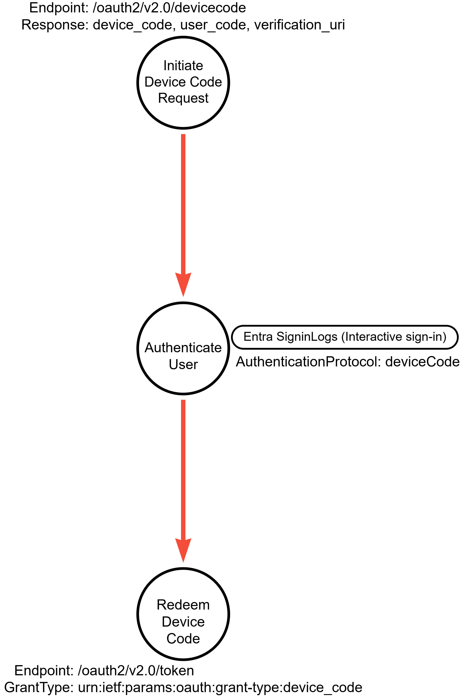
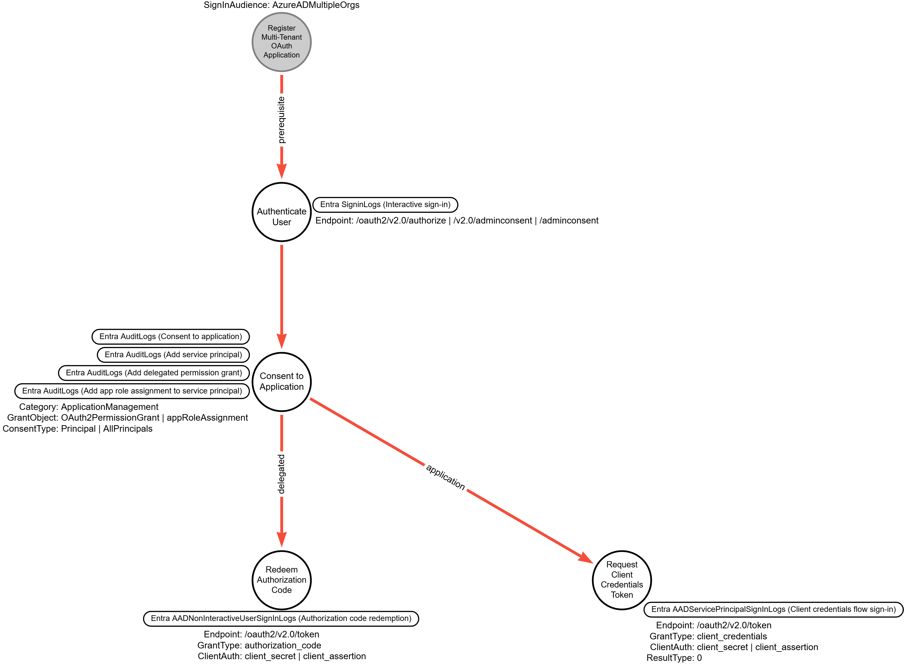
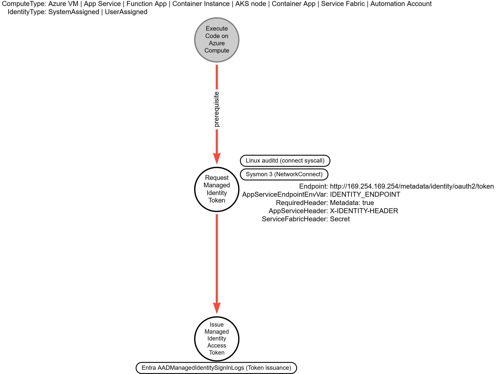
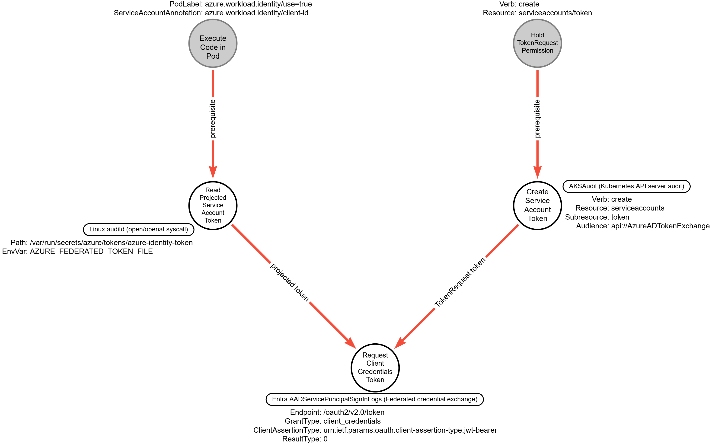

# Steal Application Access Token (Microsoft Entra ID)

## Metadata

| Key          | Value                                                  |
|--------------|--------------------------------------------------------|
| ID           | TRR0000                                                |
| External IDs | [AZT203], [AZT601], [T1528]                            |
| Tactics      | Credential Access                                      |
| Platforms    | Identity Provider, Containers, IaaS, Office Suite, SaaS|
| Contributors | John McGuinness                                        |

### Scope Statement

This TRR covers OAuth access-token acquisition on Microsoft Entra ID
where an adversary causes a legitimate Entra ID OAuth flow to issue
tokens to attacker-controlled infrastructure, or extracts a token
issued to an Entra-attached managed identity or federated workload
identity on a compromised Azure compute or AKS resource.

The token-acquisition pipeline ends when the adversary first receives
the access or refresh token; later use of the token, refresh-token
replay of artifacts harvested elsewhere, and resource API calls are
[T1550.001]. Client-credentials issuance to a service principal that
the victim tenant was induced to consent to is acquisition and belongs
to Procedure B; this TRR treats theft of an application client secret
or certificate from disk, a repository, or a key vault as [T1552], and
issuance with that stolen credential on a legitimately consented
principal as use of that credential under [T1078.004]. A privileged
principal in the victim tenant assigning app roles to an application
directly is not induced consent and is not modeled here. First-party
authorization-code phishing, where the victim authenticates to a
Microsoft first-party `client_id` and relays the authorization code to
the adversary, is covered by library TRR0034 (OAuth Authorization Code
Phishing); the redirect-host and subdomain-takeover variants of that
flow are excluded here as well. Authentication transfer, the
cross-device sign-in flow from PC to mobile for Microsoft apps that
Microsoft enables by default for all users and manages with the
Conditional Access Authentication flows condition that also targets
device code flow, is in preview and is not modeled. This TRR treats
Adversary-in-the-Middle capture of an Entra session cookie as [T1539]
with [T1557] because the artifact is a cookie, Primary Refresh Token
extraction from a compromised Windows endpoint as [T1003] with
[T1552], PRT acquisition through an attacker-registered device as
[T1098.005], and the addition of a federated identity
credential to an existing application as [T1098.001] followed by use
of the added credential under [T1078.004]. Azure Arc-enabled servers
are excluded because the Arc token request requires reading a
challenge file available only to a privileged local group. The Azure
Logic Apps path (ATRM AZT601.3), in which a workflow definition is
modified so that Azure Logic Apps itself obtains the managed
identity's token at workflow runtime, is excluded. Federated identity
credentials trusting issuers outside Azure compute, such as GitHub
Actions or Azure Pipelines, are excluded. This TRR treats reads of
token material a client has already cached on disk, such as the Azure
CLI token cache or a Cloud Shell home image, as [T1552.001]; reads of
tokens held in browser web storage are excluded without a technique
pointer because neither the [T1539] nor the [T1552.001] description
names them. The cross-tenant Entra actor-token path was fixed by
Microsoft in July 2025 and assigned CVE-2025-55241 in September 2025;
it is not modeled.

## Technique Overview

An adversary obtains a Microsoft Entra ID access token or refresh token
issued on behalf of a user, service principal, managed identity, or
federated workload identity, and holds it outside the client the token
was issued to. Entra ID issues bearer tokens, which any party in
possession can use without demonstrating possession of a cryptographic
key, and a standard OAuth2 token contains no certificate binding
information. Because the authentication requirements were met when the
token was issued, a replayed token grants the adversary access to
organizational resources even where the user satisfied multifactor
authentication. ATT&CK states that application access tokens are used
to make authorized API requests on behalf of a user or service
([T1528]).

## Technical Background

### The Microsoft Identity Platform OAuth Endpoint Surface

Microsoft Entra ID exposes its v2.0 authorization endpoint at
`https://login.microsoftonline.com/{tenant}/oauth2/v2.0/authorize`
and its token endpoint at
`https://login.microsoftonline.com/{tenant}/oauth2/v2.0/token`;
Microsoft notes that the endpoint URI format may vary by application
type, sign-in audience, and Azure cloud instance
([Microsoft Identity Platform OAuth 2.0 and OpenID Connect Protocols]).
Interactive user flows obtain authorization at `/authorize` and redeem
at `/token`. The device code flow uses two different endpoints: the
client posts to
`https://login.microsoftonline.com/{tenant}/oauth2/v2.0/devicecode`
and then polls `/token`
([Microsoft Identity Platform OAuth 2.0 Device Authorization Grant]).
Client credentials, on-behalf-of, and federated-credential exchange
also redeem at `/oauth2/v2.0/token`
([Microsoft Identity Platform Client Credentials Flow],
[Microsoft Identity Platform On-Behalf-Of Flow]). For Azure virtual
machines and App Service, managed identity token endpoints sit on the
resource rather than on the login host:
Azure virtual machines expose the Instance Metadata Service endpoint
`http://169.254.169.254/metadata/identity/oauth2/token`, a
non-routable address accessible only from within a running virtual
machine instance
([Use Managed Identities on an Azure VM to Acquire Access Tokens],
[Azure Instance Metadata Service]), and App Service and Azure
Functions define the `IDENTITY_ENDPOINT` and `IDENTITY_HEADER`
environment variables
([App Service Managed Identity Overview]). AKS workload identity
projects a Kubernetes service account token into the pod, sets
`AZURE_FEDERATED_TOKEN_FILE` to its path, and uses the Microsoft Entra
v2 token endpoint rather than the IMDS resource flow
([Use Microsoft Entra Workload ID on AKS]).

RFC 6749 defines four grant types (authorization code, implicit,
resource owner password credentials, and client credentials) plus
extension grants and the refresh-token exchange
([RFC 6749 OAuth 2.0 Authorization Framework]); the device
authorization grant is RFC 8628
([RFC 8628 OAuth 2.0 Device Authorization Grant]). The Microsoft
identity platform documentation lists authorization code with PKCE,
implicit, integrated Windows authentication, resource owner password,
device code, client credentials, and on-behalf-of as its OAuth 2.0
flows and grants
([Microsoft Identity Platform Authentication Flows and Application Scenarios]),
and documents the hybrid flow as the authorization code flow with an
ID token also returned from `/authorize`
([Microsoft Identity Platform OAuth 2.0 Authorization Code Flow]).
Microsoft recommends against the implicit grant flow,
which provides no refresh tokens
([Microsoft Identity Platform Implicit Grant Flow]), and against the
resource owner password credentials flow, which is incompatible with
multifactor authentication and blocks users who need MFA
([Microsoft Identity Platform ROPC Flow]). In the device authorization
grant, the device requesting the authorization is not the same as the
device from which the user grants access, and Microsoft states that
Entra ID has no reliable way to verify that the person who enters the
code is signing in from the device that generated it
([Dynamics 365 Warehouse Management App User-Based Authentication]).

### Device Authorization Grant Internals

A device code flow begins with the client posting `client_id` and
`scope` to `/oauth2/v2.0/devicecode`; the response carries
`device_code` (a long string used to verify the session between the
client and the authorization server), `user_code` (a short string
shown to the user to identify the session on a secondary device),
`verification_uri`, `expires_in` (the number of seconds before the two
codes expire), and `interval` (the number of seconds the client should
wait between polling requests); the value Entra ID returns in
`interval` is not stated on the Microsoft page. Microsoft gives
`https://microsoft.com/devicelogin` as an example of the URL the user
visits ([MSAL Authentication Flows]); no Microsoft page states the
value the endpoint returns in `verification_uri`. The code lifetime is
stated in [Token Lifetimes]. While the user authenticates at the
verification URI, the client polls `/oauth2/v2.0/token` with
`grant_type=urn:ietf:params:oauth:grant-type:device_code` and the
`device_code`. Microsoft documents four errors served before the user
completes authentication: `authorization_pending`,
`authorization_declined`, `bad_verification_code`, and
`expired_token`. Once the user signs in, the device obtains access
tokens and, if `offline_access` was in the original `scope`, a refresh
token. The documented device authorization request carries `tenant`,
`client_id`, and `scope`, and the documented token request carries
`tenant`, `grant_type`, `client_id`, and `device_code`; neither
documented request includes a `redirect_uri`, PKCE, or `state`
parameter, and Microsoft does not state that the endpoint rejects
them. The device code flow is available only for public client
applications. Since June 2021 the device code flow includes a prompt
that validates the user is signing into the app they expect
([Microsoft Identity Platform Breaking Changes Reference]). The error
reference describes `AADSTS50199` (`CmsiInterrupt`) as the user being
asked to confirm that this app is the application they intended to
sign into, states that the interrupt is shown for all scheme redirects
in mobile browsers, and gives as its cause that a system webview has
been used to request a token for a native application
([Microsoft Entra Authentication Error Codes]); Microsoft's April 2026
report says that error 50199 followed by success within a 5-minute
interval for a user suggests a pause to input the code from the
phishing email
([Microsoft Security Blog - AI-Enabled Device Code Phishing 2026]).
That the device code confirmation prompt is the step recorded as
50199 is a derivation from those three statements; no page states it.

### Authorization Code Flow Internals

The authorization code flow is a two-leg exchange: an `/authorize`
request that returns a code, then a `/token` request that redeems it
([Microsoft Identity Platform OAuth 2.0 Authorization Code Flow]). The
authorize request carries `client_id`, `scope`, a `redirect_uri` that
must exactly match one registered for the application, and
`code_challenge`, which Microsoft recommends for all application types
and requires for single-page applications. Once the user authenticates
and grants consent, the platform returns the response to the
`redirect_uri`, with the code as a query-string parameter in the
default response mode. The client redeems the code with a POST to
`/token` carrying `grant_type=authorization_code`, the code, and the
same `redirect_uri`; confidential web apps authenticate with a
`client_secret` or a `client_assertion` JWT signed with a registered
certificate, `code_verifier` is required if PKCE was used in the
authorization request, and public clients must not use secrets or
certificates when redeeming a code. The response carries an access
token and, only if `offline_access` was requested, a refresh token.
The OAuth 2.0 specification requires that a code be used to redeem an
access token only once ([MSAL Authentication Flows]); reuse is refused
with `AADSTS54005`, and RFC 6749 recommends a maximum code lifetime of
10 minutes. RFC 7636 addresses the authorization code interception
attack by a malicious app by creating a unique code verifier for every
authorization request ([RFC 7636 Proof Key for Code Exchange]).

Redirect URIs are case-sensitive and must match the registered value;
Microsoft Entra login servers only redirect users and send tokens to
redirect URIs added to an app registration
([Microsoft Identity Platform Redirect URI Restrictions]). Wildcard
URIs are unsupported in app registrations configured to sign in
personal Microsoft accounts and work or school accounts, and allowed
for apps configured to sign in only work or school accounts in one
organization's tenant; the port component of a `localhost` redirect
URI is ignored for matching.

### Client Credentials and Federated Credential Exchange

Service-principal token issuance is a POST to `/oauth2/v2.0/token`
with `grant_type=client_credentials`
([Microsoft Identity Platform Client Credentials Flow]). Microsoft
documents three cases: a shared secret; a certificate, where
`client_assertion` is a JWT the application creates and signs with the
certificate registered for it; and a federated credential, where
`client_assertion` is a JWT the application gets from another identity
provider, such as Kubernetes, whose specifics are registered on the
application as a federated identity credential. The assertion cases
set `client_assertion_type` to
`urn:ietf:params:oauth:client-assertion-type:jwt-bearer`. The
`/.default` scope value tells the platform to issue a token for the
direct application permissions configured for the resource, and
refresh tokens are never granted with this flow. Federated workload
identity for AKS posts `grant_type=client_credentials` with
`client_assertion_type=urn:ietf:params:oauth:client-assertion-type:jwt-bearer`
and the kubelet-projected service-account JWT as the `client_assertion`
([Use Microsoft Entra Workload ID on AKS]). The federated identity
credential's `issuer`, `subject`, and `audience` values must
case-sensitively match the corresponding claims in the token
([Microsoft Identity Platform Workload Identity Federation]); when the
checks pass, the platform issues an access token to the external
workload. Flexible federated identity credentials, in preview, add a
`claimsMatchingExpression` with single-character and multi-character
wildcard matching
([Microsoft Entra Flexible Federated Identity Credentials]); Microsoft
states that support is currently provided for matching against GitHub,
GitLab, and Terraform Cloud issued tokens; Kubernetes-issued tokens are
not in that list.

### The Instance Metadata Service

The Instance Metadata Service is a REST API at the non-routable
address `169.254.169.254`, accessible only from within a running
virtual machine instance ([Azure Instance Metadata Service]). The
security boundary of a managed identity is the resource where it is
used: all code and scripts running on a virtual machine can request
and retrieve tokens for any managed identity available on it
([Use Managed Identities on an Azure VM to Acquire Access Tokens]).
A request must contain the header `Metadata: true`, which Microsoft
describes as a mitigation against server-side request forgery, and
must not contain an `X-Forwarded-For` header; a request failing either
requirement is rejected. The token request is an HTTP GET to the
endpoint with the `api-version` query parameter (`2018-02-01` or
greater) and the `resource` query parameter, the App ID URI of the
target resource, which also appears in the issued token's `aud` claim.
The response `token_type` is `Bearer`, and the token is based on the
managed identity's service principal; Microsoft describes these tokens
as representing the application that accesses the resource and not
any specific user ([App Service Managed Identity Overview]). The
managed identities subsystem caches tokens: on-the-wire calls to
Microsoft Entra ID result only when a cache miss occurs because no
token is in the subsystem cache, or when the cached token is expired.

App Service and Azure Functions provide an internally accessible REST
endpoint for token retrieval: `IDENTITY_ENDPOINT` holds the URL of the
local token service and `IDENTITY_HEADER` holds a value the platform
rotates, which the caller adds as the `X-IDENTITY-HEADER` header on an
HTTP GET to `IDENTITY_ENDPOINT` with `api-version=2019-08-01`
([App Service Managed Identity Overview],
[App Service Environment Variables and App Settings Reference]).
Container Apps define the same two environment variables with the same
request shape ([Azure Container Apps Managed Identities]). Azure
Automation runbooks send both the `Metadata` header set to `true` and
`X-IDENTITY-HEADER`, and the samples on that page send the request to
the URL in `IDENTITY_ENDPOINT`
([Enable Managed Identity for Azure Automation]).
Service Fabric exposes an HTTPS `localhost` token service that takes a
`Secret` header
([Service Fabric Managed Identity in Application Code]). The Container
Instances page's sample token request goes to the IMDS address with
the `Metadata` header set to `true`; for Windows container instances
the metadata server is not available for getting a Microsoft Entra
token, and the token request goes to
`IDENTITY_ENDPOINT` with `IDENTITY_HEADER`
([Azure Container Instances Managed Identity]). In
an AKS cluster the IMDS endpoint is by default accessible from all
pods; when IMDS restriction is enabled, pods that are not on the host
network cannot acquire managed identity tokens from it
([AKS IMDS Restriction]). The documented request in each of these
cases goes to the IMDS address, a `localhost` service, or the URL in
`IDENTITY_ENDPOINT`, in the form each page's sample request shows (the
Automation page shows both a GET and a POST form); no
authorization-endpoint step appears in any of the references.

### Access Token Structure

An Entra ID access token is a JSON web token with a header, a payload,
and a signature, each separated by a period and separately Base64
encoded, signed with an asymmetric algorithm such as RS256
([Microsoft Identity Platform Access Tokens]). The claims reference
([Microsoft Identity Platform Access Token Claims Reference]) defines
`aud` (the intended audience), `iss` (the STS that constructs the
token and the tenant of the authenticated user), `tid` (the tenant the
user signs in to), `oid` (the immutable identifier of the user or
service principal), `appid` in v1.0 tokens and its replacement `azp`
in v2.0 tokens (the application ID of the client using the token),
`appidacr` and `azpacr` (`0` for a public client, `1` for a client
secret, `2` for a client certificate), `scp` (consented scopes, user
tokens only), `roles` (the permissions the client credential flow uses
in place of user scopes for application tokens, and the user's
assigned roles for user tokens), `amr` (authentication methods, with
documented values `pwd`, `rsa`, `otp`, `fed`, `wia`, `mfa`, `ngcmfa`,
`wiaormfa`, and `none`), `iat`, `nbf`, and `exp` (Unix timestamps),
`uti` (the per-token identifier equivalent to the JWT `jti` claim),
`sid` (the session identifier), and `xms_cc`, whose value `cp1` is
the authoritative way to identify a client that can handle a claims
challenge and whose presence the resource controls. The platform
issues either token version from either endpoint: the version follows
the resource's `requestedAccessTokenVersion` setting (`null` or `1`
yields v1.0, `2` yields v2.0), and Microsoft Graph tokens are
v1.0-formatted regardless of the endpoint used
([Microsoft Identity Platform On-Behalf-Of Flow]).

Bearer is the only token type Entra ID supports. A standard OAuth2
token contains no certificate binding information; an mTLS
proof-of-possession token includes a `cnf` claim that binds the token
to a certificate, a feature in private preview that supports app-only
tokens only ([Microsoft Identity Web Token Binding]). Token Protection
is a Conditional Access session control that attempts to reduce token
replay attacks by ensuring only device bound sign-in session tokens,
like Primary Refresh Tokens, are accepted by Microsoft Entra ID when
applications request access to protected resources
([Microsoft Entra Token Protection]). On Windows the PRT's client
secret is stored in platform hardware such as the TPM
([Microsoft Entra Protecting Tokens]); on Apple platforms Entra ID
uses the Secure Enclave to store proof-of-possession keys
([Microsoft Entra Token Protection Deployment Guide for Apple]). As of
October 2026 the concept page gives native-application support the
status General Availability on Windows, iOS and iPadOS, and macOS,
and browser-based support the status Preview for selected web apps
that access Azure Resource Manager on Windows and macOS; the Windows
deployment guide still states that Token Protection supports native
applications only
([Microsoft Entra Token Protection Deployment Guide for Windows]). For
native applications, enforcement covers Exchange Online, SharePoint
Online, and Microsoft Teams, and on Windows also
Azure Virtual Desktop and Windows 365; the Windows guide lists
Microsoft Teams, OneDrive, Outlook, Word, Excel, PowerPoint, and
Visual Studio Code among the supported applications.

### Token Lifetimes

When issued, an access token receives a random default lifetime
between 60 and 90 minutes (75 minutes on average), varied to spread
token demand over time; when both the client and the resource support
Continuous Access Evaluation, the lifetime increases to long-lived,
up to 28 hours
([Microsoft Identity Platform Configurable Token Lifetimes],
[Microsoft Entra Continuous Access Evaluation]). The refresh token
Max Inactive Time is 90 days and the Max Age for both
single-factor and multifactor refresh tokens is until-revoked; a
refresh token sent to a redirect URI registered as `spa` expires after
24 hours. Since January 30, 2021, refresh and session token lifetimes
are not configurable through token lifetime policies. Authorization
codes are short lived
([Microsoft Identity Platform OAuth 2.0 Authorization Code Flow]). The
user has 15 minutes from the device authorization request to sign in,
which is the default `expires_in` of a device code.

### Conditional Access Posture

The Conditional Access authentication flows condition explicitly
targets device code flow
([Microsoft Entra Conditional Access Authentication Flows]). Microsoft
recommends blocking device code flow wherever possible, getting as
close as possible to a unilateral block, and allowing it only in well
documented and secured use cases such as legacy tooling that cannot be
updated ([Microsoft Entra Block Authentication Flows Policy];
[Microsoft Entra Conditional Access Authentication Flows]).
Starting early September 2024, Microsoft began enforcing
authentication flows policies on Device Registration Service (client
ID `01cb2876-7ebd-4aa4-9cc9-d28bd4d359a9`) for policies that target
all resources in the resource picker. In February 2025 Microsoft
announced the rollout of a managed Conditional Access policy that
blocks device code flow, aimed especially at organizations not
actively using it
([Security Boulevard - Blocking Device Code Flow in Microsoft Entra ID]).
Microsoft creates and deploys Microsoft-managed policies to eligible
tenants based on licensing and feature
eligibility, in a Report-only state, enables them no less than 30 days
later if they are left in that state, and lets administrators exclude
users or turn a policy on or off but not rename or delete it
([Microsoft Entra Microsoft-Managed Conditional Access Policies]).
Starting July 1, 2026, all new Microsoft Entra tenants block device
code flow as part of security defaults
([Microsoft Entra Security Defaults]); existing tenants are not
automatically affected unless they already have security defaults
enabled
([Dynamics 365 Warehouse Management App User-Based Authentication]).

Protocol tracking state is sustained through subsequent refreshes, so
a session that began with device code flow or authentication transfer
can remain subject to authentication flows policies on later
redemptions; where the policy applies to all applications, the
refresh-token redemption fails with `AADSTS530036`. The Microsoft
Graph `originalTransferMethod` value for such a session is
`deviceCodeFlow` ([Microsoft Graph signIn Resource]); the Conditional
Access documentation describes the original transfer method of such a
session as set to Device code flow
([Microsoft Entra Conditional Access Authentication Flows]).
Conditional Access is evaluated whenever Microsoft
Entra ID issues or refreshes an access token
([Microsoft Entra Conditional Access and Agent ID]). When the
device-code flow is used, the require-managed-device grant control and
device state conditions are not supported, because the device
performing authentication cannot provide its device state to the
device that is providing a code, and the device state in the token is
locked to the device performing authentication
([Microsoft Entra Conditional Access Grant Controls]).

### OAuth Consent Framework

Microsoft defines two permission types: delegated permissions, which
allow an application to act on a user's behalf and appear in the
`scp` claim, and application permissions, also known as app roles,
used in the app-only scenario without a signed-in user and carried in
the `roles` claim
([Microsoft Identity Platform Permissions and Consent Overview],
[Microsoft Entra Application and Delegated Permission Access Tokens]).
Users can consent for their own data to delegated permissions and
administrators for all users; app-only
permissions always require a tenant administrator's consent
([Microsoft Identity Platform Convert App to Multitenant]). The result
of consent for Microsoft Graph is an `OAuth2PermissionGrant` for
delegated permissions or an `appRoleAssignment` for application
permissions; an `OAuth2PermissionGrant` carries `consentType`
`Principal` (one user) or `AllPrincipals` (all users, grantable by an
administrator) ([Microsoft Graph oAuth2PermissionGrant Resource]).
Application permissions can be granted through a consent experience
([Microsoft Graph Service Principal App Role Assignment]).

Tenant user-consent settings offer three options: disable user
consent so users cannot grant permissions to applications; allow users
to consent to applications from verified publishers or the
organization, but only for permissions the administrator selects; or
allow users to consent to all applications for any permission that
does not require admin consent
([Microsoft Entra User and Admin Consent Overview]). Beginning
November 2020, when risk-based step-up consent is enabled (it is
enabled by default and changes behavior only when user consent is
enabled), users cannot consent to most newly registered multitenant
apps that are not publisher verified; the policy applies to apps
registered after November 8, 2020 that request permissions beyond
basic sign-in and user-profile read from users in tenants other than
the registering tenant, and the blocked attempt is logged with
category `ApplicationManagement`, activity `Consent to application`,
and status reason `Risky application detected`
([Microsoft Identity Platform Publisher Verification Overview],
[Microsoft Entra Risk-Based Step-Up Consent]). The Microsoft managed
consent policy, which is the default for a new tenant, lets end users
consent to any user-consentable delegated permission except a
Microsoft-maintained list that includes Microsoft Graph
`Files.Read.All`, `Files.ReadWrite.All`, `Sites.Read.All`,
`Sites.ReadWrite.All`, listed scopes in the Mail, MailboxItem,
Calendars, Chat, OnlineMeetings, MailBoxFolder, MailBoxSettings,
Contacts, Tasks, and People families, and the Exchange Online
`EAS.AccessAsUser.All`, `EWS.AccessAsUser.All`,
`IMAP.AccessAsUser.All`, and `POP.AccessAsUser.All` scopes
([Microsoft Entra Manage App Consent Policies]); an administrator can
enable the admin consent workflow so that users may request review of
an application they are not allowed to consent to
([Microsoft Entra Configure User Consent]).

Granting tenant-wide admin consent requires signing in as a user
authorized to consent on behalf of the organization. The
grant-admin-consent page lists Privileged Role Administrator for any
permission on any API; Cloud Application Administrator, AI
Administrator, or Application Administrator for any permission except
Microsoft Graph app roles; and a custom directory role that includes
the permission to grant permissions to applications
([Microsoft Entra Grant Tenant-Wide Admin Consent],
[Microsoft Entra Built-In Roles Reference]). A Microsoft
troubleshooting page states
instead that consent for application permissions always requires a
global or company administrator
([Microsoft Entra Troubleshoot Consent Issues]). The admin consent
endpoint `https://login.microsoftonline.com/{tenant}/v2.0/adminconsent`
(also documented as `/{tenant}/adminconsent`) requires a tenant
administrator to sign in to complete the request, application
permissions are requested through the `/.default` scope value, and
the documented success redirect carries `admin_consent=True`,
`tenant`, `scope`, and `state`
([Microsoft Identity Platform Admin Consent Endpoint]). By default all
users in a tenant can register applications; setting `Users can
register applications` to No disables that
([Microsoft Entra Restrict Who Can Create Applications]).

### Continuous Access Evaluation

Continuous Access Evaluation allows access tokens to be revoked based
on critical events and policy evaluation rather than on lifetime
expiry ([Microsoft Identity Platform App Resilience with CAE]). The
events currently evaluated are: the user account is deleted or
disabled; the user's password is changed or reset; multifactor
authentication is enabled for the user; an administrator explicitly
revokes all refresh tokens for the user; and Microsoft Entra ID
Protection detects high user risk
([Microsoft Entra Continuous Access Evaluation]). Changes to
Conditional Access policies and group membership can take up to one
day to take effect; token export to a machine outside a trusted
network can be prevented with Conditional Access location policies;
Exchange Online, SharePoint Online, Teams, and Microsoft Graph can
synchronize key Conditional Access policies for evaluation within the
service. The initial
implementation covers Exchange, Teams, and SharePoint Online.
Microsoft is working with the industry on standards that would let
third-party applications use CAE
([Microsoft Entra Resilience with Continuous Access Evaluation]), and
CAE for Application Proxy extends CAE to on-premises applications
published through Application Proxy
without requiring the application to be CAE-aware
([Microsoft Entra Application Proxy Continuous Access Evaluation]).
A client declares CAE readiness with the client capability `cp1`,
surfaced as the `xms_cc` claim; a CAE-enabled API returns a 401 status
with a claims challenge in the `WWW-Authenticate` header when the
token is revoked or the IP address changes. CAE does not support
guest user accounts, and CAE for workload identities covers Microsoft
Graph only and does not support managed identities
([Microsoft Entra Continuous Access Evaluation for Workload Identities]).

### Telemetry Surfaces

Entra ID sign-in logs have four types: interactive user sign-ins,
non-interactive user sign-ins, service principal sign-ins, and managed
identity sign-ins ([Microsoft Entra Sign-In Logs Overview]). An
interactive sign-in is one in which the user provides an
authentication factor to Entra ID; a non-interactive sign-in is done
on behalf of a user by a client app or OS component without the user
providing a factor, and Microsoft's examples include a client app
using a refresh token to get an access token and a client using an
authorization code to get an access token and refresh token
([Microsoft Entra Interactive User Sign-Ins],
[Microsoft Entra Non-Interactive User Sign-Ins]). Service principal
sign-ins do not
involve a user; the app provides its own credential, such as a
certificate or app secret, and Microsoft names an application using a
client secret in the OAuth client credentials flow as an example
([Microsoft Entra Service Principal Sign-Ins]). Managed identity
sign-ins are performed by resources whose secrets Azure manages
([Microsoft Entra Managed Identity Sign-Ins]). In a Log Analytics
workspace the four types are the `SigninLogs` table, whose reference
page carries no description line and whose category the
diagnostic-settings page describes as interactive sign-in logs
([Azure Monitor SigninLogs Table],
[Microsoft Entra Diagnostic Settings Log Options]);
`AADNonInteractiveUserSignInLogs`
([Azure Monitor AADNonInteractiveUserSignInLogs Table]);
`AADServicePrincipalSignInLogs`
([Azure Monitor AADServicePrincipalSignInLogs Table]); and
`AADManagedIdentitySignInLogs`
([Azure Monitor AADManagedIdentitySignInLogs Table]).
`MicrosoftServicePrincipalSignInLogs` holds Microsoft applications'
service principal sign-ins and is offered as an opt-in through
diagnostic settings only, in preview
([Azure Monitor MicrosoftServicePrincipalSignInLogs Table]).
Microsoft describes routing as selecting the logs to route and then
the endpoint, and the service principal sign-in page states those
logs are only available by configuring diagnostic settings
([Microsoft Entra Service Principal Sign-In Table Reference]); no
sign-in category is described as reaching a workspace without a
selection. The Microsoft Graph beta `signIn` resource is a single
schema whose `signInEventTypes` property carries `interactiveUser`,
`nonInteractiveUser`, `managedIdentity`, or `servicePrincipal`
([Microsoft Graph signIn Resource]). In Microsoft Defender XDR
advanced hunting, `EntraIdSignInEvents` contains interactive and
non-interactive sign-ins and `EntraIdSpnSignInEvents` contains
service principal and managed identity sign-ins; both require an
Entra ID P2 license, and on October 19, 2026 they replace
`AADSignInEventsBeta` and `AADSpnSignInEventsBeta`
([Microsoft Defender XDR EntraIdSignInEvents Table],
[Microsoft Defender XDR EntraIdSpnSignInEvents Table]).

`AuthenticationProtocol` lists the protocol type or grant type used in
the authentication; the `SigninLogs` page documents the values `none`,
`oAuth2`, `ropc`, `wsFederation`, `saml20`, and `deviceCode`, and the
Graph beta resource adds values including `authenticationTransfer`,
`clientCredentials`, `refreshTokenGrant`, and `prtGrant`.
The `SigninLogs` page describes `IncomingTokenType` as the type of
token utilized to sign in, with the examples primary refresh token and
saml assertion; the Graph beta `incomingTokenType` property lists the
token types presented to authenticate the actor (`none`,
`primaryRefreshToken`, `saml11`, `saml20`, `remoteDesktopToken`,
`refreshToken`), and Microsoft cautions not to infer the absence of a
token from a value outside that list.
`OriginalTransferMethod` carries the transfer method used to initiate
a session throughout all subsequent requests; the Graph values are
`none`, `deviceCodeFlow`, and `authenticationTransfer`. `ResultType`
is defined as `0` for success on the `SigninLogs` page; the
`AADNonInteractiveUserSignInLogs` and `AADManagedIdentitySignInLogs`
pages describe the column only as Success or Failure.
`AADServicePrincipalSignInLogs` carries `ClientCredentialType` (with
examples client assertion and client secret), `FederatedCredentialId`
(the identifier of the federated identity credential used to sign in),
`ServicePrincipalId`, `AppId`, and `ResourceDisplayName`;
`AADManagedIdentitySignInLogs` carries `ServicePrincipalId`,
`ResourceIdentity`, `ResourceDisplayName`, `ManagedServiceIdentity`,
and `FederatedCredentialId`. For non-interactive sign-ins performed
by confidential clients, the logged `IPAddress` is the original IP
used for the original token issuance, not the source of the refresh
request.

`AuditLogs` is the Microsoft Entra audit log, which captures changes
to applications, groups, users, and licenses, with the activity in
`ActivityDisplayName` ([Azure Monitor AuditLogs Table],
[Microsoft Entra Diagnostic Settings Log Options]). The Core
Directory activity reference lists, under category
`ApplicationManagement`, the activities `Add app role assignment to
service principal`, `Add application`, `Add delegated permission
grant`, `Add owner to application`, `Add owner to service principal`,
`Add service principal`, `Consent to application`, and `Update
application` ([Microsoft Entra Audit Activity Reference]); Microsoft
maps `Consent to application` to a user granting consent, `Add
delegated permission grant` to granting delegated access, and `Add
app role assignment to service principal` to granting app-only
access ([Microsoft Entra Audit Logs for App Permissions]). The
Purview audit log describes `Add service principal` as an application
registered in Microsoft Entra ID
([Microsoft Purview Audit Log Activities]) and carries `Consent to
application` activities
([Detect and Remediate Illicit Consent Grants - Microsoft Learn]); its
default retention policy covers records whose `Workload` is
`AzureActiveDirectory`, one of three values the supported-services
page lists for Microsoft Entra ID
([Microsoft Purview Audit Log Retention Policies],
[Microsoft Purview Audit Supported Services]).
Microsoft Graph activity logs,
enabled through a diagnostic setting with an Entra ID P1 or P2
license, provide an audit trail of all HTTP requests the Microsoft
Graph service receives and processes for a tenant
([Microsoft Graph Activity Logs Overview]). Entra ID Protection
([Microsoft Entra ID Protection Risk Detections]) emits sign-in risk
types including `anomalousToken` (abnormal token characteristics such
as an unusual lifetime or a token played from an unfamiliar location,
covering session tokens and refresh tokens), `unfamiliarFeatures`
(raised on interactive and non-interactive sign-ins),
`unlikelyTravel`, `mcasImpossibleTravel`, `maliciousIPAddress`, and
`suspiciousBrowser`.

The managed identity client uses an endpoint on the virtual machine
rather than a Microsoft Entra endpoint, and Entra ID is called only
by the subsystem on a cache miss or expiry
(see [The Instance Metadata Service]); the Entra-side record of a
managed identity token is, as a derivation from the cache statement
and the managed identity sign-in table definition, the
`AADManagedIdentitySignInLogs` row written for that subsystem call,
and the attacker's own request has no Entra record described in the
references. Host-side, the request is observable as a Linux auditd
`SYSCALL` record, which a syscall rule naming `connect` starts when a
program makes that call ([Linux auditctl Manual Page],
[Red Hat Auditing the System]), and as Sysmon event ID 3
(NetworkConnect), which logs TCP and UDP connections linked to a
process, is disabled by default, and is defined in the shared event
manifest for Windows and Linux
([Sysmon], [Sysmon Common Event Manifest]). A syscall rule with no
additional arch directive applies to both 32-bit and 64-bit syscalls
([Linux auditctl Manual Page]). The Azure Activity Log contains
subscription-level events that track operations on each Azure
resource as seen from outside the resource, such as starting a
virtual machine ([Monitor Azure Kubernetes Service]); the definition
names operations as seen from outside the resource and gives no
in-guest example. App Service resource-log categories include
`AppServiceConsoleLogs`
(standard output and standard error), `AppServiceHTTPLogs` (web
server logs), and `AppServicePlatformLogs` (container operation logs)
([Azure App Service Monitoring Data Reference]); none of the nine
categories is described as recording outbound HTTP requests from the
app, and that the request to `IDENTITY_ENDPOINT` reaches the console
log only when the application writes it to standard output or error
is a derivation from the category definition. A file read
in a pod is observable as an auditd record under a watch rule
(`-w path`) or a syscall rule with `-F path`; an audit event contains
a `PATH` record for every path passed to the system call, and since
glibc 2.26 the `open()` wrapper issues the `openat()` system call
([Linux open Manual Page]). `AKSAudit` contains all Kubernetes API
server audit logs, including events with the get and list verbs,
requires diagnostic settings, and carries `Verb` (the Kubernetes verb,
or the lower-cased HTTP method for non-resource requests), `ObjectRef`
(resource, namespace, name, and subresource), `RequestUri`, `User`,
`PodName`, and `SourceIps`; `AKSAuditAdmin` limits the scope to
modifying operations ([Azure Monitor AKSAudit Table],
[Kubernetes Auditing], [Kubernetes Audit API Reference]). In the
Kubernetes authorization model an HTTP `POST` maps to the `create`
verb
([Kubernetes Authorization Overview]).

### The Microsoft Authentication Broker Client

The Microsoft Authentication Broker Service has client ID
`29d9ed98-a469-4536-ade2-f981bc1d605e`; the macOS SSO extension
troubleshooting page states that all Primary Refresh Token requests
are made to it
([Microsoft Entra Troubleshoot the macOS SSO Extension]).

## Procedures

| ID | Title | Tactic |
|---|---|---|
| TRR0000.AZR.A | Device Code Phishing | Credential Access |
| TRR0000.AZR.B | Multi-Tenant Illicit Consent Grant | Credential Access |
| TRR0000.AZR.C | Managed Identity Token Retrieval | Credential Access |
| TRR0000.AZR.D | AKS Workload Identity Token Theft | Credential Access |

### Procedure A: Device Code Phishing (TRR0000.AZR.A)

This procedure covers the device authorization grant initiated on a
device in the adversary's possession, with the victim granting access
from another device. The two-device property and the request and
response shapes are stated in [Device Authorization Grant Internals];
this narrative covers only what the adversary does with them and what
the tenant records.

The adversary generates a legitimate device code request at
`/oauth2/v2.0/devicecode` (`n0`) and tricks the target into entering
the `user_code` at a legitimate Microsoft sign-in page
([Microsoft Security Blog - Storm-2372 Device Code Phishing]); RFC
8628 gives the example of an email instructing the user to visit the
verification URL and enter the code. The victim's authentication at
the verification page (`n1`) authenticates the threat actor's session
([Microsoft Security Blog - CaptiveCrunch]). The adversary's client
polls `/oauth2/v2.0/token` with the device-code grant type (`n2`) and
captures the access and refresh tokens that are generated. Microsoft
states that the requesting client receives the tokens through a back
channel; that the victim passes no credential or token to the
adversary is a derivation from that statement.

The `SigninLogs` page enumerates `deviceCode` as an
`AuthenticationProtocol` value, Microsoft's authentication-flows page
ties device code flow events in the sign-in logs to that property,
and an interactive sign-in is one in which the user provides a
factor; placing the victim's device-code authentication in an
`Entra SigninLogs (Interactive sign-in)` row with
`AuthenticationProtocol` = `deviceCode` follows from those three
statements, and no single Microsoft sentence states it.
Whether the `/oauth2/v2.0/devicecode` request is logged anywhere is
not documented, so `n0` carries no label. No Microsoft page states
that the device-code redemption at `/oauth2/v2.0/token` writes its
own `AADNonInteractiveUserSignInLogs` row, although that table's
schema carries `AuthenticationProtocol` with the value `deviceCode`
and an `OriginalTransferMethod` column, so `n2` carries no label.

Microsoft reported Storm-2372 on February 13, 2025, assessing with
moderate confidence that the actor aligns with Russian interests, with
attacks appearing to have been ongoing since August 2024 against
government, NGO, IT services and technology, defense,
telecommunications, health, higher education, and energy targets in
Europe, North America, Africa, and the Middle East. The actor likely
targeted victims through WhatsApp, Signal, and Microsoft Teams, posing
as a prominent person to develop rapport before sending invitations
to online events or meetings via phishing emails. In a February 14,
2025 update Microsoft observed the actor shifting to the Microsoft
Authentication Broker client ID
(see [The Microsoft Authentication Broker Client]), which yields a
refresh token that can be used to request another token for the
device registration service. Huntress reported a device code phishing
wave that surfaced on March 2, 2026 (first cases February 19)
targeting Microsoft 365 identities across more than 340 organizations
in the US, Canada, Australia, New Zealand, and Germany, with phishing
sites hosted on Cloudflare `workers.dev` instances and Railway, a
platform-as-a-service provider, used as attack infrastructure; lures
included construction bid proposals and RFPs, DocuSign, DocSend, and
secure-document pretexts, fake voicemail, abuse of Microsoft Forms
pages, and abuse of the Microsoft Dynamics 365 Customer Voice feature,
with the malicious URLs wrapped inside Cisco Secure Email, Trend Micro
URL Protection, and Mimecast URL Protection redirect services
([Huntress - Railway PaaS M365 Token Replay Campaign]). Microsoft's
April 6, 2026 report
([Microsoft Security Blog - AI-Enabled Device Code Phishing 2026])
describes a campaign whose phishing emails were generated with AI
around RFP, invoice, and manufacturing themes, whose landing page
posts to the actor's backend to obtain a device code, pushes it onto
the victim's clipboard with `navigator.clipboard.writeText`, and polls
the actor's `/state` endpoint every 3 to 5 seconds until the victim
completes the MFA-backed login. The report says threat actors used
automation platforms like Railway.com to spin up short-lived polling
nodes,
and notes heavy reliance on Vercel, Cloudflare Workers, and AWS Lambda
to host the redirect logic; Microsoft states that the
activity aligns with the emergence of a phishing-as-a-service toolkit,
and the report cites the Huntress post. In the phishing-as-a-service
operation Sekoia documents, the `user_code` is requested from
`/oauth2/v2.0/devicecode` when the victim loads the phishing page and
remains valid for 15 minutes from that load
([Sekoia - EvilTokens Device Code Phishing Part 1]); Huntress
attributed the Railway activity to that service.

Microsoft reported on July 31, 2026 that Storm-2945, a sub-cluster of
Midnight Blizzard, had since July 16 redirected a portion of
compromised captive-portal landing pages into the device code
authentication flow, where users might be instructed to enter a
device code into a legitimate Microsoft sign-in page
([Microsoft Security Blog - CaptiveCrunch]). The Hacker News reported
on July 7, 2026 that between late June and early July 2026 a
compromised rental website displayed the user code and linked to
Microsoft device login while a backend generated and polled Microsoft
Authentication Broker device-code tokens
([The Hacker News - DEBULL Tooling Abuses Microsoft Device Code]).
Proofpoint reported on December 18, 2025 that it had tracked multiple
state-aligned actors abusing OAuth device code authorization for
account takeover since January 2025
([Proofpoint - Phishing for Device Code Authorization Account Takeover]).
The report also describes QR-code lures to a website on an
attacker-controlled server that initiates the device authorization
grant with a preconfigured client ID while the user is redirected to
the Microsoft device code login URL, and Proofpoint suspects that the
tool behind that flow could have been used in a campaign by TA2723, a
financially-motivated, high-volume credential phishing actor it
observed conducting device code phishing beginning October 2025. A
community intrusion write-up from August 17, 2026 records a device
code sign-in logged as Azure CLI against the Device Registration
Service ([Nicola Suter - Device Code Phish]).

### Procedure B: Multi-Tenant Illicit Consent Grant (TRR0000.AZR.B)

This procedure covers consent in the victim tenant to an application
the adversary registered elsewhere, with two branches that end in
different token issuances: a delegated branch that redeems an
authorization code, and an application branch that issues a
client-credentials token to the consented application's service
principal. The consent settings, the roles that may grant application
permissions, and the admin consent endpoint are stated in
[OAuth Consent Framework]; the code and client-credentials request
shapes in [Authorization Code Flow Internals] and
[Client Credentials and Federated Credential Exchange].

The prerequisite (`n3`, gray) is an application registered with the
sign-in audience `AzureADMultipleOrgs`, which admits work or school
accounts from any organization's tenant
([Microsoft Identity Platform App Manifest Reference]). Microsoft
states that an application object is the global representation for
use across all tenants and that its service principal is the local
representation in a specific tenant, with changes to the object
reflected only in the home tenant
([Microsoft Identity Platform Application and Service Principal Objects]);
that the victim tenant holds no object for the application before
consent, and so records nothing of the registration, is a derivation
from that statement and from consent creating the service principal,
not a Microsoft statement. The node is gray and carries no label on
that derivation.

On the delegated branch the victim authenticates at
`/oauth2/v2.0/authorize` (`n4`). When a user from a different tenant
signs in to the application for the first time, Entra ID asks the
user to consent to the requested permissions; if the user consents, a
service principal for the application is created in the user's tenant
and a delegation recording the consent is created in the directory
(`n5`) ([Microsoft Identity Platform Convert App to Multitenant]).
The platform then returns the authorization code to the registered
`redirect_uri`, and the adversary redeems it at `/oauth2/v2.0/token`
with `grant_type=authorization_code` and the application's
`client_secret` or `client_assertion` (`n6`). Whether the victim may
consent at all depends on the tenant user-consent setting, risk-based
step-up consent, and the Microsoft managed consent policy stated in
[OAuth Consent Framework]. Microsoft states that the consent
prompt appears when no previous record of user or admin consent for
the required permissions exists
([Microsoft Entra User and Admin Consent Overview]); a run against a
grant created earlier traverses
`n4` and `n6` with that earlier consent as its prerequisite, and
whether the `n5` audit rows are written again on such a run is not
stated on any Microsoft page.

On the application branch the sign-in at `n4` is a tenant
administrator's, at the admin consent endpoint, which Entra ID
requires before it completes the request. The consent (`n5`) results
in an `appRoleAssignment`. That an approval at the admin consent
endpoint writes `Add app role assignment to service principal`, and
that the consenting tenant's log receives it, is a derivation from
the activity's mapping to app-only access and from the statement that
application permissions can be granted through a consent experience,
both in [OAuth Consent Framework] and [Telemetry Surfaces]; no
Microsoft page shows the row for an admin consent run. The documented
success redirect (see
[OAuth Consent Framework]) lists no `code` parameter, and the
client-credentials page proceeds from that response directly to a
`/token` request authenticated by the application's own credential;
Microsoft does not say in words that no authorization code is
returned. The application then requests its token with the
client-credentials grant and its own shared secret, certificate
assertion, or federated assertion (`n16`), the request stated in
[Client Credentials and Federated Credential Exchange].

The victim's interactive sign-in is an `Entra SigninLogs (Interactive
sign-in)` row whose `AppId` column identifies the application. On the
delegated branch the consent produces `Entra AuditLogs (Consent to
application)`, `Entra AuditLogs (Add service principal)`, and `Entra
AuditLogs (Add delegated permission grant)`; on the application
branch the node carries `Entra AuditLogs (Add app role assignment to
service principal)` on the derivation stated above, and whether an
admin consent run also writes the `Consent to application` and `Add
service principal` rows is not stated on any Microsoft page. The
activity names are quoted from the Core Directory reference, while
the tie between a consent and the `Add service principal` row is a
derivation from consent creating the service principal and from the
activity's definition. The code
redemption at `n6` is an `Entra AADNonInteractiveUserSignInLogs
(Authorization code redemption)` row: Microsoft lists a client using
an authorization code to get an access token and refresh token as a
non-interactive sign-in example, and the interactive and
non-interactive definitions are disjoint. The client-credentials
issuance at `n16` is an `Entra AADServicePrincipalSignInLogs (Client
credentials flow sign-in)` row carrying `ClientCredentialType`,
`ServicePrincipalId`, and `AppId`; that the row lands in the victim
tenant's log is a derivation from consent creating the service
principal there, the token request naming that tenant in its path,
and Microsoft's statement that an application's sign-in activity can
be reviewed by the resource tenant's administrator in sign-in logs
([Microsoft Entra Retire Service-Principal-Less Authentication]),
which Microsoft wrote about applications authenticating without a
service principal rather than about a consented multitenant
application.

The diagram adds the arrow labels `delegated` (`n5` -> `n6`) and
`application` (`n5` -> `n16`).

### Procedure C: Managed Identity Token Retrieval (TRR0000.AZR.C)

This procedure covers a token request from code the adversary runs on
an Azure compute resource with an attached managed identity, against
the managed identity token endpoint (IMDS or the URL in
`IDENTITY_ENDPOINT`). The endpoint, header, and caching
facts are stated in [The Instance Metadata Service]; the procedure
diverges from Procedures A and B in that no user, no consent, and no
authorization-endpoint step is involved, which is a derivation from
the documented token requests and from Microsoft's statement that in
the client credentials flow permissions
are granted directly to the application by an administrator and no
user is involved.

The prerequisite (`n10`, gray) is code execution on the resource:
Azure VM, App Service, Function App, Container Instance, AKS node,
Container App, Service Fabric, or Automation Account, with a
system-assigned or user-assigned identity. ATRM lists
`Microsoft.Compute/virtualMachines/write` and
`Microsoft.Compute/virtualMachines/extensions/*` as the permissions
for its virtual machine IMDS sub-technique
([Azure Threat Research Matrix AZT601.1]). The node is gray and carries
no label because code execution on the resource is the access vector,
which is outside the technique's observable boundary, and any record
the vector produces belongs to the vector's own technique; that an
execution primitive exercised with those Azure Resource Manager
permissions is recorded in the Azure Activity Log rather than in an
Entra sign-in or audit record is a derivation from the Activity Log
definition in [Telemetry Surfaces], as no Entra record is documented
for those primitives. From that context the adversary issues the
token request to the managed identity token endpoint (`n11`), using
the endpoint and header each host documents, as stated in
[The Instance Metadata Service]. Entra ID returns a JWT bearer access
token based on the managed identity's service principal (`n12`).

The request at `n11` is observable as `Linux auditd (connect
syscall)` and `Sysmon 3 (NetworkConnect)` records for the connection
to the token endpoint address. The issuance at `n12` is an `Entra
AADManagedIdentitySignInLogs (Token issuance)` row carrying
`ServicePrincipalId` (the service principal that initiated the
sign-in), `ResourceIdentity` and `ResourceDisplayName` (the resource
the service principal signed into), and `ManagedServiceIdentity`.
That the row is written only when the
request reaches Entra ID on a cache miss or an expired cached token
is a derivation from the cache statement and the managed identity
sign-in table definition (see [The Instance Metadata Service] and
[Telemetry Surfaces]). A pod without the `azure.workload.identity/use`
label receives no projected token volume, so a credential chain that
falls through to managed identity ([Azure SDK Credential Chains])
calls node IMDS, which is reachable from all pods by default, and
obtains a token for an identity attached to the node; that path is a
derivation from those statements and runs `n10` -> `n11` -> `n12`
here rather than through Procedure D, and Microsoft lists the kubelet
identity's default permissions as None
([AKS Managed Identity Overview]).

Orca Security's January 17, 2023 research found server-side request
forgery in Azure Digital Twins, Azure Functions, Azure API Management,
and Azure Machine Learning, two of them exploitable without
authentication, and describes `IDENTITY_HEADER` as a header used to
help mitigate SSRF attacks whose value the platform rotates
([Orca Security - SSRF Vulnerabilities in Four Azure Services]);
Microsoft's resolution post states that the vulnerabilities could not
be used to access metadata, connect to internal services, access
unauthorized data, or obtain cross-tenant access, and that the
machine-learning SSRF did not leak any sensitive data or tokens
([MSRC - Microsoft Resolves Four SSRF Vulnerabilities in Azure]).
Because the token GET needs the `IDENTITY_HEADER` value that lives in
the process environment, an SSRF primitive without that value does
not reach the token; that conclusion is a derivation from the
documented request shape and the header's description.

### Procedure D: AKS Workload Identity Token Theft (TRR0000.AZR.D)

This procedure covers acquisition of a Kubernetes service account JWT
that a federated identity credential trusts, followed by its exchange
at the Entra token endpoint for an access token issued to the
federated application. The exchange request and the federated
identity credential matching rules are stated in
[Client Credentials and Federated Credential Exchange]; this narrative
covers the two ways the assertion is obtained and what each records.

The prerequisite of the projected-token branch (`n13`, gray) is code
execution in a pod of an AKS cluster configured for Microsoft Entra
Workload ID; the node is gray and carries no label because code
execution in the pod is the access vector, which is outside the
technique's observable boundary, and any record the vector produces
belongs to the vector's own technique. The pod carries the
label `azure.workload.identity/use: "true"`, and only pods with that
label are mutated by the admission webhook to inject the Azure
environment variables and the projected service account token volume;
the service account carries the `azure.workload.identity/client-id`
annotation naming the Entra application
([Use Microsoft Entra Workload ID on AKS]). The adversary reads the
projected token (`n14`) from the file named by
`AZURE_FEDERATED_TOKEN_FILE`; Microsoft gives
`/var/run/secrets/azure/tokens/azure-identity-token` as an example
path and calls the mount path an implementation detail of the webhook
that can change. The token is a signed JWT ([Kubernetes Authentication]),
and Kubernetes refreshes the projected token in place before it
expires. The read is observable as `Linux auditd (open/openat
syscall)` under a rule keyed on the path. `/proc/<pid>/environ` holds
the initial environment set at `execve`, so, as a derivation from
that statement and the variable holding a path, it yields the token
file path and not the token; `/proc/<pid>/mem` gives access to a
process's memory pages under a ptrace access-mode check and yields
the token only where the process holds it
([Linux proc_pid_mem Manual Page],
[Linux proc_pid_environ Manual Page]). A procfs read opens a procfs
path rather than the token path, so a path-keyed audit rule covers
the file read and not the memory read; that is a derivation from the
two manual pages and the audit rule form.

On the TokenRequest branch the adversary mints the assertion instead
of reading it (`n17`). The prerequisite of this branch (`n18`, gray)
is `create` rights on `serviceaccounts/token`, the right Kubernetes
says lets users create TokenRequests to issue tokens for existing
service accounts ([Kubernetes RBAC Good Practices]). After a caller
authenticates to the Kubernetes API, AKS authorizes the request with
Kubernetes RBAC, Microsoft Entra ID authorization using Azure role
assignments, or both ([AKS Access and Identity Concepts]); that the
TokenRequest call is authorized under that model is a derivation from
those two statements, as no AKS page cited here states it for that
call. The node is gray and carries no label because holding the right is a
standing authorization the API server evaluates at `n17`. The
TokenRequest subresource
of a ServiceAccount, a `POST` to
`/api/v1/namespaces/{namespace}/serviceaccounts/{name}/token`,
issues a time-bound token for that service account with the audiences
the caller requests ([Kubernetes Service Account Administration],
[Kubernetes TokenRequest API Reference]). Direct Entra workload
identity federation requires a token with the audience
`api://AzureADTokenExchange`; when identity bindings are enabled the
webhook sets the default projected token's audience to
`api://AKSIdentityBinding` instead. The federated identity credential
for a service account names the subject
`system:serviceaccount:<namespace>:<name>` and lists the audiences
that may appear in the token, with `api://AzureADTokenExchange` as the
recommended value
([Microsoft Entra Workload Identity Federation Create Trust]). That
Entra ID accepts a TokenRequest-minted token is a derivation: the
credential matches on issuer, subject, and audience, a TokenRequest
for the same service account carries that subject and the requested
audience, and Microsoft documents the exchange only for the projected
token. Neither Microsoft `kubectl create token --audience` sample
found ([kubectl create token]), on the IoT Operations broker
authentication page or the Foundry Local page, shows the audience
`api://AzureADTokenExchange`
([Azure IoT Operations Broker Authentication],
[Foundry Local Service Account Token Authentication]), an absence
finding and not a Microsoft statement. The request is
observable as an `AKSAudit (Kubernetes API server audit)` row; that
the row carries `Verb` `create` with `ObjectRef` resource
`serviceaccounts` and subresource `token` is a derivation from the
POST-to-create mapping and the audit event schema, as no page shows a
TokenRequest audit row. The kubelet itself obtains the token in a
projected `serviceAccountToken` volume through the TokenRequest API
and refreshes it before it expires
([Kubernetes Service Account Administration]), and kubelets
authorized by the Node authorizer authenticate as
`system:node:<nodeName>` ([Kubernetes Node Authorization]); by the
same derivation the kubelet's own TokenRequests would carry the same
verb and object reference, and whether `AKSAudit` separates them from
an attacker's call is not documented.

Either assertion is presented at `/oauth2/v2.0/token` in a
client-credentials token request (`n15`) with the jwt-bearer
assertion type, the federated application's `client_id`, and the
target `scope`, the request and the issuer, subject, and audience
matching rules stated in
[Client Credentials and Federated Credential Exchange]. An exchange
whose federated identity credential is on an application registration
is an `Entra AADServicePrincipalSignInLogs (Federated credential
exchange)` row identified by `ClientCredentialType` and
`FederatedCredentialId`; `AADManagedIdentitySignInLogs` also carries
`FederatedCredentialId`, and the documented AKS setup federates a
user-assigned managed identity, so which table records an exchange
whose credential is on a user-assigned managed identity is not stated
by Microsoft. The `IPAddress` column is the client address Entra ID
sees; by default AKS uses a Standard Load Balancer for egress through
an AKS-assigned public IP, and the NAT gateway outbound types use
Azure NAT Gateway for cluster egress
([Customize Cluster Egress with Outbound Types in AKS]), so the
address recorded for the exchange is
the cluster's egress address rather than the pod's, which is a
derivation from the column definition and the egress configuration.
A federated identity credential whose `subject` names a different
namespace or service account authorizes that account's pods instead;
that follows from the subject-match requirement
([Microsoft Entra Workload Identity Federation Considerations]).

The diagram adds the arrow labels `projected token` (`n14` -> `n15`)
and `TokenRequest token` (`n17` -> `n15`), each branch fed by its own
gray prerequisite (`n13` -> `n14`, `n18` -> `n17`).

## Available Emulation Tests

| ID      | Link                          |
|---------|-------------------------------|
| T1528-1 | [Atomic Test 1 - Blob Upload] |
| T1528-2 | [Atomic Test 2 - File Share]  |

## References

- [MITRE ATT&CK T1528]
- [MITRE ATT&CK T1539]
- [MITRE ATT&CK T1550.001]
- [MITRE ATT&CK T1552]
- [MITRE ATT&CK T1552.001]
- [MITRE ATT&CK T1557]
- [MITRE ATT&CK T1003]
- [MITRE ATT&CK T1098.005]
- [MITRE ATT&CK T1098.001]
- [MITRE ATT&CK T1078.004]
- [Azure Threat Research Matrix AZT203]
- [Azure Threat Research Matrix AZT601]
- [Azure Threat Research Matrix AZT601.1]
- [RFC 6749 OAuth 2.0 Authorization Framework]
- [RFC 6750 OAuth 2.0 Bearer Token Usage]
- [RFC 7636 Proof Key for Code Exchange]
- [RFC 8628 OAuth 2.0 Device Authorization Grant]
- [Microsoft Identity Platform OAuth 2.0 and OpenID Connect Protocols]
- [Microsoft Identity Platform OAuth 2.0 Authorization Code Flow]
- [Microsoft Identity Platform OAuth 2.0 Device Authorization Grant]
- [Microsoft Identity Platform Client Credentials Flow]
- [Microsoft Identity Platform On-Behalf-Of Flow]
- [Microsoft Identity Platform Authentication Flows and Application Scenarios]
- [Microsoft Identity Platform Implicit Grant Flow]
- [Microsoft Identity Platform ROPC Flow]
- [Microsoft Identity Platform Admin Consent Endpoint]
- [MSAL Authentication Flows]
- [Microsoft Identity Platform Breaking Changes Reference]
- [Microsoft Entra Authentication Error Codes]
- [Microsoft Identity Platform Redirect URI Restrictions]
- [Microsoft Identity Platform Access Tokens]
- [Microsoft Identity Platform Access Token Claims Reference]
- [Microsoft Identity Platform Configurable Token Lifetimes]
- [Microsoft Identity Web Token Binding]
- [Microsoft Identity Platform Permissions and Consent Overview]
- [Microsoft Entra Application and Delegated Permission Access Tokens]
- [Microsoft Identity Platform Convert App to Multitenant]
- [Microsoft Identity Platform App Manifest Reference]
- [Microsoft Identity Platform Application and Service Principal Objects]
- [Microsoft Identity Platform Publisher Verification Overview]
- [Microsoft Entra Risk-Based Step-Up Consent]
- [Microsoft Entra User and Admin Consent Overview]
- [Microsoft Entra Manage App Consent Policies]
- [Microsoft Entra Configure User Consent]
- [Microsoft Entra Grant Tenant-Wide Admin Consent]
- [Microsoft Entra Built-In Roles Reference]
- [Microsoft Entra Troubleshoot Consent Issues]
- [Microsoft Entra Restrict Who Can Create Applications]
- [Microsoft Entra Retire Service-Principal-Less Authentication]
- [Microsoft Graph oAuth2PermissionGrant Resource]
- [Microsoft Graph Service Principal App Role Assignment]
- [Microsoft Graph signIn Resource]
- [Microsoft Entra Conditional Access Authentication Flows]
- [Microsoft Entra Conditional Access Authentication Transfer]
- [Microsoft Entra Block Authentication Flows Policy]
- [Microsoft Entra Microsoft-Managed Conditional Access Policies]
- [Microsoft Entra Conditional Access Grant Controls]
- [Microsoft Entra Conditional Access and Agent ID]
- [Microsoft Entra Security Defaults]
- [Security Boulevard - Blocking Device Code Flow in Microsoft Entra ID]
- [Dynamics 365 Warehouse Management App User-Based Authentication]
- [Microsoft Entra Token Protection]
- [Microsoft Entra Token Protection Deployment Guide for Windows]
- [Microsoft Entra Token Protection Deployment Guide for Apple]
- [Microsoft Entra Protecting Tokens]
- [Microsoft Entra Continuous Access Evaluation]
- [Microsoft Entra Continuous Access Evaluation for Workload Identities]
- [Microsoft Entra Resilience with Continuous Access Evaluation]
- [Microsoft Entra Application Proxy Continuous Access Evaluation]
- [Microsoft Identity Platform App Resilience with CAE]
- [Microsoft Identity Platform Workload Identity Federation]
- [Microsoft Entra Workload Identity Federation Considerations]
- [Microsoft Entra Workload Identity Federation Create Trust]
- [Microsoft Entra Flexible Federated Identity Credentials]
- [Use Managed Identities on an Azure VM to Acquire Access Tokens]
- [Azure Instance Metadata Service]
- [App Service Managed Identity Overview]
- [App Service Environment Variables and App Settings Reference]
- [Azure Container Apps Managed Identities]
- [Enable Managed Identity for Azure Automation]
- [Service Fabric Managed Identity in Application Code]
- [Azure Container Instances Managed Identity]
- [Azure Arc-Enabled Servers Managed Identity Authentication]
- [Azure Logic Apps Authenticate with Managed Identity]
- [AKS IMDS Restriction]
- [AKS Managed Identity Overview]
- [AKS Access and Identity Concepts]
- [Azure SDK Credential Chains]
- [Use Microsoft Entra Workload ID on AKS]
- [Customize Cluster Egress with Outbound Types in AKS]
- [Azure IoT Operations Broker Authentication]
- [Foundry Local Service Account Token Authentication]
- [Monitor Azure Kubernetes Service]
- [Microsoft Entra Sign-In Logs Overview]
- [Microsoft Entra Interactive User Sign-Ins]
- [Microsoft Entra Non-Interactive User Sign-Ins]
- [Microsoft Entra Service Principal Sign-Ins]
- [Microsoft Entra Managed Identity Sign-Ins]
- [Microsoft Entra Diagnostic Settings Log Options]
- [Microsoft Entra Service Principal Sign-In Table Reference]
- [Azure Monitor SigninLogs Table]
- [Azure Monitor AADNonInteractiveUserSignInLogs Table]
- [Azure Monitor AADServicePrincipalSignInLogs Table]
- [Azure Monitor AADManagedIdentitySignInLogs Table]
- [Azure Monitor MicrosoftServicePrincipalSignInLogs Table]
- [Azure Monitor AuditLogs Table]
- [Azure Monitor AKSAudit Table]
- [Microsoft Defender XDR EntraIdSignInEvents Table]
- [Microsoft Defender XDR EntraIdSpnSignInEvents Table]
- [Microsoft Entra Audit Activity Reference]
- [Microsoft Entra Audit Logs for App Permissions]
- [Microsoft Purview Audit Log Activities]
- [Microsoft Purview Audit Log Retention Policies]
- [Microsoft Purview Audit Supported Services]
- [Detect and Remediate Illicit Consent Grants - Microsoft Learn]
- [Token Theft Playbook - Microsoft Learn]
- [Microsoft Graph Activity Logs Overview]
- [Microsoft Entra ID Protection Risk Detections]
- [Azure App Service Monitoring Data Reference]
- [Microsoft Entra Troubleshoot the macOS SSO Extension]
- [Sysmon]
- [Sysmon Common Event Manifest]
- [Linux auditctl Manual Page]
- [Red Hat Auditing the System]
- [Linux open Manual Page]
- [Linux proc_pid_mem Manual Page]
- [Linux proc_pid_environ Manual Page]
- [Kubernetes Authentication]
- [Kubernetes Service Account Administration]
- [Kubernetes TokenRequest API Reference]
- [kubectl create token]
- [Kubernetes Auditing]
- [Kubernetes Audit API Reference]
- [Kubernetes Authorization Overview]
- [Kubernetes RBAC Good Practices]
- [Kubernetes Node Authorization]
- [Microsoft Security Blog - Storm-2372 Device Code Phishing]
- [Microsoft Security Blog - AI-Enabled Device Code Phishing 2026]
- [Microsoft Security Blog - CaptiveCrunch]
- [Huntress - Railway PaaS M365 Token Replay Campaign]
- [Sekoia - EvilTokens Device Code Phishing Part 1]
- [The Hacker News - DEBULL Tooling Abuses Microsoft Device Code]
- [Proofpoint - Phishing for Device Code Authorization Account Takeover]
- [Nicola Suter - Device Code Phish]
- [Orca Security - SSRF Vulnerabilities in Four Azure Services]
- [MSRC - Microsoft Resolves Four SSRF Vulnerabilities in Azure]
- [Dirk-jan Mollema - Obtaining Global Admin with Actor Tokens]
- [MSRC - CVE-2025-55241]
- [NVD - CVE-2025-55241 Entra ID Actor Token]
- [Atomic Red Team T1528]

[T1003]: https://attack.mitre.org/techniques/T1003/
[T1078.004]: https://attack.mitre.org/techniques/T1078/004/
[T1098.001]: https://attack.mitre.org/techniques/T1098/001/
[T1098.005]: https://attack.mitre.org/techniques/T1098/005/
[T1528]: https://attack.mitre.org/techniques/T1528/
[T1539]: https://attack.mitre.org/techniques/T1539/
[T1550.001]: https://attack.mitre.org/techniques/T1550/001/
[T1552]: https://attack.mitre.org/techniques/T1552/
[T1552.001]: https://attack.mitre.org/techniques/T1552/001/
[T1557]: https://attack.mitre.org/techniques/T1557/
[AZT203]: https://microsoft.github.io/Azure-Threat-Research-Matrix/InitialAccess/AZT203/AZT203/
[AZT601]: https://microsoft.github.io/Azure-Threat-Research-Matrix/CredentialAccess/AZT601/AZT601/

[Device Authorization Grant Internals]: #device-authorization-grant-internals
[Authorization Code Flow Internals]: #authorization-code-flow-internals
[Client Credentials and Federated Credential Exchange]: #client-credentials-and-federated-credential-exchange
[The Instance Metadata Service]: #the-instance-metadata-service
[Token Lifetimes]: #token-lifetimes
[OAuth Consent Framework]: #oauth-consent-framework
[Telemetry Surfaces]: #telemetry-surfaces
[The Microsoft Authentication Broker Client]: #the-microsoft-authentication-broker-client

[MITRE ATT&CK T1528]: https://attack.mitre.org/techniques/T1528/
[MITRE ATT&CK T1539]: https://attack.mitre.org/techniques/T1539/
[MITRE ATT&CK T1550.001]: https://attack.mitre.org/techniques/T1550/001/
[MITRE ATT&CK T1552]: https://attack.mitre.org/techniques/T1552/
[MITRE ATT&CK T1552.001]: https://attack.mitre.org/techniques/T1552/001/
[MITRE ATT&CK T1557]: https://attack.mitre.org/techniques/T1557/
[MITRE ATT&CK T1003]: https://attack.mitre.org/techniques/T1003/
[MITRE ATT&CK T1098.001]: https://attack.mitre.org/techniques/T1098/001/
[MITRE ATT&CK T1098.005]: https://attack.mitre.org/techniques/T1098/005/
[MITRE ATT&CK T1078.004]: https://attack.mitre.org/techniques/T1078/004/
[Azure Threat Research Matrix AZT203]: https://microsoft.github.io/Azure-Threat-Research-Matrix/InitialAccess/AZT203/AZT203/
[Azure Threat Research Matrix AZT601]: https://microsoft.github.io/Azure-Threat-Research-Matrix/CredentialAccess/AZT601/AZT601/
[Azure Threat Research Matrix AZT601.1]: https://microsoft.github.io/Azure-Threat-Research-Matrix/CredentialAccess/AZT601/AZT601-1/
[RFC 6749 OAuth 2.0 Authorization Framework]: https://datatracker.ietf.org/doc/html/rfc6749
[RFC 6750 OAuth 2.0 Bearer Token Usage]: https://datatracker.ietf.org/doc/html/rfc6750
[RFC 7636 Proof Key for Code Exchange]: https://datatracker.ietf.org/doc/html/rfc7636
[RFC 8628 OAuth 2.0 Device Authorization Grant]: https://datatracker.ietf.org/doc/html/rfc8628
[Microsoft Identity Platform OAuth 2.0 and OpenID Connect Protocols]: https://learn.microsoft.com/en-us/entra/identity-platform/v2-protocols
[Microsoft Identity Platform OAuth 2.0 Authorization Code Flow]: https://learn.microsoft.com/en-us/entra/identity-platform/v2-oauth2-auth-code-flow
[Microsoft Identity Platform OAuth 2.0 Device Authorization Grant]: https://learn.microsoft.com/en-us/entra/identity-platform/v2-oauth2-device-code
[Microsoft Identity Platform Client Credentials Flow]: https://learn.microsoft.com/en-us/entra/identity-platform/v2-oauth2-client-creds-grant-flow
[Microsoft Identity Platform On-Behalf-Of Flow]: https://learn.microsoft.com/en-us/entra/identity-platform/v2-oauth2-on-behalf-of-flow
[Microsoft Identity Platform Authentication Flows and Application Scenarios]: https://learn.microsoft.com/en-us/entra/identity-platform/authentication-flows-app-scenarios
[Microsoft Identity Platform Implicit Grant Flow]: https://learn.microsoft.com/en-us/entra/identity-platform/v2-oauth2-implicit-grant-flow
[Microsoft Identity Platform ROPC Flow]: https://learn.microsoft.com/en-us/entra/identity-platform/v2-oauth-ropc
[Microsoft Identity Platform Admin Consent Endpoint]: https://learn.microsoft.com/en-us/entra/identity-platform/v2-admin-consent
[MSAL Authentication Flows]: https://learn.microsoft.com/entra/identity-platform/msal-authentication-flows
[Microsoft Identity Platform Breaking Changes Reference]: https://learn.microsoft.com/entra/identity-platform/reference-breaking-changes
[Microsoft Entra Authentication Error Codes]: https://learn.microsoft.com/entra/identity-platform/reference-error-codes
[Microsoft Identity Platform Redirect URI Restrictions]: https://learn.microsoft.com/entra/identity-platform/reply-url
[Microsoft Identity Platform Access Tokens]: https://learn.microsoft.com/en-us/entra/identity-platform/access-tokens
[Microsoft Identity Platform Access Token Claims Reference]: https://learn.microsoft.com/en-us/entra/identity-platform/access-token-claims-reference
[Microsoft Identity Platform Configurable Token Lifetimes]: https://learn.microsoft.com/en-us/entra/identity-platform/configurable-token-lifetimes
[Microsoft Identity Web Token Binding]: https://learn.microsoft.com/entra/msidweb/call-downstream-apis/token-binding
[Microsoft Identity Platform Permissions and Consent Overview]: https://learn.microsoft.com/entra/identity-platform/permissions-consent-overview
[Microsoft Entra Application and Delegated Permission Access Tokens]: https://learn.microsoft.com/troubleshoot/entra/entra-id/app-integration/application-delegated-permission-access-tokens-identity-platform
[Microsoft Identity Platform Convert App to Multitenant]: https://learn.microsoft.com/entra/identity-platform/howto-convert-app-to-be-multi-tenant
[Microsoft Identity Platform App Manifest Reference]: https://learn.microsoft.com/entra/identity-platform/reference-microsoft-graph-app-manifest
[Microsoft Identity Platform Application and Service Principal Objects]: https://learn.microsoft.com/entra/identity-platform/app-objects-and-service-principals
[Microsoft Identity Platform Publisher Verification Overview]: https://learn.microsoft.com/entra/identity-platform/publisher-verification-overview
[Microsoft Entra Risk-Based Step-Up Consent]: https://learn.microsoft.com/entra/identity/enterprise-apps/configure-risk-based-step-up-consent
[Microsoft Entra User and Admin Consent Overview]: https://learn.microsoft.com/entra/identity/enterprise-apps/user-admin-consent-overview
[Microsoft Entra Manage App Consent Policies]: https://learn.microsoft.com/entra/identity/enterprise-apps/manage-app-consent-policies
[Microsoft Entra Configure User Consent]: https://learn.microsoft.com/entra/identity/enterprise-apps/configure-user-consent
[Microsoft Entra Grant Tenant-Wide Admin Consent]: https://learn.microsoft.com/en-us/entra/identity/enterprise-apps/grant-admin-consent
[Microsoft Entra Built-In Roles Reference]: https://learn.microsoft.com/en-us/entra/identity/role-based-access-control/permissions-reference
[Microsoft Entra Troubleshoot Consent Issues]: https://learn.microsoft.com/en-us/troubleshoot/entra/entra-id/app-integration/troubleshoot-consent-issues
[Microsoft Entra Restrict Who Can Create Applications]: https://learn.microsoft.com/en-us/entra/identity/role-based-access-control/delegate-app-roles
[Microsoft Entra Retire Service-Principal-Less Authentication]: https://learn.microsoft.com/en-us/entra/identity-platform/retire-service-principal-less-authentication
[Microsoft Graph oAuth2PermissionGrant Resource]: https://learn.microsoft.com/graph/api/resources/oauth2permissiongrant?view=graph-rest-1.0
[Microsoft Graph Service Principal App Role Assignment]: https://learn.microsoft.com/en-us/graph/api/serviceprincipal-post-approleassignedto?view=graph-rest-1.0
[Microsoft Graph signIn Resource]: https://learn.microsoft.com/en-us/graph/api/resources/signin?view=graph-rest-beta
[Microsoft Entra Conditional Access Authentication Flows]: https://learn.microsoft.com/en-us/entra/identity/conditional-access/concept-authentication-flows
[Microsoft Entra Conditional Access Authentication Transfer]: https://learn.microsoft.com/en-us/entra/identity/conditional-access/concept-authentication-transfer
[Microsoft Entra Block Authentication Flows Policy]: https://learn.microsoft.com/entra/identity/conditional-access/policy-block-authentication-flows
[Microsoft Entra Microsoft-Managed Conditional Access Policies]: https://learn.microsoft.com/en-us/entra/identity/conditional-access/managed-policies
[Microsoft Entra Conditional Access Grant Controls]: https://learn.microsoft.com/entra/identity/conditional-access/concept-conditional-access-grant
[Microsoft Entra Conditional Access and Agent ID]: https://learn.microsoft.com/entra/identity/conditional-access/agent-id
[Microsoft Entra Security Defaults]: https://learn.microsoft.com/entra/fundamentals/security-defaults
[Security Boulevard - Blocking Device Code Flow in Microsoft Entra ID]: https://securityboulevard.com/2025/04/blocking-device-code-flow-in-microsoft-entra-id
[Dynamics 365 Warehouse Management App User-Based Authentication]: https://learn.microsoft.com/dynamics365/supply-chain/warehousing/warehouse-app-authenticate-user-based
[Microsoft Entra Token Protection]: https://learn.microsoft.com/en-us/entra/identity/conditional-access/concept-token-protection
[Microsoft Entra Token Protection Deployment Guide for Windows]: https://learn.microsoft.com/en-us/entra/identity/conditional-access/deployment-guide-token-protection-windows
[Microsoft Entra Token Protection Deployment Guide for Apple]: https://learn.microsoft.com/en-us/entra/identity/conditional-access/deployment-guide-token-protection-apple
[Microsoft Entra Protecting Tokens]: https://learn.microsoft.com/en-us/entra/identity/devices/protecting-tokens-microsoft-entra-id
[Microsoft Entra Continuous Access Evaluation]: https://learn.microsoft.com/en-us/entra/identity/conditional-access/concept-continuous-access-evaluation
[Microsoft Entra Continuous Access Evaluation for Workload Identities]: https://learn.microsoft.com/entra/identity/conditional-access/concept-continuous-access-evaluation-workload
[Microsoft Entra Resilience with Continuous Access Evaluation]: https://learn.microsoft.com/entra/architecture/resilience-with-continuous-access-evaluation
[Microsoft Entra Application Proxy Continuous Access Evaluation]: https://learn.microsoft.com/entra/identity/app-proxy/concept-continuous-access-evaluation
[Microsoft Identity Platform App Resilience with CAE]: https://learn.microsoft.com/en-us/entra/identity-platform/app-resilience-continuous-access-evaluation
[Microsoft Identity Platform Workload Identity Federation]: https://learn.microsoft.com/en-us/entra/workload-id/workload-identity-federation
[Microsoft Entra Workload Identity Federation Considerations]: https://learn.microsoft.com/en-us/entra/workload-id/workload-identity-federation-considerations
[Microsoft Entra Workload Identity Federation Create Trust]: https://learn.microsoft.com/en-us/entra/workload-id/workload-identity-federation-create-trust
[Microsoft Entra Flexible Federated Identity Credentials]: https://learn.microsoft.com/en-us/entra/workload-id/workload-identities-flexible-federated-identity-credentials
[Use Managed Identities on an Azure VM to Acquire Access Tokens]: https://learn.microsoft.com/en-us/entra/identity/managed-identities-azure-resources/how-to-use-vm-token
[Azure Instance Metadata Service]: https://learn.microsoft.com/en-us/azure/virtual-machines/instance-metadata-service
[App Service Managed Identity Overview]: https://learn.microsoft.com/en-us/azure/app-service/overview-managed-identity
[App Service Environment Variables and App Settings Reference]: https://learn.microsoft.com/en-us/azure/app-service/reference-app-settings
[Azure Container Apps Managed Identities]: https://learn.microsoft.com/en-us/azure/container-apps/managed-identity
[Enable Managed Identity for Azure Automation]: https://learn.microsoft.com/en-us/azure/automation/enable-managed-identity-for-automation
[Service Fabric Managed Identity in Application Code]: https://learn.microsoft.com/en-us/azure/service-fabric/how-to-managed-identity-service-fabric-app-code
[Azure Container Instances Managed Identity]: https://learn.microsoft.com/en-us/azure/container-instances/container-instances-managed-identity
[Azure Arc-Enabled Servers Managed Identity Authentication]: https://learn.microsoft.com/en-us/azure/azure-arc/servers/managed-identity-authentication
[Azure Logic Apps Authenticate with Managed Identity]: https://learn.microsoft.com/en-us/azure/logic-apps/authenticate-with-managed-identity
[AKS IMDS Restriction]: https://learn.microsoft.com/en-us/azure/aks/imds-restriction
[AKS Managed Identity Overview]: https://learn.microsoft.com/en-us/azure/aks/managed-identity-overview
[AKS Access and Identity Concepts]: https://learn.microsoft.com/en-us/azure/aks/concepts-identity
[Azure SDK Credential Chains]: https://learn.microsoft.com/en-us/azure/developer/python/sdk/authentication/credential-chains
[Use Microsoft Entra Workload ID on AKS]: https://learn.microsoft.com/en-us/azure/aks/workload-identity-overview
[Customize Cluster Egress with Outbound Types in AKS]: https://learn.microsoft.com/en-us/azure/aks/egress-outboundtype
[Azure IoT Operations Broker Authentication]: https://learn.microsoft.com/en-us/azure/iot-operations/manage-mqtt-broker/howto-configure-authentication
[Foundry Local Service Account Token Authentication]: https://learn.microsoft.com/azure/azure-sovereign-clouds/private/foundry-local/how-to-configure-service-account-token-authentication
[Monitor Azure Kubernetes Service]: https://learn.microsoft.com/en-us/azure/aks/monitor-aks
[Microsoft Entra Sign-In Logs Overview]: https://learn.microsoft.com/en-us/entra/identity/monitoring-health/concept-sign-ins
[Microsoft Entra Interactive User Sign-Ins]: https://learn.microsoft.com/en-us/entra/identity/monitoring-health/concept-interactive-sign-ins
[Microsoft Entra Non-Interactive User Sign-Ins]: https://learn.microsoft.com/en-us/entra/identity/monitoring-health/concept-noninteractive-sign-ins
[Microsoft Entra Service Principal Sign-Ins]: https://learn.microsoft.com/en-us/entra/identity/monitoring-health/concept-service-principal-sign-ins
[Microsoft Entra Managed Identity Sign-Ins]: https://learn.microsoft.com/en-us/entra/identity/monitoring-health/concept-managed-identity-sign-ins
[Microsoft Entra Diagnostic Settings Log Options]: https://learn.microsoft.com/en-us/entra/identity/monitoring-health/concept-diagnostic-settings-logs-options
[Microsoft Entra Service Principal Sign-In Table Reference]: https://learn.microsoft.com/entra/identity/monitoring-health/reference-service-principal-table
[Azure Monitor SigninLogs Table]: https://learn.microsoft.com/en-us/azure/azure-monitor/reference/tables/signinlogs
[Azure Monitor AADNonInteractiveUserSignInLogs Table]: https://learn.microsoft.com/en-us/azure/azure-monitor/reference/tables/aadnoninteractiveusersigninlogs
[Azure Monitor AADServicePrincipalSignInLogs Table]: https://learn.microsoft.com/en-us/azure/azure-monitor/reference/tables/aadserviceprincipalsigninlogs
[Azure Monitor AADManagedIdentitySignInLogs Table]: https://learn.microsoft.com/en-us/azure/azure-monitor/reference/tables/aadmanagedidentitysigninlogs
[Azure Monitor MicrosoftServicePrincipalSignInLogs Table]: https://learn.microsoft.com/en-us/azure/azure-monitor/reference/tables/microsoftserviceprincipalsigninlogs
[Azure Monitor AuditLogs Table]: https://learn.microsoft.com/en-us/azure/azure-monitor/reference/tables/auditlogs
[Azure Monitor AKSAudit Table]: https://learn.microsoft.com/en-us/azure/azure-monitor/reference/tables/aksaudit
[Microsoft Defender XDR EntraIdSignInEvents Table]: https://learn.microsoft.com/en-us/defender-xdr/advanced-hunting-entraidsigninevents-table
[Microsoft Defender XDR EntraIdSpnSignInEvents Table]: https://learn.microsoft.com/en-us/defender-xdr/advanced-hunting-entraidspnsigninevents-table
[Microsoft Entra Audit Activity Reference]: https://learn.microsoft.com/entra/identity/monitoring-health/reference-audit-activities
[Microsoft Entra Audit Logs for App Permissions]: https://learn.microsoft.com/entra/identity/enterprise-apps/app-perms-audit-logs
[Microsoft Purview Audit Log Activities]: https://learn.microsoft.com/purview/audit-log-activities
[Microsoft Purview Audit Log Retention Policies]: https://learn.microsoft.com/purview/audit-log-retention-policies
[Microsoft Purview Audit Supported Services]: https://learn.microsoft.com/purview/audit-supported-services
[Detect and Remediate Illicit Consent Grants - Microsoft Learn]: https://learn.microsoft.com/en-us/defender-office-365/detect-and-remediate-illicit-consent-grants
[Token Theft Playbook - Microsoft Learn]: https://learn.microsoft.com/en-us/security/operations/token-theft-playbook
[Microsoft Graph Activity Logs Overview]: https://learn.microsoft.com/en-us/graph/microsoft-graph-activity-logs-overview
[Microsoft Entra ID Protection Risk Detections]: https://learn.microsoft.com/en-us/entra/id-protection/concept-identity-protection-risks
[Azure App Service Monitoring Data Reference]: https://learn.microsoft.com/en-us/azure/app-service/monitor-app-service-reference
[Microsoft Entra Troubleshoot the macOS SSO Extension]: https://learn.microsoft.com/entra/identity/devices/troubleshoot-mac-sso-extension-plugin
[Sysmon]: https://learn.microsoft.com/en-us/sysinternals/downloads/sysmon
[Sysmon Common Event Manifest]: https://raw.githubusercontent.com/microsoft/SysmonCommon/main/manifest.xml
[Linux auditctl Manual Page]: https://man7.org/linux/man-pages/man8/auditctl.8.html
[Red Hat Auditing the System]: https://docs.redhat.com/en/documentation/red_hat_enterprise_linux/9/html/security_hardening/auditing-the-system_security-hardening
[Linux open Manual Page]: https://man7.org/linux/man-pages/man2/open.2.html
[Linux proc_pid_mem Manual Page]: https://man7.org/linux/man-pages/man5/proc_pid_mem.5.html
[Linux proc_pid_environ Manual Page]: https://man7.org/linux/man-pages/man5/proc_pid_environ.5.html
[Kubernetes Authentication]: https://kubernetes.io/docs/reference/access-authn-authz/authentication/
[Kubernetes Service Account Administration]: https://kubernetes.io/docs/reference/access-authn-authz/service-accounts-admin/
[Kubernetes TokenRequest API Reference]: https://raw.githubusercontent.com/kubernetes/website/release-1.34/content/en/docs/reference/kubernetes-api/authentication-resources/token-request-v1.md
[kubectl create token]: https://kubernetes.io/docs/reference/kubectl/generated/kubectl_create/kubectl_create_token/
[Kubernetes Auditing]: https://kubernetes.io/docs/tasks/debug/debug-cluster/audit/
[Kubernetes Audit API Reference]: https://kubernetes.io/docs/reference/config-api/apiserver-audit.v1/
[Kubernetes Authorization Overview]: https://kubernetes.io/docs/reference/access-authn-authz/authorization/
[Kubernetes RBAC Good Practices]: https://kubernetes.io/docs/concepts/security/rbac-good-practices/
[Kubernetes Node Authorization]: https://kubernetes.io/docs/reference/access-authn-authz/node/
[Microsoft Security Blog - Storm-2372 Device Code Phishing]: https://www.microsoft.com/en-us/security/blog/2025/02/13/storm-2372-conducts-device-code-phishing-campaign/
[Microsoft Security Blog - AI-Enabled Device Code Phishing 2026]: https://www.microsoft.com/en-us/security/blog/2026/04/06/ai-enabled-device-code-phishing-campaign-april-2026/
[Microsoft Security Blog - CaptiveCrunch]: https://www.microsoft.com/en-us/security/blog/2026/07/31/captivecrunch-midnight-blizzard-targets-travelers-worldwide-for-malware-delivery-and-credential-theft/
[Huntress - Railway PaaS M365 Token Replay Campaign]: https://www.huntress.com/blog/railway-paas-m365-token-replay-campaign
[Sekoia - EvilTokens Device Code Phishing Part 1]: https://www.sekoia.com/blog/new-widespread-eviltokens-kit-device-code-phishing-as-a-service-part-1
[The Hacker News - DEBULL Tooling Abuses Microsoft Device Code]: https://thehackernews.com/2026/07/debull-tooling-abuses-microsoft-device.html
[Proofpoint - Phishing for Device Code Authorization Account Takeover]: https://www.proofpoint.com/us/blog/threat-insight/access-granted-phishing-device-code-authorization-account-takeover
[Nicola Suter - Device Code Phish]: https://nicolasuter.ch/til/devicecodephish/
[Orca Security - SSRF Vulnerabilities in Four Azure Services]: https://orca.security/resources/blog/ssrf-vulnerabilities-in-four-azure-services/
[MSRC - Microsoft Resolves Four SSRF Vulnerabilities in Azure]: https://www.microsoft.com/en-us/msrc/blog/2023/01/microsoft-resolves-four-ssrf-vulnerabilities-in-azure-cloud-services
[Dirk-jan Mollema - Obtaining Global Admin with Actor Tokens]: https://dirkjanm.io/obtaining-global-admin-in-every-entra-id-tenant-with-actor-tokens/
[MSRC - CVE-2025-55241]: https://api.msrc.microsoft.com/sug/v2.0/en-US/vulnerability/CVE-2025-55241
[NVD - CVE-2025-55241 Entra ID Actor Token]: https://nvd.nist.gov/vuln/detail/CVE-2025-55241
[Atomic Red Team T1528]: https://github.com/redcanaryco/atomic-red-team/tree/master/atomics/T1528
[Atomic Test 1 - Blob Upload]: https://github.com/redcanaryco/atomic-red-team/tree/master/atomics/T1528
[Atomic Test 2 - File Share]: https://github.com/redcanaryco/atomic-red-team/tree/master/atomics/T1528
