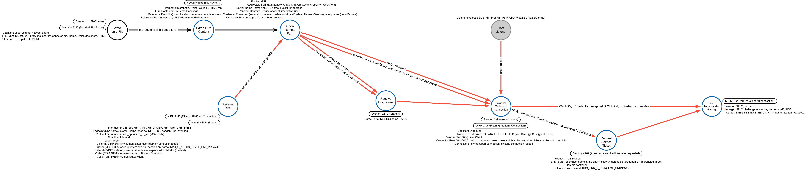
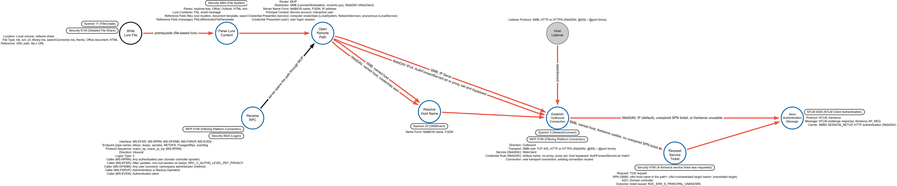

# Forced Authentication (Windows)

## Metadata

| Key          | Value             |
|--------------|-------------------|
| ID           | TRR0000           |
| External IDs | [T1187]           |
| Tactics      | Credential Access |
| Platforms    | Windows           |
| Contributors | John McGuinness   |

### Scope Statement

This TRR covers operations on a Windows host that cause a principal (a
service's security context or an interactive user's logon session) other than
the adversary's current execution context to open an adversary-named remote
resource and automatically send that principal's NTLM or Kerberos
authentication toward the adversary's host, ending when the authentication
leaves the victim host.

Name resolution poisoning, where the victim initiates a lookup and the
adversary answers it, is [T1557.001] Name Resolution Poisoning and SMB Relay
and is not covered, and relay, certificate enrollment through a relayed
identity ([T1649]), and offline cracking ([T1110.002]) are downstream of the
end state; a poisoned name can serve as the adversary-side name that a coerced
open resolves, but the poisoning itself is not modeled. Server-side
authentication caused through requests to separately installed products (SQL
Server, Exchange Server, Configuration Manager) is out of scope. An `http(s)`
reference that an application fetches through its own HTTP stack rather than
through the Multiple UNC Provider is not modeled, because no documented
instance on a current Windows build of automatic credential release to an
adversary host was found. Microsoft Entra joined devices in a hybrid
environment, Microsoft Entra Connect servers, and Azure-hosted Windows servers
are Windows targets: for such Entra joined devices the user-session procedure
applies, and what a coerced LocalSystem or NetworkService component on them
presents is not stated by any page found; Microsoft Entra Connect servers,
which must be installed on a domain-joined server, and Azure-hosted Windows
servers are targets of both procedures.

## Technique Overview

Forced Authentication is the collection of credential material by causing a
Windows principal to authenticate automatically to a host the adversary
controls. A Windows component that opens a remote name hands it to the
Multiple UNC Provider, a network redirector connects to the named host, and
the SMB session setup carries the NTLM challenge response or Kerberos service
ticket of the security context that performed the open, or the WebDAV request
carries that context's authentication under the NTLM or Negotiate scheme,
without a prompt. The adversary causes that open from outside the victim's
security context and receives the authentication message at a listener on
its own host.

## Technical Background

### UNC names and the Multiple UNC Provider

A UNC path begins with a server or host name prefaced by `\\`; the server name
can be a NetBIOS machine name or an IP or FQDN address
([File path formats on Windows systems - Microsoft Learn]). The Multiple UNC
Provider (MUP) is the kernel-mode component that channels all remote file
system accesses that use a UNC name to a network redirector capable of
handling the request ([IOCTL_REDIR_QUERY_PATH - Microsoft Learn]). If the
Distributed File System (DFS) client is enabled, which is the default, MUP
first passes the request for a `\\server\share` to the DFS client to determine
whether the request is for a DFS share, which the DFS client does by sending a
referral request to the `IPC$` share of an appropriate server
([MUP and DFS Interactions - Microsoft Learn]). MUP then sends a prefix
resolution request to each provider in the order given by the `ProviderOrder`
registry value, serially, and stops as soon as the first provider claims the
prefix; Microsoft's example value is `RDPNP,LanmanWorkstation,WebClient`, the
Terminal Services client, the SMB redirector, then the WebDAV redirector, and
each claimed prefix is cached subject to a timeout
([Support for UNC Naming and MUP - Microsoft Learn]). The same page applies
the serial rule to say that if `RDPNP` claims a prefix, MUP does not call the
SMB or WebDAV redirectors; that a prefix claimed by the SMB redirector never
reaches the WebDAV redirector is a derivation from that rule. For SMB requests
MUP redirects the request to the network provider `LanmanWorkstation`
(`ntlanman.dll`), which calls the Workstation service (`svchost.exe`), which
calls the network redirector `mrxsmb.sys`
([Offline files synchronization issue - Microsoft Learn]). When a Windows
system attempts to connect to an SMB resource, it automatically attempts to
authenticate and sends credential information for the current user to the
remote system ([T1187]). For the host name in an adversary-supplied path, in
either procedure, the Windows Server DNS zones page states that by default any
authenticated Active Directory user can create the A or PTR records in any
zone, and that when an owner creates such a record only the users or groups
specified in the ACL for that name that have write permission are enabled to
modify records corresponding to that name
([DNS zone types - Microsoft Learn]).

### SMB session setup and protocol selection

The SMB2 client sends the `SESSION_SETUP` request to request a new authenticated
session: if the server initiated authentication using SPNEGO, the request
buffer carries a token produced by the GSS protocol
([MS-SMB2 SESSION_SETUP Request - Microsoft Learn]), and SMB2 assumes SPNEGO
infrastructure on both the client and the server
([MS-SMB2 Prerequisites and Preconditions - Microsoft Learn]). If a new
session is being established, the client MAY reuse an existing connection such
that multiple sessions are multiplexed on the same connection, or establish a
new connection for the new session; the client SHOULD search its connection
table for a connection whose server name matches the application-supplied
server name and use it if found; and a session MUST NOT be reused when the
credentials for the request do not match those used in establishing the
existing session
([MS-SMB2 Application Requests a Connection to a Share - Microsoft Learn]).
The specification's product behavior notes 125 and 127 on that section state
that Windows-based clients always set up a new transport connection when
establishing a new session to a server and that Windows will reuse the
connection to establish a new session if a connection is available and the
server name matches; neither note carries a version scope, and which note
governs the SMB redirector on current Windows builds is not stated
([MS-SMB2 Product Behavior - Microsoft Learn]).

The Negotiate security package selects between Kerberos and NTLM
([Event 4624 - Microsoft Learn]): it selects Kerberos unless it can't be used
by one of the systems involved in the authentication or the calling app
didn't provide sufficient information to use Kerberos, and to allow Negotiate
to select Kerberos the client app must provide a service principal name
(SPN), a user principal name (UPN), or a NetBIOS account name as the target
name; otherwise, Negotiate always selects NTLM
([Microsoft Negotiate - Microsoft Learn]). Kerberos must resolve
`cifs/<server>` to the account that services the request; if that SPN is
still registered on a decommissioned file server's computer account, clients
get a ticket for the wrong account and the connection then fails or silently
falls back to NTLM, and a `HOST` SPN implicitly covers a set of service
classes that includes `cifs`
([Manage namespaces for Azure Files - Microsoft Learn]). A Windows
Kerberos client contacts the ticket-granting service in the target computer's
domain, presents a TGT, and asks for a ticket to the computer; the ticket can
be reused until it expires, but the first access to any computer requires a
trip to the ticket-granting service
([Key Distribution Center - Microsoft Learn]). The client stores the ticket
in its ticket cache ([Ticket-Granting Service Exchange - Microsoft Learn]),
which is kept per logon session ([klist - Microsoft Learn]), and presents that
ticket when it accesses the server again
([Session Tickets - Microsoft Learn]). Those pages describe the Windows
Kerberos client without naming the SMB client; that an SMB client whose logon
session holds an unexpired cached ticket for the SPN presents that ticket and
sends no new ticket request is a derivation. Microsoft's Kerberos event
logging page states, for the `KDC_ERR_S_PRINCIPAL_UNKNOWN` code that the
server sends if it doesn't recognize the SPN that a client requested access
to, that the client automatically sends a request to authenticate by using
NTLM, and that if the server is configured to allow NTLM authentication the
client authenticates and the user doesn't notice the issue
([Enable Kerberos event logging - Microsoft Learn]); the page names no client
application, protocol, or Windows version. Clients and member servers use the
`SpnCacheTimeout` value, default 15 minutes, to age out and purge negative
cache entries (SPN not found), and on domain controllers the SPN cache is
disabled
([Kerberos registry entries and KDC configuration keys - Microsoft Learn]).
In a Microsoft Kerberos troubleshooting scenario, after opening a UNC path to
a named server from Windows Explorer on a Windows 11 client, the `klist`
output should include a service ticket for `CIFS/<server>`
([Kerberos authentication log analysis scenario - Microsoft Learn]). That, on
a victim that is not a workgroup member, an SMB client whose target is a host
name and whose logon session holds no unexpired cached ticket for its SPN
sends a TGS request, unless Kerberos can't be used by one of the systems
involved in the authentication, whether or not the SPN is registered, a
registered SPN yielding a ticket and an unregistered SPN drawing
`KDC_ERR_S_PRINCIPAL_UNKNOWN` followed by the client's NTLM request, is a
derivation from those statements and from the target-name and workgroup
statements in the next paragraph: the client presents a name-based SPN, so
Negotiate selects Kerberos unless it can't be used by one of the systems
involved, and the workgroup rule is one such case; with no reusable cached
ticket the client contacts the ticket-granting service; and the KDC can only
answer a request it received. No page found states this for the Windows SMB
client and a host name with no registered SPN on current builds, or says
whether a negative SPN cache entry lets a repeat attempt within the timeout
skip the request.

By default Windows does not attempt Kerberos authentication for a host if the
hostname is an IP address and falls back to other enabled authentication
protocols like NTLM, and beginning with Windows 10 version 1507 and Windows
Server 2016, Kerberos clients can be configured to support IPv4 and IPv6
hostnames in SPNs through a registry entry that does not exist by default
([Configuring Kerberos over IP - Microsoft Learn]); an SMB request for a UNC
path using an IP address by default attempts NTLM
([Kerberos in Azure NetApp Files - Microsoft Learn]). When Negotiate is
selected, supplying no target name or an invalid target name causes Kerberos
to be skipped and NTLM to be used, and a target name that is not a properly
formed SPN, UPN, or NetBIOS-style domain name produces a "principal not found"
error from the domain controller, after which Negotiate falls back to NTLM
([Application Verifier Tests - Microsoft Learn]). NTLM must be used for
Windows authentication with systems configured as a member of a workgroup
([NTLM Overview - Microsoft Learn]).

Synacktiv's 2024 research ([Relaying Kerberos over SMB - Synacktiv])
describes the SMB client building its SPN through `SecMakeSPNEx2`: if the SPN
already contains a marshaled `CREDENTIAL_TARGET_INFORMATIONW` structure, it is
unmarshaled and used in subsequent calls, so the client asks for a Kerberos
ticket for `cifs/fileserver` but connects to the adversary-named host, and the
rogue SMB server receives the `AP_REQ` message; the demonstrated setup
registers a DNS record pointing the marshaled name at the adversary machine
and then uses any coercion technique to make the domain controller
authenticate. Whether the client looks up its ticket cache by the unmarshaled
SPN or by the marshaled name is not stated.

### The WebDAV redirector

In Windows Vista and later, the `WebClient` service is used to allow Windows
Explorer to interact with a WebDAV resource, and the service uses Windows HTTP
Services (WinHTTP) to perform network I/O operations to the remote host
([Credentials prompt when accessing WebDAV FQDN sites - Microsoft Learn]).
WinHTTP's automatic logon applies only to the NTLM and Negotiate authentication
schemes, with the current thread token or session token as the default
credentials ([Authentication in WinHTTP - Microsoft Learn]), and ATT&CK's
description of the lure chain names outbound NTLM over WebDAV on ports 80 and
443 ([DET0022 - MITRE ATT&CK]). That the default logon credentials the
`WebClient` service sends without a prompt use the NTLM or Negotiate scheme is
an application of the WinHTTP rule, not a statement of any page found. The
WebDAV credentials-prompt page states three cases in which credentials are sent
automatically. If no proxy is configured, WinHTTP sends credentials only to
local intranet sites: a URL whose server name contains no period is assumed to
be on a local intranet site, and a URL that contains periods is assumed to be on
the Internet, so no credentials are automatically sent to that server unless a
proxy is configured and the server is indicated for proxy bypass, which can be
through either the bypass list or the proxy configuration script; WinHTTP does
not check the security zone settings in Internet Explorer to determine whether a
website is in a zone that allows credentials to be sent automatically. After the
`AuthForwardServerList` URL list is configured, credentials automatically
authenticate to the listed WebDAV servers even if those servers are on the
Internet; the list is a registry value under
`HKLM\SYSTEM\CurrentControlSet\Services\WebClient\Parameters`, a URL that
matches any of the expressions in the list gets the user credential even if no
proxy is configured, the sample list includes any encrypted channel to a host
whose IP address is `172.169.4.6`, IPv6 is not to be used in the list, and the
`WebClient` service must be restarted after the registry is modified
([Error accessing a network drive mapped to a web share - Microsoft Learn]).
That automatic credential release on the WebDAV carrier occurs under any of the
three cases, and that the IPv4 sample entry makes an IPv4-literal host eligible,
is a derivation from those statements; that a dotted IPv4 address outside the
list and not indicated for proxy bypass falls under the period rule and receives
no automatic credentials is a derivation from the period rule on
[Credentials prompt when accessing WebDAV FQDN sites - Microsoft Learn]. The
WebDAV UNC path format is `\\server[@SSL][@port][\path]`, where `@SSL` is
optional and indicates a request for an SSL connection and `port` is an optional
port number, with standard ports 80 for `http` and 443 for `https`
([DavGetHTTPFromUNCPath function - Microsoft Learn]). Microsoft's SMB
interception defense page states that Windows clients may not require the
`WebClient` service to be running, that the service provides the WebDAV
protocol, that when users access files using WebDAV there is no method to force
a TLS-based connection over HTTPS, and that the `WebClient` could connect to
HTTP/80 if WebDAV has been enabled
([SMB interception defense - Microsoft Learn]).

Basic authentication over WebDAV is disabled by default unless the connection
is using SSL, and on Windows Vista, Windows 7, Windows 8, and Windows 8.1 the
WebDAV redirector is already installed
([Using the WebDAV Redirector - Microsoft Learn]). The `WebClient` (WebDAV)
service is deprecated and is not started by default in Windows
([Deprecated features for Windows client - Microsoft Learn]); the WebDAV
Redirector service is deprecated and is not installed by default in Windows
Server ([Features removed or deprecated in Windows Server - Microsoft Learn]).
On Windows 10, versions 1607, 1703, 1709, and 1809, the `ProviderOrder`
default value is `RDPNP,LanmanWorkstation,webclient` and `WebClient` is one of
the default network providers
([Network provider settings removed after in-place upgrade - Microsoft Learn]);
that page lists `WebClient` among the default network providers without
stating an installation state, and no Microsoft page found states the
installation state on Windows 11 or on Windows 10 outside those versions. When
the `WebClient` service is disabled, WebDAV requests are not transmitted
([MS15-020 - Microsoft Learn]). That on the WebDAV branch a start of the
service precedes the outbound connection wherever the service is not running
is a derivation from the service's role in the network I/O, the
disabled-service statement, and the not-started default; whether that start
happens automatically on demand, and which trigger events the service
registers, are not stated by any Microsoft page found, and the start is not
drawn on the DDM because no record of it is quoted.

### Which principal authenticates

A service running as LocalSystem acts as the computer on the network and
presents the computer's credentials to remote servers
([LocalSystem Account - Microsoft Learn]), in the format
`<domain_name>\<computer_name>$`
([Securing computer accounts - Microsoft Learn]). A service that runs in the
context of the NetworkService account presents the computer's credentials to
remote servers ([NetworkService Account - Microsoft Learn]). LocalService
presents anonymous credentials on the network
([LocalService Account - Microsoft Learn]). For an interactive user, the
Local Security Authority Subsystem Service (LSASS) stores credentials in
memory on behalf of users with active Windows sessions, and the stored
credentials let users access network resources such as file shares without
reentering their credentials for each remote service
([Credentials Processes in Windows Authentication - Microsoft Learn]). When a
user signs in to a Microsoft Entra joined device in a hybrid environment, the
local security authority (LSA) service enables Kerberos and NTLM
authentication on the device, and with SSO the device can access a UNC path on
an AD member server
([SSO to on-premises resources from Entra joined devices - Microsoft Learn]).
What a Microsoft Entra joined device outside a hybrid environment sends when
a cloud-only user's session opens a UNC path to an adversary host, and what a
coerced LocalSystem or NetworkService component on a Microsoft Entra joined
device inside or outside a hybrid environment presents on the network, are
not stated by any page found.

For the LSARPC case, MSRC states that an unauthenticated attacker could call
a method on the LSARPC interface and coerce the domain controller to
authenticate against another server using NTLM ([CVE-2021-36942 - MSRC]). For
the print spooler, Defender for Identity states that connecting to a domain
controller's print spooler and telling it to send the notification to the
system with unconstrained delegation exposes the domain controller computer
account credential, and that the Print Spooler is owned by SYSTEM
([Identity infrastructure security posture assessments - Microsoft Learn]).
MS-RPRN states that if the client provides authentication information, the
server SHOULD impersonate the client while processing a method
([MS-RPRN Transport - Microsoft Learn]). That a coerced component presents
its own process context rather than an impersonated caller, as a rule across
interfaces, is a derivation from those statements, and the impersonation
sentence shows the answer depends on where in processing the outbound open
occurs. The EFS service is hosted in `lsass.exe`
([File Encryption - Microsoft Learn]); the service accounts of the DFS
Namespace and File Server VSS Agent services are not stated; and the
`ElfrOpenBELW` method page does not state whether the EventLog service opens
the backup file in its own context or while impersonating the caller
([MS-EVEN ElfrOpenBELW - Microsoft Learn]).

### RPC over named pipes

Adding an endpoint to an interface's IDL definition allows the interface to be
called through any endpoint in that process, and specifying one does not
restrict access to the interface to that endpoint
([MIDL endpoint attribute - Microsoft Learn]). The `ncacn_np` sequence runs
RPC directly over SMB with no intermediate protocol; the server name,
endpoint, and credentials an application supplies when it creates the binding
handle are provided to SMB to identify the named pipe and its SMB session
([MS-RPCE RPC over SMB - Microsoft Learn]). A pipe is named
`\\ServerName\pipe\PipeName`, where `ServerName` is a remote computer or a
period for the local computer ([Pipe Names - Microsoft Learn]); opening one
over SMB2 is a tree connect whose share name is `IPC$`, the share name that
indicates the open targets a named pipe
([MS-SMB2 Application Requests Opening a Named Pipe - Microsoft Learn]), and
the `IPC$` share is created by the Server service to allow named pipe
connections to the server
([IPC$ share and null session behavior - Microsoft Learn]).

### Inbox RPC interfaces that accept a path or host argument

The interfaces below are the ones modeled on Receive RPC; each has a method
whose protocol specification places a path or host name in an argument. The
UUIDs and endpoints are from the specifications' transport and standards
pages ([MS-EFSR Transport - Microsoft Learn],
[MS-RPRN Standards Assignments - Microsoft Learn],
[MS-DFSNM Transport - Microsoft Learn],
[MS-FSRVP Standards Assignments - Microsoft Learn],
[MS-EVEN Transport - Microsoft Learn]) and the opnums from their method
tables ([MS-EFSR Server Message Processing - Microsoft Learn],
[MS-RPRN Print Server Methods - Microsoft Learn],
[MS-DFSNM Message Processing Events and Sequencing Rules - Microsoft Learn],
[MS-FSRVP Server Details - Microsoft Learn],
[MS-EVEN Server Message Processing - Microsoft Learn]).

| Interface | UUID | Endpoint | Method (opnum) | Path or host argument |
|---|---|---|---|---|
| MS-EFSR | `df1941c5-fe89-4e79-bf10-463657acf44d` (on `\pipe\efsrpc`); `c681d488-d850-11d0-8c52-00c04fd90f7e` (on `\pipe\lsarpc`) | `\pipe\efsrpc`, `\pipe\lsarpc` | `EfsRpcOpenFileRaw` (0), `EfsRpcEncryptFileSrv` (4) | `FileName`, an EFSRPC identifier |
| MS-RPRN | `12345678-1234-ABCD-EF00-0123456789AB` | `\pipe\spoolss` | `RpcRemoteFindFirstPrinterChangeNotificationEx` (65) | `pszLocalMachine`, the name of the client computer |
| MS-DFSNM | `4FC742E0-4A10-11CF-8273-00AA004AE673` v3.0 | `\PIPE\NETDFS` | `NetrDfsAddStdRoot` (12), `NetrDfsRemoveStdRoot` (13) | `ServerName`, the host name of the DFS root target |
| MS-FSRVP | `a8e0653c-2744-4389-a61d-7373df8b2292` | `\pipe\FssagentRpc` | `IsPathSupported` (8) | `ShareName`, the full path of the share in UNC format |
| MS-EVEN | `82273FDC-E32A-18C3-3F78-827929DC23EA` v0.0 | `\PIPE\eventlog` | `ElfrOpenBELW` (9) | `BackupFileName`, an NT Object Path of the backup file |

**MS-EFSR.** The client and server MUST communicate over RPC using named pipes
over SMB; connecting to `\pipe\efsrpc` selects the first UUID in the table and
connecting to `\pipe\lsarpc` the second
([MS-EFSR Transport - Microsoft Learn]), and calls are received at either
pipe ([MS-EFSR Server Message Processing - Microsoft Learn]). EFSRPC servers
SHOULD use UNC paths for EFSRPC identifiers
([MS-EFSR EFSRPC Identifiers - Microsoft Learn]). For `EfsRpcOpenFileRaw`,
whose `FileName` is an EFSRPC identifier, if the `CREATE_FOR_IMPORT` flag is
not set, the server MUST attempt to locate the object requested
([MS-EFSR EfsRpcOpenFileRaw - Microsoft Learn]); `EfsRpcEncryptFileSrv` takes
the same identifier type ([MS-EFSR EfsRpcEncryptFileSrv - Microsoft Learn]).
The server SHOULD use the RPC protocol to retrieve the identity of the caller
and enforce that the caller has the required permissions
([MS-EFSR Server Message Processing - Microsoft Learn]). The EFS service is
always installed with startup type Manual on Windows Server 2016 with Desktop
Experience
([Disabling system services on Windows Server 2016 - Microsoft Learn]). With
the CVE-2021-36942 updates, released August 10, 2021
([CVE-2021-36942 - MSRC]), `EfsRpcOpenFileRaw` using the `\pipe\lsarpc`
endpoint returns `ERROR_ACCESS_DENIED` on Windows Server 2008 through Windows
Server 2022 and Windows 7 through Windows 11; after the CVE-2021-43893 update
(Windows 7 and later, Windows Server 2008 R2 SP1 and later), Windows EFSRPC
servers require the `RPC_C_AUTHN_LEVEL_PKT_PRIVACY` authentication level on
all EFSRPC methods; after the CVE-2022-26925 updates, null-session EFSRPC
calls over `lsarpc` receive `RPC_S_ACCESS_DENIED`; Windows servers other than
Windows 2000, Windows XP, Windows Server 2003, Windows Vista, and Windows
Server 2008 listen for EFSRPC on both pipes; and the `\pipe\lsarpc` endpoint
is not available in Windows 11 v22H2 and later and Windows Server 2022, 23H2
and later ([MS-EFSR Product Behavior - Microsoft Learn]). MSRC describes the
CVE-2022-26925 update, released May 10, 2022, as detecting anonymous
connection attempts in LSARPC and disallowing them
([CVE-2022-26925 - MSRC]). The specification's product behavior note 39
states that opnums 10, 14, 17, and 23 to 44 are only used locally by Windows,
never remotely ([MS-EFSR Product Behavior - Microsoft Learn]). Whether EFSRPC
methods other than `EfsRpcOpenFileRaw`, called over `\pipe\efsrpc` by an
authenticated caller at packet privacy, still make a fully patched Windows
Server 2022 or 2025 or Windows 11 24H2 host authenticate outbound is not
stated by any Microsoft page found.

**MS-RPRN.** The specification states that the protocol uses RPC over named
pipes only ([MS-RPRN Overview - Microsoft Learn]). The well-known endpoint
`\pipe\spoolss` is used for RPC calls made from the print client to the print
server; the client MUST use no authentication and the server MUST accept
connections without authentication; and an endpoint with the same name MUST
also be used for the RPC calls the server makes to send printer change
notifications back to the client, `RpcReplyOpenPrinter` among them, and the
client MUST accept connections without authentication from the server for
those methods ([MS-RPRN Transport - Microsoft Learn]). The `pszLocalMachine`
argument of `RpcRemoteFindFirstPrinterChangeNotificationEx` is the name of
the client computer, the server MUST create a notification channel back to
the client by calling `RpcReplyOpenPrinter` on the client specified by that
name, and the method SHOULD assume that the handle to the printer or server
object can be used without further access checks
([MS-RPRN RpcRemoteFindFirstPrinterChangeNotificationEx - Microsoft Learn]).
Defender for Identity states that any authenticated user can remotely connect
to a domain controller's print spooler service, request an update on new
print jobs, and tell the domain controller to send the notification to the
system with unconstrained delegation
([Identity infrastructure security posture assessments - Microsoft Learn]).
On the named-pipe transport the callback is an RPC-over-named-pipe call to
`\pipe\spoolss` on the named client, which [RPC over named pipes] places on an
SMB session opened on `IPC$` for a UNC pipe name that MUP routes to a
redirector; that the callback therefore passes through the same remote open
as any other UNC access is a derivation. On Windows 11, version 22H2 and
later, by default RPC over TCP is used for print-related client-server
communications, RPC over named pipes is still available but disabled by
default, and by default the client or server only listens for incoming
connections via RPC over TCP
([Windows 11 RPC connection updates for print - Microsoft Learn]). The
Printers policy CSP, applicable to the Pro, Enterprise, Education, and IoT
Enterprise editions of Windows 11, version 22H2 and later, states that a
policy setting controls which protocol and protocol settings to use for
outgoing RPC connections to a remote print spooler, that by default RPC over
TCP is used and authentication is always enabled, and that for RPC over named
pipes authentication is always enabled for domain joined machines and disabled
for non domain joined machines ([Policy CSP Printers - Microsoft Learn]), which
differs from the specification's no-authentication rule for `\pipe\spoolss`.
Whether the `RpcReplyOpenPrinter` callback uses RPC over TCP on those builds
or on Windows Server 2025, whether a callback over RPC over TCP carries
RPC-layer authentication, and the print RPC defaults for any Server SKU, are
not stated by any Microsoft page found. The Print Spooler is always installed
with startup type Automatic on Windows Server 2016 with Desktop Experience,
and Microsoft rates it OK to disable if not a print server or a DC
([Disabling system services on Windows Server 2016 - Microsoft Learn]).

**MS-DFSNM.** The protocol uses RPC over SMB on `\PIPE\NETDFS` and allows any
user to establish a connection to a DFS server; the DFS service MUST verify
whether the user has administrator privileges to the namespace
([MS-DFSNM Transport - Microsoft Learn]). The `NetrDfsAddStdRoot` and
`NetrDfsRemoveStdRoot` method pages define `ServerName` as the host name of
the DFS root target and state no step that opens or connects to the
`ServerName` host ([MS-DFSNM NetrDfsAddStdRoot - Microsoft Learn],
[MS-DFSNM NetrDfsRemoveStdRoot - Microsoft Learn]); for `NetrDfsAddStdRoot`
the `RootShare` share MUST already exist, the method MUST fail with
`NERR_NetNameNotFound` if it does not, and the server MUST synchronously
insert the namespace object into the local information store, without the
page naming the host on which the share check runs
([MS-DFSNM NetrDfsAddStdRoot - Microsoft Learn]). The Win32 `NetDfsAddStdRoot`
page places that share on the server that will host the new DFS root target
and states that the function does not create a new share
([NetDfsAddStdRoot function - Microsoft Learn]); whether the DFS Namespace
service checks the share on the host named by `ServerName` or only locally is
not stated by any page found. The product behavior note that Windows 2000 and
Windows Server 2008 and later ignore `ServerName` and use the local NetBIOS
host name instead is attached to `NetrDfsAddFtRoot`, opnum 10, not to opnums
12 and 13 ([MS-DFSNM Product Behavior - Microsoft Learn],
[MS-DFSNM NetrDfsAddFtRoot - Microsoft Learn]). Defender for Identity
documents an alert stating that an attack using the MS-DFSNM API can be used
to force a domain controller to authenticate against a remote machine under
an attacker's control, which triggers NTLM authentication
([Defender for Identity security alerts - Microsoft Learn]). Vendor research
from 2022 states that any authenticated user can make a remote procedure call
to the service and execute `NetrDfsAddStdRoot` or `NetrDfsRemoveStdRoot`,
that both perform a permissions check through
`AccessImpersonateCheckRpcClient` that returns access denied for users who
aren't allowed to do any changes to DFS, and that when access is denied they
block the adding or removing of a stand-alone namespace but still perform a
request to the specified host name or IP address
([MS-DFSNM coercion micropatch - 0patch]); whether the server contacts the
`ServerName` host before or after the namespace administrator check is not
stated by any Microsoft page found. The Win32 `NetDfsAddStdRoot` and
`NetDfsRemoveStdRoot` functions require the caller to have Administrator
privilege on the DFS server ([NetDfsAddStdRoot function - Microsoft Learn],
[NetDfsRemoveStdRoot function - Microsoft Learn]).

**MS-FSRVP.** The endpoint is available only on RPC over named pipes, and any
user can establish a connection to the RPC server
([MS-FSRVP Transport - Microsoft Learn]). `IsPathSupported` takes
`ShareName`, the full path of the share in UNC format, and the server MUST
verify that the share identified by `ShareName` exists on the server, MUST
identify the file store on which `ShareName` is hosted in an
implementation-defined manner, and MUST set `OwnerMachineName` to the name of
the server the client is required to connect to in order to create shadow
copies for `ShareName` ([MS-FSRVP IsPathSupported - Microsoft Learn]). The
authentication level is `RPC_C_AUTHN_LEVEL_PKT_INTEGRITY` or
`RPC_C_AUTHN_LEVEL_PKT_PRIVACY` ([MS-FSRVP Server Details - Microsoft Learn]),
and Windows-based servers additionally check whether the caller is a member
of the local administrators or backup operators group
([MS-FSRVP Security - Microsoft Learn]). MSRC's CVE-2022-30154 entry states
that systems running Windows Server with the optional component File Server
VSS Agent Service installed are vulnerable and that by default systems
running Windows Server are not vulnerable ([CVE-2022-30154 - MSRC]); a news
report quotes Microsoft stating that the MS-FSRVP coercion abuse was
mitigated with CVE-2022-30154
([Microsoft statement on the MS-FSRVP fix - BleepingComputer]).

**MS-EVEN.** The server interface is identified by the UUID in the table on
the well-known endpoint `\PIPE\eventlog`, and the server MUST specify RPC over
named pipes (`ncacn_np`) as the protocol sequence
([MS-EVEN Transport - Microsoft Learn]). `ElfrOpenBELW` instructs the server
to return a handle to a backup event log, and the caller MUST have permission
to read the file containing the backup event log for this to succeed;
`BackupFileName` points to an NT Object Path of the file where the backup
event log is located, the server MUST verify that the caller has read access
to the file and MUST attempt to open the file, failing the method if either
does not succeed, and the server MUST ignore the `UNCServerName` argument
([MS-EVEN ElfrOpenBELW - Microsoft Learn]). The product behavior note that
UNC paths can only be used as `BackupFileName` for Windows NT Workstation 4.0
SP2 and Windows 2000 is attached to `ElfrClearELFW`, opnum 0, not to
`ElfrOpenBELW` ([MS-EVEN Product Behavior - Microsoft Learn],
[MS-EVEN ElfrClearELFW - Microsoft Learn]); whether `ElfrOpenBELW` accepts a
UNC `BackupFileName` on current Windows builds is not stated by any page
found, and the context of its open is the open point in
[Which principal authenticates]. Because the server makes access
control decisions as part of its responses, the client MUST authenticate to
the server ([MS-EVEN Server Message Processing - Microsoft Learn]).

A community catalog lists coercion methods in further protocols (MS-COMA,
MS-DHCPM, MS-DNSP, MS-PAR, MS-PLA, MS-RAIW, MS-UAMG, MS-VDS, MS-WSP)
([Windows coerced authentication methods - GitHub]). For MS-UAMG, Microsoft
states that the Windows Update Agent API used from a remote computer requires
administrator privileges ([Using WUA from a remote computer - Microsoft Learn])
and that `IUpdateServiceManager::AddScanPackageService`, which takes the path
of the scan file to register, cannot be called from a remote computer
([IUpdateServiceManager AddScanPackageService - Microsoft Learn]); the
catalog lists the method on `IUpdateServiceManager2`. The fix status and
per-method privilege requirements of the other cataloged interfaces are not
stated by any page found, and the server actions of the MS-PAR, MS-COMA,
MS-PLA, MS-UAMG, and MS-VDS methods on a path argument are not quoted.
Defender for Identity documents alerts for EFSRPC coercion
([Defender for Identity XDR alerts - Microsoft Learn]) and for MS-DFSNM
coercion ([Defender for Identity security alerts - Microsoft Learn]); those
are product alerts, not records of an operation.

### Content parsed in a user session

An application can set the location (path and index) of a shortcut's icon
with `IShellLink::SetIconLocation` ([Shell Links - Microsoft Learn]); the path
is the fully qualified path of the file that contains the icon
([ShellLinkObject.SetIconLocation - Microsoft Learn]). CISA's report on
Dragonfly states that default Windows functionality enables icons to be
loaded from a local or remote Windows repository, and that with the icon path
set to a remote server controlled by the actors, when the user browses to the
directory, Windows attempts to load the icon and initiate an SMB
authentication session during which the active user's credentials are passed
([Russian Government Cyber Activity Targeting Critical Infrastructure - CISA]).
ATT&CK describes a modified `.LNK` or `.SCF` file with the icon filename
pointing to an external reference that forces the system to load the resource
when the icon is rendered ([T1187]). A vendor states that `.scf`, `.url`, and
`.lnk` files can contain references to remote UNC paths, and that when
Windows Explorer processes the LNK file's icon location field it spawns an
outbound SMB connection from `explorer.exe`
([Weaponizing SMB shares to steal domain credentials - Security Cafe]). The
Explorer policy "Allow the use of remote paths in file shortcut icons"
determines whether remote paths can be used for file shortcut (`.lnk` file)
icons; if it is enabled, file shortcut icons are allowed to be obtained from
remote paths, and if it is disabled or not configured, file shortcut icons
that use remote paths are prevented from being displayed; the policy's CSP
applicability rows list Windows 10, version 2004 with KB5005101 and later and
Windows 11, version 21H2 and later
([Policy CSP ADMX_WindowsExplorer - Microsoft Learn]). On Windows 11, version
22H2 and later, the "Allow theme files from network locations" policy
determines whether remote paths can be used for resources inside a Windows
desktop theme (`.theme` or `.themepack`) file, and when it is not configured
the default behavior is to block remote resources in theme files
([Policy CSP ADMX_Desktop - Microsoft Learn]). The June 9, 2026 update
KB5094126 for Windows 11, versions 24H2 and 25H2, introduces a security
hardening change to how Windows processes `desktop.ini` files, after which
some users might notice missing custom folder icons or localized folder names
for content from downloaded or remote locations, while access to folders is
not affected ([KB5094126 June 9, 2026 update - Microsoft Support]). Whether
those three controls prevent the network open of the remote path or only the
display of the icon is not stated by any page found. The Internet shortcut
(`.url`) object exposes the `PID_IS_ICONFILE` property, the file that contains
the icon ([Internet Shortcuts - Microsoft Learn]); no Microsoft page found
documents its handling of a remote path, and no Microsoft page found documents
SCF icon handling. Libraries aggregate items from local and remote storage
locations into a single view in Windows Explorer
([Library Schema - Microsoft Learn]); a search connector's `<url>` element can
be a `file://` URL or a URL that uses the `knownfolders:` protocol, and
Windows 7 creates the ShellLink from that value on the first load of the
library ([Search Connector url Element - Microsoft Learn],
[Search Connector simpleLocation Element - Microsoft Learn]); the Search
Connector Description schema covers `.searchConnector-ms` files and the
`searchConnectorDescriptionType` elements of `.library-ms` files
([Search Connector Description Schema - Microsoft Learn]). The `search-ms`
application protocol is a convention for querying the Windows Search index
that enables applications, like Windows Explorer, to query the index with
parameter-value arguments; its `crumb` parameter's `location` property
specifies a path to search, including a folder on a remote machine through
`crumb=location:<URL-encoded path>`, and Windows Vista can bypass the Indexer
and traverse the directory directly if the location is outside the Indexer's
crawl scope ([search-ms protocol - Microsoft Learn],
[Using the crumb parameter - Microsoft Learn]). The crumb page describes the
location implementation as available only on Windows Vista, while the
parameter-value page states that Windows Vista and later support it
([Parameter-value arguments - Microsoft Learn]); whether current Windows 11
Explorer, resolving a `search-ms` URI whose location names a UNC path, opens
that remote path and authenticates without further user action, and through
which content paths the URI reaches Explorer, is not stated by any page
found.

Microsoft's CVE FAQs name the interactions short of opening a file. For
CVE-2025-24054, minimal interaction with a malicious file by a user such as
selecting (single-click), inspecting (right-click), or performing an action
other than opening or executing the file could trigger the vulnerability
([CVE-2025-24054 - MSRC]). For CVE-2025-24071 and CVE-2025-50154, a user
would need to be tricked into opening a folder that contains a specially
crafted file ([CVE-2025-24071 - MSRC], [CVE-2025-50154 - MSRC]). For
CVE-2024-21320, the attacker would have to convince the user to manipulate
the specially crafted file, but not necessarily click or open it, and systems
that have disabled NTLM are not affected ([CVE-2024-21320 - MSRC]). Starting
with the Windows security updates released on and after October 14, 2025,
File Explorer automatically disables the preview feature for files downloaded
from the internet, a change Microsoft describes as mitigating a vulnerability
where NTLM hash leakage might occur if users preview files containing HTML
tags referencing external paths
([KB5070960 File Explorer preview for internet files - Microsoft Support]).
Which Explorer interaction resolves each file type on current Windows beyond
those statements is not stated.

ATT&CK describes a spearphishing attachment containing a document with a
resource that is automatically loaded when the document is opened, such as a
request similar to `file://[remote address]/Normal.dotm` ([T1187]). CISA
states that as part of the standard processes executed by Microsoft Word,
that request authenticates the client with the server, sending the user's
credential hash to the remote server before retrieving the requested file,
and that transfer of credentials can occur even if the file is not retrieved
([Russian Government Cyber Activity Targeting Critical Infrastructure - CISA]).
MSTIC describes an HTML lure whose URL, prefixed with a `file://` protocol
handler, is indicative of an attempt to coax the operating system to send
NTLMv2 material to the actor-controlled IP address over port 445
([Breaking down NOBELIUM's early-stage toolset - Microsoft Security Blog]).
For CVE-2023-23397, MSRC states that a specially crafted email triggers
automatically when it is retrieved and processed by the Outlook client, which
could lead to exploitation before the email is viewed in the Preview Pane
([CVE-2023-23397 - MSRC]). Microsoft's investigation guidance states that the
message's `PidLidReminderFileParameter` MAPI property must be set to a UNC
path share on a threat actor-controlled server, reached over SMB on TCP port
445, that the connection to the remote SMB server sends the user's Net-NTLMv2
hash in a negotiation message, and that with the updates installed the
parameter is not honored if the path points outside of the local or trusted
network locations
([Investigating attacks using CVE-2023-23397 - Microsoft Security Blog]). The
property specifies the filename of the sound that a client should play when
the reminder for that object becomes overdue
([PidLidReminderFileParameter - Microsoft Learn]). When an Outlook 2016
account is configured to use Cached Exchange Mode, a local copy of the user's
Exchange mailbox is kept in an offline data file (`.ost`) that is updated from
Exchange Server in the background when the user is online
([Plan and configure Cached Exchange Mode - Microsoft Learn]); in Online mode
an `.ost` file is not used
([Outlook performance issues with too many items - Microsoft Learn]). Where
the client reads the message's properties from when it processes a reminder,
and any host record of that processing, are not stated.

### NTLM restrictions on current builds

Starting with Windows Server 2025 and Windows 11, version 24H2, SMB can be
configured to block NTLM, and the SMB client supports blocking NTLM
authentication for remote outbound connections
([SMB NTLM blocking - Microsoft Learn]); Microsoft states that with that
option an attacker who tricks a user or application into sending NTLM
challenge responses to a malicious server no longer receives any NTLM data
([What's new in Windows 11, version 24H2 - Microsoft Learn]). The
`NTLM/BlockAll` policy, applicable to the Pro, Enterprise, Education, and IoT
Enterprise editions of Windows 11, version 24H2 and later, blocks all outbound
NTLM authentication regardless of account type or target and defaults to
Disabled ([Policy CSP NTLM - Microsoft Learn]). The "Restrict NTLM: Outgoing
NTLM traffic to remote servers" policy defaults to Allow all
([Policy CSP LocalPoliciesSecurityOptions - Microsoft Learn]). Members of the
Protected Users group can't authenticate by using NTLM, Digest
Authentication, or CredSSP ([Understand security groups - Microsoft Learn]),
and accounts for services and computers cannot be members of Protected Users
([How to configure protected accounts - Microsoft Learn]). All versions of
NTLM are deprecated, and NTLMv1 is removed starting in Windows 11, version
24H2 and Windows Server 2025
([Deprecated features for Windows client - Microsoft Learn]).

### Telemetry sources

WFP 5156 (Filtering Platform Connection) generates when the Windows Filtering
Platform has allowed a connection; its Direction field gives the direction of
the allowed connection and Application Name the full path and name of the
executable for the process ([Event 5156 - Microsoft Learn]). Security 4624
(Logon) generates when a logon session is created, on the computer that was
accessed; logon type 3, Network, is a user or computer logged on to the
computer from the network ([Event 4624 - Microsoft Learn]). Neither page
names RPC, a named pipe, or an SMB session. That a remote caller's named-pipe
call on an authenticated SMB session produces both records on the victim is a
derivation: the caller's connection is one the Windows Filtering Platform
allows, and the `ncacn_np` sequence runs directly over SMB with the binding's
credentials identifying the SMB session opened on `IPC$`, as described in
[RPC over named pipes]. For an inbound MS-RPRN call over RPC over TCP the
caller's TCP connection is allowed by the same platform, so the 5156
placement is the same derivation. The Printers policy CSP states, for Windows
11, version 22H2 and later, that by default incoming RPC connections to the
print spooler are allowed only over TCP and use the Negotiate authentication
protocol, and, for Windows 11, version 24H2 and later, that by default packet
level privacy is enabled for RPC for incoming connections
([Policy CSP Printers - Microsoft Learn]); Microsoft's logon-type reference
lists RPC calls among the examples of logon type 3, Network
([Logon types and reusable credentials - Microsoft Learn]); and the
Security 4624 (Logon) generation statement above applies. That an
authenticated inbound MS-RPRN call over RPC over TCP to a Windows 11 22H2 or
later spooler with default listener settings produces Security 4624 (Logon)
with logon type 3 on the victim is a derivation from those statements; no
page found states it for the spooler, and the listener defaults are stated
for client editions only. Security 5145 (Detailed File Share) generates on
every access to a network share object, where Share Path can be empty, for
example for `IPC$`, and Relative Target Name is relative to the share
([Event 5145 - Microsoft Learn]); Security 5140 (File Share) generates once
per session, on the first access attempt ([Event 5140 - Microsoft Learn]).
That a named-pipe open over `IPC$` writes those two records, with the pipe
name in Relative Target Name, is a derivation. Microsoft's page for Security
5712 (RPC Events) states that it appears the event never occurs
([Event 5712 - Microsoft Learn]).

Sysmon 11 (FileCreate) records when a file is created or overwritten, and
Sysmon 22 (DNSEvent) records DNS queries issued by a process, regardless of
whether the query succeeds ([Sysmon events - Microsoft Learn]). Security 4663
(File System) indicates that a specific operation was performed on an object;
it generates only if the object's SACL has the required ACE for the specific
access right used, it has no Failure events, it records the object name (the
path, for a file) and the full path of the accessing process's executable,
and `ReadData` is the right to read a file's data
([Event 4663 - Microsoft Learn]); that a file read is recorded only where the
file's SACL carries an ACE for `ReadData` is an application of that rule. The
reference page for Security 5145 (Detailed File Share) defines Source Address
as the source IP address from which access was performed, an IPv6 address or
`::ffff:IPv4` address of a client, and Share Path as the full system (NTFS)
path for the accessed share ([Event 5145 - Microsoft Learn]); the Audit
Detailed File Share policy, when enabled, audits access to all shared files and
folders on the system ([Policy CSP Audit - Microsoft Learn]), and audit events
for the file system are generated only for objects that have configured
SACLs, and only if the type of access requested and the account making the
request match the SACL
([Advanced audit policy configuration - Microsoft Learn]). That, for a lure
file on a share, Security 5145 (Detailed File Share) is written by the host
that serves the share with the reading client in Source Address, that
Security 4663 (File System) for the lure file is written by the host whose
file system holds the object and its SACL, also the serving host, that the
reading host writes neither record for the remote object, and that a share
served by a non-Windows host writes neither record, is a derivation from
those statements. Sysmon 17 (Pipe Created) generates when a named pipe is
created, and Sysmon 18 (Pipe Connected) logs when a named pipe connection is
made between a client and a server ([Sysmon - Microsoft Learn]); the built-in
Sysmon events page groups them as named pipe events that record creation and
connection to named pipes ([Sysmon events - Microsoft Learn]). Whether Sysmon
18 (Pipe Connected) records a connection made by a remote client opening the
pipe over SMB through `IPC$` to a named pipe on the host where Sysmon runs,
and which process it attributes such a connection to, is not stated by any
page found, so neither event labels Receive RPC: Sysmon 17 (Pipe Created)
records the pipe's creation, and the question on Sysmon 18 (Pipe Connected)
is open. No reference page was found for the SMB client operational events
that one Microsoft page lists in a query for successful UNC and mapped-drive
connections ([Azure Local disconnected operations security - Microsoft Learn]),
or for a kernel file event naming a remote path and the opening process.
Sysmon 3 (NetworkConnect) logs TCP and UDP connections on the machine, is
disabled by default, and links each connection to a process through the
ProcessId and ProcessGuid fields, with source and destination host names, IP
addresses, and port numbers ([Sysmon - Microsoft Learn]); built-in Sysmon is
disabled by default and must be explicitly enabled
([Enable built-in Sysmon - Microsoft Learn]). Which process Sysmon 3
(NetworkConnect) and WFP 5156 (Filtering Platform Connection) attribute an
outbound SMB connection to when the connection originates in the kernel-mode
SMB redirector is not stated on either record's page. Security 4769 (A
Kerberos service ticket was requested) generates on each Kerberos TGS ticket
request the Key Distribution Center gets, and only on domain controllers; if
TGS issue fails, a Failure event carries a Failure Code not equal to `0x0`,
some errors are reported only when the `KdcExtraLogLevel` registry value is
set, with flag `0x01` auditing SPN unknown errors, and Failure Code `0x7` is
`KDC_ERR_S_PRINCIPAL_UNKNOWN`, an error that can occur if the domain controller
can't find the server's name in Active Directory
([Event 4769 - Microsoft Learn]). The `KdcExtraLogLevel` entry has a default
value of 2, and value 1 (`0x1`) audits unknown SPN errors in the security
event log with Event ID 4769 logged as a failed audit
([Kerberos registry entries and KDC configuration keys - Microsoft Learn]).
That a domain controller at the default value writes no 4769 failure record
for a TGS request for an SPN it cannot find, so that, of the two outcomes
modeled on the Request Service Ticket branch, the record by default exists
for the issued ticket only, is a derivation from those two pages.

Windows 11, version 24H2 and Windows Server 2025 introduce NTLM audit logging
for clients, servers, and domain controllers; by default the events are
enabled, and each audit log is split into two event IDs with the same
information that differ only by event level. The client logs record outgoing
NTLM authentication attempts, with details about the applications or services
initiating NTLM connections and a Usage Id/Reason field; the client record is
written to the `Microsoft-Windows-NTLM/Operational` log as event ID 4020
(Information), labeled NTLM 4020 (NTLM Client Authentication) in this TRR, or
4021 (Warning), with the text "This machine attempted to authenticate to a
remote resource via NTLM." and the fields Process Name, Target Machine, and
Reason ID. The page's audit levels state that Information indicates standard
NTLM events, such as NTLMv2 authentication, where no reduction in security is
detected, that Warning indicates a downgrade of NTLM security, such as the use
of NTLMv1, and that an event might be marked Warning for instances such as
NTLMv1 usage detected by the client, server, or domain controller, Enhanced
Protection for Authentication marked as not supported or insecure, or certain
NTLM security features, such as the message integrity check (MIC), not being
used. The client record's Usage Id/Reason field highlights why NTLM
authentication was used, with values that include 5 (the target name was
missing or empty), 6 (the target name could not be resolved by Kerberos or
other protocols), and 7 (the target name contains an IP address), and the
record carries a Target Resource field holding the SPN. In accordance with
Microsoft controlled feature rollout, the changes first gradually roll out to
Windows 11, version 24H2 machines, followed later by Windows Server 2025
machines including domain controllers
([KB5064479 NTLM auditing enhancements - Microsoft Support]). With the
"Restrict NTLM: Outgoing NTLM traffic to remote servers" policy set to Audit
all, the client computer logs an event for each NTLM authentication request
to a remote server in the Operational log under Applications and Services
Log/Microsoft/Windows/NTLM
([Policy CSP LocalPoliciesSecurityOptions - Microsoft Learn]), and no page
found states that event's ID. For the Kerberos branch on any build, no
client-host record of the outbound authentication with its own reference page
was found: client-side Kerberos event logging is turned off by default, the
`LogLevel` registry entry defaults to 0, and if it is set to any non-zero
value all Kerberos-related events are logged in the System event log, with no
event ID named on either page
([Enable Kerberos event logging - Microsoft Learn],
[Kerberos registry entries and KDC configuration keys - Microsoft Learn]).

## Procedures

| ID            | Title                                         | Tactic            |
|---------------|-----------------------------------------------|-------------------|
| TRR0000.WIN.A | Path-Taking Request to an Inbox RPC Interface | Credential Access |
| TRR0000.WIN.B | Content Parsed in a User Session              | Credential Access |

### The shared pipeline

Both procedures converge at Open Remote Path and share every operation after
it, and each procedure's DDM contains the entire model with the active path
in red.

Open Remote Path is the operation at which the coerced component hands the
adversary-supplied name to MUP, which routes it to the SMB or WebDAV
redirector as described in [UNC names and the Multiple UNC Provider]; the node
carries the router, the redirector, the server-name form, the principal
context, and the credential presented for each principal as properties, and it
carries no telemetry label because no reference page was found for the SMB
client operational events or for a kernel file event naming a remote path and
the opening process. Four conditional arrows leave it. If the SMB redirector
claims the prefix and the host is a name, or if `WebClient` claims the prefix,
the host is a name, and WinHTTP sends credentials to it, the victim resolves
the name at Resolve Host Name, which carries Sysmon 22 (DNSEvent); if the SMB
redirector claims the prefix and the host is an IP literal, or if `WebClient`
claims the prefix and the IPv4 literal matches `AuthForwardServerList` or,
when a proxy is configured, is indicated for proxy bypass, the path goes
directly to Establish Outbound Connection. The WebDAV arrows carry the
credential cases stated in [The WebDAV redirector]; an IPv4 literal outside
the list that is not, with a proxy configured, indicated for proxy bypass has
no WebDAV arrow, because of the period-rule derivation in that section, and
an IPv6 literal on the WebDAV carrier is not drawn. Establish Outbound
Connection carries Sysmon 3 (NetworkConnect) and WFP 5156 (Filtering Platform
Connection) with Direction Outbound. Its transport property is SMB over TCP
445, or HTTP or HTTPS for WebDAV in the `@SSL` and `@port` path forms, where
the `WebClient` service performs the network I/O; its
`Credential Rule (WebDAV)` property lists the three credential cases (a
dotless name with no proxy, a proxy-bypassed host, and an
`AuthForwardServerList` match), placed on this node rather than on Open
Remote Path because WinHTTP applies the rule during the service's network I/O
after MUP has chosen the redirector; and its `Connection` property carries
both values the MS-SMB2 section quoted in
[SMB session setup and protocol selection] permits, a new transport
connection or an existing connection reused. Both labels on the node are
connection records, so where the client reuses a connection one record may
cover two authentications; that reading is a derivation from the MS-SMB2
statements in [SMB session setup and protocol selection], where the governing
product note is stated as open, and the two records' definitions. Host Listener
feeds it as a prerequisite and is drawn gray with a gray fill: the listener
runs on the adversary-controlled server that receives the victim's
authentication, and that it produces no record on the victim host is a
derivation. From the connection, if the SMB redirector carries the open, the
victim is not a workgroup member, the target is a name, the logon session
holds no unexpired cached ticket for its SPN, and Kerberos can be used by the
systems involved, the victim requests a service ticket from a domain
controller at Request Service Ticket, which carries Security 4769 (A Kerberos
service ticket was requested) under the default-value scope stated in
[Telemetry sources]; that the request is sent whether or not the SPN is
registered is the derivation named in
[SMB session setup and protocol selection], with its residual open point
stated there, the Negotiate exception and the workgroup rule as one case of
it are the statements cited there, the cached-ticket condition is the
derivation named in the same section, and the marshaled-target case is drawn
on this same branch, with `cifs/<unmarshaled target name>` as a second SPN
property, because its source pairs the marshaled name with any coercion
trigger, which makes it a protocol branch downstream of either procedure
rather than a trigger of its own. The branch is scoped to the SMB carrier
because whether the `WebClient` request to a named WebDAV host uses
Negotiate resolving to Kerberos, which SPN it presents, and whether it causes
a TGS request is not stated by any page found. The node's `Outcome` property
carries the two outcomes the node models: a ticket is issued and the Kerberos
`AP_REQ` follows, or the KDC returns `KDC_ERR_S_PRINCIPAL_UNKNOWN` and the
client automatically sends an NTLM request, so NTLM reaches the end state
through this branch as well. If the victim is a workgroup member, the target
is an IP literal (by default; Kerberos clients configured for IP-address SPNs,
as stated in [SMB session setup and protocol selection], are not drawn), an
unexpired cached ticket exists, Kerberos can't be used by one of the systems
involved, or the WebDAV redirector carries the open (a TGS request on that
carrier, not stated as noted above, is not drawn), the connection proceeds
directly to Send Authentication Message. That node is the end state: the NTLM
challenge response or the Kerberos `AP_REQ`, carried in the SMB2
`SESSION_SETUP` request, or, on the WebDAV branch, an authentication under
the NTLM or Negotiate scheme carried in the WinHTTP request, whose scheme and
credential handling are described in [The WebDAV redirector]. It carries
NTLM 4020 (NTLM Client Authentication), the Information-level event ID, on
the NTLM branch under the build and rollout condition in [Telemetry sources];
the Warning-level event ID 4021 described there is not a label on the node,
and the node carries no label on the Kerberos branch or on earlier builds.

### Procedure A: Path-Taking Request to an Inbox RPC Interface (TRR0000.WIN.A)

The operation unique to this procedure is Receive RPC: a remote caller invokes
a method on one of the interfaces in
[Inbox RPC interfaces that accept a path or host argument] whose argument
names a path or host, and the hosting component opens that name through MUP.
The arrow from Receive RPC to Open Remote Path is conditional on the server
opening the path through MUP, and the per-interface basis in
[Inbox RPC interfaces that accept a path or host argument] is as follows:
the MS-EFSR method page states that the server MUST attempt to locate the
object when the `CREATE_FOR_IMPORT` flag is not set and the MS-EVEN method
page that the server MUST attempt to open the file, and the MS-RPRN page
states a call to the named client whose route through Open Remote Path is
the named-pipe derivation; the MS-DFSNM and MS-FSRVP method pages state no
step that opens or connects to the named host, so for those two interfaces
the arrow rests on the Defender for Identity alert text and the news report
quoted in [Inbox RPC interfaces that accept a path or host argument],
respectively. The interface, endpoint, and protocol sequence are properties of
Receive RPC, and the methods and opnums are listed in the table in
[Inbox RPC interfaces that accept a path or host argument]; none of them is a
separate procedure, because they change only the request that reaches the
hosting component, and adding an endpoint to an interface's IDL definition
allows the interface to be called through any endpoint in that process. The
`Caller` properties carry the per-interface authorization from the same section.
The authenticating party per interface, and its open points, are stated in
[Which principal authenticates]. The one prerequisite is Host Listener. Atomic
Red Team Test 1 ([Atomic Red Team T1187 - GitHub]) is an instance of this
procedure through MS-EFSR, using the LSARPC named pipe
([EFSRPC coercion proof-of-concept README - GitHub]); whether its default
method still produces outbound authentication on a host with the CVE-2021-36942
update is not stated.

Receive RPC carries WFP 5156 (Filtering Platform Connection) with Direction
Inbound and Security 4624 (Logon) with logon type 3. Their placement is the
derivation stated in [Telemetry sources], which also states the inbound
MS-RPRN case over RPC over TCP.

Several candidate paths would be instances or branches of this procedure and
are not drawn, each because the point that would place it on the model is
open or a derivation.

A `RpcReplyOpenPrinter` callback over RPC over TCP would be a connect-back
from Receive RPC that bypasses Open Remote Path; whether the callback uses
that transport on Windows 11 22H2 and later or on Windows Server 2025, and
whether such a callback carries RPC-layer authentication, are not stated, as
recorded in [Inbox RPC interfaces that accept a path or host argument].

A DCOM-hosted interface would add an activation request on the victim before
Receive RPC: at a rudimentary level, activation consists of sending the object
activation service on the remote machine a class identifier, one or more
IIDs, and optionally an initialization storage reference
([MS-DCOM Activation - Microsoft Learn]), and it returns the object references
and the object exporter's RPC bindings
([MS-DCOM Activation Response - Microsoft Learn]). That the activation is a
victim-side operation before Receive RPC is a derivation, no event reference
page or System-log article found states a record of a successful activation,
and the server actions of the cataloged DCOM methods on a path argument are
not quoted.

Cross-session activation, which would be an instance of this procedure with
the session owner as the authenticating principal, starts a local server
process in a specified session for applications configured to run as the
interactive user
([Session-to-Session Activation with a Session Moniker - Microsoft Learn]),
and when a client uses the session moniker to name a session that does not
match its identity the server runs as the user who owns the session, not the
launching user, and the default access permissions in that scenario would not
allow the launching user to call methods on the server unless the object sets
access permissions that allow it ([Interactive User - Microsoft Learn]); a
vendor README ([DCOM cross-session coercion README - GitHub]) states that its
technique abuses the DCOM activation service to trigger an NTLM
authentication of any user logged on to the target machine, and a vendor post
([Weaponizing DCOM for NTLM authentication coercions - IBM X-Force]) reports
capturing an NTLMv2 hash after supplying a UNC path for a method parameter of
a DCOM object made to run in another active session. That an exporter created
in another user's session presents that user's logon-session credential
outbound is a derivation, and the interface and method are not quoted from a
Microsoft page.

A client that unmarshals a DCOM object reference MUST specify RPC endpoint
information containing the network address in the reference's first string
binding and the well-known endpoint of the object resolver
([MS-DCOM Unmarshaling an Object Reference - Microsoft Learn]), a connect-back
from Receive RPC that would bypass Open Remote Path; on Windows, DCOM clients
specify `RPC_C_AUTHN_LEVEL_PKT_INTEGRITY` as the authentication level and
`RPC_C_IMPL_LEVEL_IDENTIFY` as the impersonation level for the OXID resolution
call ([MS-DCOM Product Behavior - Microsoft Learn]). Which principal's
credentials Windows presents when the local `DCOMSCM` makes the OXID
resolution call for an unmarshaling process
([DCOMSCMRemoteCallFlags - Microsoft Learn]), and whether a coerced component
goes on to make an ORPC call to the adversary exporter, are not stated by any
page found.

A local trigger, in which, according to a 2019 NCC Group post
([When an image change leads to a privilege escalation - NCC Group]), a
low-privilege user could abuse the profile image change to achieve a network
authentication as SYSTEM, is not drawn: no Learn page found names the
component or service that opens or copies a user-selected account picture or
lock-screen image, the security context it runs in, or whether a UNC or
WebDAV path is accepted on current Windows, and its current patch status is
not stated. A local caller of a modeled interface would reach the same
hosting service over `ncalrpc` or a local named pipe, a derivation from
[Selecting a Protocol Sequence - Microsoft Learn] and
[Named Pipes - Microsoft Learn]; neither Receive RPC label is stated for a
local caller, and whether the five modeled interfaces register `ncalrpc`
endpoints or check caller locality is not stated by any page read.

A Windows Search Protocol query with a UNC scope and the MS-PAR
`RpcAsyncOpenPrinter` method, which if confirmed would differ from the
modeled interfaces in request encoding rather than in operations, are listed by
the community catalog ([Windows coerced authentication methods - GitHub]), and
a vendor README states that the Windows Search target connects over SMB to
the listener using the machine account
([Windows Search Protocol coercion README - GitHub]); whether the MS-WSP
request arrives as an RPC call and what either server does with the path are
not quoted.

The red path enters at Receive RPC, crosses to Open Remote Path on the
conditional arrow, and then follows every shared arrow: the four carrier
branches to Resolve Host Name and Establish Outbound Connection, the Host
Listener prerequisite, and the two protocol branches through Request Service
Ticket or directly to Send Authentication Message. The Write Lure File and
Parse Lure Content arrows are left black because no content is parsed in a
user session on this path.

### Procedure B: Content Parsed in a User Session (TRR0000.WIN.B)

This procedure shares the same pipeline as TRR0000.WIN.A from Open Remote Path
onward. It diverges at its entry: content carrying a remote reference reaches
a parser running in the user's session, the parser extracts the reference at
Parse Lure Content and opens it, and the credential presented is the user's
logon-session credential held by LSASS, as described in
[Which principal authenticates]. The parser is a property of the node:
`explorer.exe`, an Office application, Outlook, or an HTML renderer. Two
variants share the operation and differ in prerequisite. In the file-based
variant the adversary first writes the lure to a local volume or a network
share at Write Lure File, the prerequisite node feeding Parse Lure Content,
and the file type (`lnk`, `scf`, `url`, `library-ms`, `searchConnector-ms`,
`theme` or `themepack`, an Office document, or an HTML file) and the
reference field (an icon location, a document template, a search connector
`url`, a remote path for a resource inside a theme file, or a `file://` link)
are properties rather than separate procedures. The default remote-resource
control for theme files is stated in [Content parsed in a user session]. A
`desktop.ini` file is not modeled: its `IconFile` entry names the folder's
custom icon file
([How to customize folders with desktop.ini - Microsoft Learn]), the
KB5094126 `desktop.ini` hardening is stated in
[Content parsed in a user session], and whether a `desktop.ini` icon entry
naming a UNC path is opened over the network when Explorer displays the
folder is not stated by any page found. A `search-ms` URI whose location
names a UNC path is not modeled because whether current Windows 11 Explorer
opens that path without further user action is not stated. The user
interactions that Microsoft's CVE FAQs and KB5070960 name are those in
[Content parsed in a user session]. In the message-store variant the adversary
sends the crafted email and places no file, so the Write Lure File prerequisite
does not apply; the Outlook client processes the retrieved message's
`PidLidReminderFileParameter` property, and whether a local copy of the
user's Exchange mailbox is kept in an offline data file (`.ost`) on the victim
host depends on the Outlook mode described in
[Content parsed in a user session]. Shell-parsed and application-parsed
content are one procedure because the operation sequence is identical; only
the parsing process and the interaction differ.

Write Lure File carries Sysmon 11 (FileCreate) for a write to a local volume
and Security 5145 (Detailed File Share) for a write to a share. Parse Lure
Content carries Security 4663 (File System) for the file-based variant, where
the lure file's SACL carries an ACE for the access right used; for a lure on
a share, which host writes those records is the derivation stated in
[Telemetry sources]. The message-store variant carries no label, because
where the client reads a retrieved message's properties from when it
processes a reminder, and any host record of that processing, are not stated.

The red path begins at the Write Lure File prerequisite, enters Parse Lure
Content, crosses to Open Remote Path, and then follows every shared arrow
through the carrier and protocol branches to Send Authentication Message. The
Receive RPC arrow is left black because no remote procedure call reaches the
victim on this path.

## Available Emulation Tests

| ID       | Link                              |
|----------|-----------------------------------|
| T1187-1  | [Atomic Red Team T1187 Test 1]    |

## References

The Atomic Red Team test and the vendor research cited below are attribution
only; the tools they name are not operations of the technique.

- [Forced Authentication - MITRE ATT&CK][T1187]
- [Name Resolution Poisoning and SMB Relay - MITRE ATT&CK][T1557.001]
- [Steal or Forge Authentication Certificates - MITRE ATT&CK][T1649]
- [Brute Force: Password Cracking - MITRE ATT&CK][T1110.002]
- [File path formats on Windows systems - Microsoft Learn]
- [Support for UNC Naming and MUP - Microsoft Learn]
- [IOCTL_REDIR_QUERY_PATH - Microsoft Learn]
- [MUP and DFS Interactions - Microsoft Learn]
- [Offline files synchronization issue - Microsoft Learn]
- [MS-SMB2 SESSION_SETUP Request - Microsoft Learn]
- [MS-SMB2 Prerequisites and Preconditions - Microsoft Learn]
- [MS-SMB2 Application Requests Opening a Named Pipe - Microsoft Learn]
- [Event 4624 - Microsoft Learn]
- [Manage namespaces for Azure Files - Microsoft Learn]
- [Key Distribution Center - Microsoft Learn]
- [Session Tickets - Microsoft Learn]
- [Ticket-Granting Service Exchange - Microsoft Learn]
- [klist - Microsoft Learn]
- [Configuring Kerberos over IP - Microsoft Learn]
- [Kerberos in Azure NetApp Files - Microsoft Learn]
- [Application Verifier Tests - Microsoft Learn]
- [NTLM Overview - Microsoft Learn]
- [Relaying Kerberos over SMB - Synacktiv]
- [Credentials prompt when accessing WebDAV FQDN sites - Microsoft Learn]
- [Authentication in WinHTTP - Microsoft Learn]
- [DET0022 - MITRE ATT&CK]
- [Using the WebDAV Redirector - Microsoft Learn]
- [Deprecated features for Windows client - Microsoft Learn]
- [Features removed or deprecated in Windows Server - Microsoft Learn]
- [LocalSystem Account - Microsoft Learn]
- [Securing computer accounts - Microsoft Learn]
- [NetworkService Account - Microsoft Learn]
- [LocalService Account - Microsoft Learn]
- [Credentials Processes in Windows Authentication - Microsoft Learn]
- [SSO to on-premises resources from Entra joined devices - Microsoft Learn]
- [CVE-2021-36942 - MSRC]
- [Identity infrastructure security posture assessments - Microsoft Learn]
- [MS-RPRN Transport - Microsoft Learn]
- [File Encryption - Microsoft Learn]
- [MS-EVEN ElfrOpenBELW - Microsoft Learn]
- [MIDL endpoint attribute - Microsoft Learn]
- [MS-RPCE RPC over SMB - Microsoft Learn]
- [Pipe Names - Microsoft Learn]
- [IPC$ share and null session behavior - Microsoft Learn]
- [MS-EFSR Transport - Microsoft Learn]
- [MS-EFSR Server Message Processing - Microsoft Learn]
- [MS-EFSR EFSRPC Identifiers - Microsoft Learn]
- [MS-EFSR EfsRpcOpenFileRaw - Microsoft Learn]
- [MS-EFSR EfsRpcEncryptFileSrv - Microsoft Learn]
- [MS-EFSR Product Behavior - Microsoft Learn]
- [Disabling system services on Windows Server 2016 - Microsoft Learn]
- [CVE-2022-26925 - MSRC]
- [MS-RPRN Overview - Microsoft Learn]
- [MS-RPRN Standards Assignments - Microsoft Learn]
- [MS-RPRN RpcRemoteFindFirstPrinterChangeNotificationEx - Microsoft Learn]
- [MS-RPRN Print Server Methods - Microsoft Learn]
- [Windows 11 RPC connection updates for print - Microsoft Learn]
- [Policy CSP Printers - Microsoft Learn]
- [MS-DFSNM Transport - Microsoft Learn]
- [MS-DFSNM NetrDfsAddStdRoot - Microsoft Learn]
- [MS-DFSNM NetrDfsRemoveStdRoot - Microsoft Learn]
- [MS-DFSNM Message Processing Events and Sequencing Rules - Microsoft Learn]
- [Defender for Identity security alerts - Microsoft Learn]
- [NetDfsAddStdRoot function - Microsoft Learn]
- [NetDfsRemoveStdRoot function - Microsoft Learn]
- [MS-FSRVP Transport - Microsoft Learn]
- [MS-FSRVP Standards Assignments - Microsoft Learn]
- [MS-FSRVP IsPathSupported - Microsoft Learn]
- [MS-FSRVP Server Details - Microsoft Learn]
- [MS-FSRVP Security - Microsoft Learn]
- [CVE-2022-30154 - MSRC]
- [Microsoft statement on the MS-FSRVP fix - BleepingComputer]
- [MS-EVEN Transport - Microsoft Learn]
- [MS-EVEN Server Message Processing - Microsoft Learn]
- [Windows coerced authentication methods - GitHub]
- [Using WUA from a remote computer - Microsoft Learn]
- [IUpdateServiceManager AddScanPackageService - Microsoft Learn]
- [Defender for Identity XDR alerts - Microsoft Learn]
- [Shell Links - Microsoft Learn]
- [ShellLinkObject.SetIconLocation - Microsoft Learn]
- [Russian Government Cyber Activity Targeting Critical Infrastructure - CISA]
- [Weaponizing SMB shares to steal domain credentials - Security Cafe]
- [Library Schema - Microsoft Learn]
- [Search Connector url Element - Microsoft Learn]
- [Search Connector simpleLocation Element - Microsoft Learn]
- [Search Connector Description Schema - Microsoft Learn]
- [CVE-2025-24054 - MSRC]
- [CVE-2025-24071 - MSRC]
- [CVE-2025-50154 - MSRC]
- [CVE-2024-21320 - MSRC]
- [KB5070960 File Explorer preview for internet files - Microsoft Support]
- [Breaking down NOBELIUM's early-stage toolset - Microsoft Security Blog]
- [CVE-2023-23397 - MSRC]
- [Investigating attacks using CVE-2023-23397 - Microsoft Security Blog]
- [PidLidReminderFileParameter - Microsoft Learn]
- [Plan and configure Cached Exchange Mode - Microsoft Learn]
- [Outlook performance issues with too many items - Microsoft Learn]
- [SMB NTLM blocking - Microsoft Learn]
- [What's new in Windows 11, version 24H2 - Microsoft Learn]
- [Policy CSP NTLM - Microsoft Learn]
- [Policy CSP LocalPoliciesSecurityOptions - Microsoft Learn]
- [Understand security groups - Microsoft Learn]
- [How to configure protected accounts - Microsoft Learn]
- [Event 5156 - Microsoft Learn]
- [Event 5145 - Microsoft Learn]
- [Event 5140 - Microsoft Learn]
- [Event 5712 - Microsoft Learn]
- [Event 4663 - Microsoft Learn]
- [Event 4769 - Microsoft Learn]
- [Sysmon - Microsoft Learn]
- [Sysmon events - Microsoft Learn]
- [Enable built-in Sysmon - Microsoft Learn]
- [Azure Local disconnected operations security - Microsoft Learn]
- [KB5064479 NTLM auditing enhancements - Microsoft Support]
- [MS-DCOM Activation - Microsoft Learn]
- [MS-DCOM Activation Response - Microsoft Learn]
- [MS-DCOM Unmarshaling an Object Reference - Microsoft Learn]
- [Session-to-Session Activation with a Session Moniker - Microsoft Learn]
- [DCOM cross-session coercion README - GitHub]
- [Weaponizing DCOM for NTLM authentication coercions - IBM X-Force]
- [When an image change leads to a privilege escalation - NCC Group]
- [Selecting a Protocol Sequence - Microsoft Learn]
- [Named Pipes - Microsoft Learn]
- [Windows Search Protocol coercion README - GitHub]
- [Atomic Red Team T1187 - GitHub]
- [EFSRPC coercion proof-of-concept README - GitHub]
- [Microsoft Negotiate - Microsoft Learn]
- [Kerberos authentication log analysis scenario - Microsoft Learn]
- [Enable Kerberos event logging - Microsoft Learn]
- [Kerberos registry entries and KDC configuration keys - Microsoft Learn]
- [MS-SMB2 Application Requests a Connection to a Share - Microsoft Learn]
- [MS-SMB2 Product Behavior - Microsoft Learn]
- [Error accessing a network drive mapped to a web share - Microsoft Learn]
- [DavGetHTTPFromUNCPath function - Microsoft Learn]
- [SMB interception defense - Microsoft Learn]
- [MS15-020 - Microsoft Learn]
- [Network provider settings removed after in-place upgrade - Microsoft Learn]
- [MS-DFSNM Product Behavior - Microsoft Learn]
- [MS-DFSNM NetrDfsAddFtRoot - Microsoft Learn]
- [MS-DFSNM coercion micropatch - 0patch]
- [MS-EVEN Product Behavior - Microsoft Learn]
- [MS-EVEN ElfrClearELFW - Microsoft Learn]
- [Policy CSP ADMX_WindowsExplorer - Microsoft Learn]
- [Policy CSP ADMX_Desktop - Microsoft Learn]
- [KB5094126 June 9, 2026 update - Microsoft Support]
- [How to customize folders with desktop.ini - Microsoft Learn]
- [Internet Shortcuts - Microsoft Learn]
- [search-ms protocol - Microsoft Learn]
- [Using the crumb parameter - Microsoft Learn]
- [Parameter-value arguments - Microsoft Learn]
- [DNS zone types - Microsoft Learn]
- [Logon types and reusable credentials - Microsoft Learn]
- [Policy CSP Audit - Microsoft Learn]
- [Advanced audit policy configuration - Microsoft Learn]
- [MS-DCOM Product Behavior - Microsoft Learn]
- [Interactive User - Microsoft Learn]
- [DCOMSCMRemoteCallFlags - Microsoft Learn]

[T1187]: https://attack.mitre.org/techniques/T1187/
[T1557.001]: https://attack.mitre.org/techniques/T1557/001/
[T1649]: https://attack.mitre.org/techniques/T1649/
[T1110.002]: https://attack.mitre.org/techniques/T1110/002/
[File path formats on Windows systems - Microsoft Learn]: https://learn.microsoft.com/dotnet/standard/io/file-path-formats
[Support for UNC Naming and MUP - Microsoft Learn]: https://learn.microsoft.com/windows-hardware/drivers/ifs/support-for-unc-naming-and-mup
[IOCTL_REDIR_QUERY_PATH - Microsoft Learn]: https://learn.microsoft.com/windows-hardware/drivers/ddi/ntifs/ni-ntifs-ioctl_redir_query_path
[MUP and DFS Interactions - Microsoft Learn]: https://learn.microsoft.com/windows-hardware/drivers/ifs/mup-and-dfs-interactions
[Offline files synchronization issue - Microsoft Learn]: https://learn.microsoft.com/troubleshoot/windows-client/networking/offline-file-synchronization-issue
[MS-SMB2 SESSION_SETUP Request - Microsoft Learn]: https://learn.microsoft.com/openspecs/windows_protocols/ms-smb2/5a3c2c28-d6b0-48ed-b917-a86b2ca4575f
[MS-SMB2 Prerequisites and Preconditions - Microsoft Learn]: https://learn.microsoft.com/openspecs/windows_protocols/ms-smb2/d11ab22a-feac-48f0-8424-79ce35d8ed88
[MS-SMB2 Application Requests Opening a Named Pipe - Microsoft Learn]: https://learn.microsoft.com/openspecs/windows_protocols/ms-smb2/a6f3da73-b52e-4338-9758-d467db195c18
[Event 4624 - Microsoft Learn]: https://learn.microsoft.com/previous-versions/windows/it-pro/windows-10/security/threat-protection/auditing/event-4624
[Manage namespaces for Azure Files - Microsoft Learn]: https://learn.microsoft.com/azure/storage/files/files-manage-namespaces
[Key Distribution Center - Microsoft Learn]: https://learn.microsoft.com/windows/win32/secauthn/key-distribution-center
[Session Tickets - Microsoft Learn]: https://learn.microsoft.com/windows/win32/secauthn/session-tickets
[Ticket-Granting Service Exchange - Microsoft Learn]: https://learn.microsoft.com/windows/win32/secauthn/ticket-granting-service-exchange
[klist - Microsoft Learn]: https://learn.microsoft.com/windows-server/administration/windows-commands/klist
[Configuring Kerberos over IP - Microsoft Learn]: https://learn.microsoft.com/windows-server/security/kerberos/configuring-kerberos-over-ip
[Kerberos in Azure NetApp Files - Microsoft Learn]: https://learn.microsoft.com/azure/azure-netapp-files/kerberos
[Application Verifier Tests - Microsoft Learn]: https://learn.microsoft.com/windows-hardware/drivers/devtest/application-verifier-tests-within-application-verifier
[NTLM Overview - Microsoft Learn]: https://learn.microsoft.com/windows-server/security/kerberos/ntlm-overview
[Relaying Kerberos over SMB - Synacktiv]: https://synacktiv.com/publications/relaying-kerberos-over-smb-using-krbrelayx
[Credentials prompt when accessing WebDAV FQDN sites - Microsoft Learn]: https://learn.microsoft.com/troubleshoot/windows-server/networking/credentials-prompt-access-webdav-fqdn-sites
[Authentication in WinHTTP - Microsoft Learn]: https://learn.microsoft.com/windows/win32/winhttp/authentication-in-winhttp
[DET0022 - MITRE ATT&CK]: https://attack.mitre.org/detectionstrategies/DET0022/
[Using the WebDAV Redirector - Microsoft Learn]: https://learn.microsoft.com/iis/publish/using-webdav/using-the-webdav-redirector
[Deprecated features for Windows client - Microsoft Learn]: https://learn.microsoft.com/windows/whats-new/deprecated-features
[Features removed or deprecated in Windows Server - Microsoft Learn]: https://learn.microsoft.com/windows-server/get-started/removed-deprecated-features-windows-server
[LocalSystem Account - Microsoft Learn]: https://learn.microsoft.com/windows/win32/services/localsystem-account
[Securing computer accounts - Microsoft Learn]: https://learn.microsoft.com/entra/architecture/service-accounts-computer
[NetworkService Account - Microsoft Learn]: https://learn.microsoft.com/windows/win32/services/networkservice-account
[LocalService Account - Microsoft Learn]: https://learn.microsoft.com/windows/win32/services/localservice-account
[Credentials Processes in Windows Authentication - Microsoft Learn]: https://learn.microsoft.com/windows-server/security/windows-authentication/credentials-processes-in-windows-authentication
[SSO to on-premises resources from Entra joined devices - Microsoft Learn]: https://learn.microsoft.com/entra/identity/devices/device-sso-to-on-premises-resources
[CVE-2021-36942 - MSRC]: https://msrc.microsoft.com/update-guide/vulnerability/CVE-2021-36942
[Identity infrastructure security posture assessments - Microsoft Learn]: https://learn.microsoft.com/defender-for-identity/security-posture-assessments/identity-infrastructure
[MS-RPRN Transport - Microsoft Learn]: https://learn.microsoft.com/openspecs/windows_protocols/ms-rprn/fdf1138a-f6b9-4b00-ada6-1fbb6097d683
[File Encryption - Microsoft Learn]: https://learn.microsoft.com/windows/win32/fileio/file-encryption
[MS-EVEN ElfrOpenBELW - Microsoft Learn]: https://learn.microsoft.com/openspecs/windows_protocols/ms-even/4db1601c-7bc2-4d5c-8375-c58a6f8fc7e1
[MIDL endpoint attribute - Microsoft Learn]: https://learn.microsoft.com/windows/win32/midl/endpoint
[MS-RPCE RPC over SMB - Microsoft Learn]: https://learn.microsoft.com/openspecs/windows_protocols/ms-rpce/7063c7bd-b48b-42e7-9154-3c2ec4113c0d
[Pipe Names - Microsoft Learn]: https://learn.microsoft.com/windows/win32/ipc/pipe-names
[IPC$ share and null session behavior - Microsoft Learn]: https://learn.microsoft.com/troubleshoot/windows-server/networking/inter-process-communication-share-null-session
[MS-EFSR Transport - Microsoft Learn]: https://learn.microsoft.com/openspecs/windows_protocols/ms-efsr/ab3c0be4-5b55-4a08-b198-f17170100be6
[MS-EFSR Server Message Processing - Microsoft Learn]: https://learn.microsoft.com/openspecs/windows_protocols/ms-efsr/403c7ae0-1a3a-4e96-8efc-54e79a2cc451
[MS-EFSR EFSRPC Identifiers - Microsoft Learn]: https://learn.microsoft.com/openspecs/windows_protocols/ms-efsr/9db7433f-be13-4605-993f-3695a2d2916e
[MS-EFSR EfsRpcOpenFileRaw - Microsoft Learn]: https://learn.microsoft.com/openspecs/windows_protocols/ms-efsr/ccc4fb75-1c86-41d7-bbc4-b278ec13bfb8
[MS-EFSR EfsRpcEncryptFileSrv - Microsoft Learn]: https://learn.microsoft.com/openspecs/windows_protocols/ms-efsr/0d599976-758c-4dbd-ac8c-c9db2a922d76
[MS-EFSR Product Behavior - Microsoft Learn]: https://learn.microsoft.com/openspecs/windows_protocols/ms-efsr/cecd911d-7105-45cc-a7c8-348335d6f03f
[Disabling system services on Windows Server 2016 - Microsoft Learn]: https://learn.microsoft.com/windows-server/security/windows-services/security-guidelines-for-disabling-system-services-in-windows-server
[CVE-2022-26925 - MSRC]: https://msrc.microsoft.com/update-guide/vulnerability/CVE-2022-26925
[MS-RPRN Overview - Microsoft Learn]: https://learn.microsoft.com/openspecs/windows_protocols/ms-rprn/0c08f943-30bd-4653-9833-42447e5093d5
[MS-RPRN Standards Assignments - Microsoft Learn]: https://learn.microsoft.com/openspecs/windows_protocols/ms-rprn/848b8334-134a-4d02-aea4-03b673d6c515
[MS-RPRN RpcRemoteFindFirstPrinterChangeNotificationEx - Microsoft Learn]: https://learn.microsoft.com/openspecs/windows_protocols/ms-rprn/eb66b221-1c1f-4249-b8bc-c5befec2314d
[MS-RPRN Print Server Methods - Microsoft Learn]: https://learn.microsoft.com/openspecs/windows_protocols/ms-rprn/72b88737-108f-4e39-8fa9-ee3af45da015
[Windows 11 RPC connection updates for print - Microsoft Learn]: https://learn.microsoft.com/troubleshoot/windows-client/printing/windows-11-rpc-connection-updates-for-print
[Policy CSP Printers - Microsoft Learn]: https://learn.microsoft.com/windows/client-management/mdm/policy-csp-printers
[MS-DFSNM Transport - Microsoft Learn]: https://learn.microsoft.com/openspecs/windows_protocols/ms-dfsnm/af348786-37e1-47a7-90f9-25727c350c38
[MS-DFSNM NetrDfsAddStdRoot - Microsoft Learn]: https://learn.microsoft.com/openspecs/windows_protocols/ms-dfsnm/b18ef17a-7a9c-4e22-b1bf-6a4d07e87b2d
[MS-DFSNM NetrDfsRemoveStdRoot - Microsoft Learn]: https://learn.microsoft.com/openspecs/windows_protocols/ms-dfsnm/e9da023d-554a-49bc-837a-69f22d59fd18
[MS-DFSNM Message Processing Events and Sequencing Rules - Microsoft Learn]: https://learn.microsoft.com/openspecs/windows_protocols/ms-dfsnm/0ca1d0c5-0538-4feb-a477-2e0b9242771a
[Defender for Identity security alerts - Microsoft Learn]: https://learn.microsoft.com/defender-for-identity/alerts-mdi-classic
[NetDfsAddStdRoot function - Microsoft Learn]: https://learn.microsoft.com/windows/win32/api/lmdfs/nf-lmdfs-netdfsaddstdroot
[NetDfsRemoveStdRoot function - Microsoft Learn]: https://learn.microsoft.com/windows/win32/api/lmdfs/nf-lmdfs-netdfsremovestdroot
[MS-FSRVP Transport - Microsoft Learn]: https://learn.microsoft.com/openspecs/windows_protocols/ms-fsrvp/c504c88e-3248-418f-8d83-22ec8f008816
[MS-FSRVP Standards Assignments - Microsoft Learn]: https://learn.microsoft.com/openspecs/windows_protocols/ms-fsrvp/92d20000-dcbc-4ec1-bf10-9a38c828436d
[MS-FSRVP IsPathSupported - Microsoft Learn]: https://learn.microsoft.com/openspecs/windows_protocols/ms-fsrvp/f0f0166f-0795-4b2f-8567-ff6a6cfb71cb
[MS-FSRVP Server Details - Microsoft Learn]: https://learn.microsoft.com/openspecs/windows_protocols/ms-fsrvp/9c9fee5f-420d-4d60-af34-26f020306963
[MS-FSRVP Security - Microsoft Learn]: https://learn.microsoft.com/openspecs/windows_protocols/ms-fsrvp/97e8cd5d-666b-428d-b701-ebd48fb59e16
[CVE-2022-30154 - MSRC]: https://msrc.microsoft.com/update-guide/vulnerability/CVE-2022-30154
[Microsoft statement on the MS-FSRVP fix - BleepingComputer]: https://www.bleepingcomputer.com/news/microsoft/microsoft-quietly-fixes-shadowcoerce-windows-ntlm-relay-bug/
[MS-EVEN Transport - Microsoft Learn]: https://learn.microsoft.com/openspecs/windows_protocols/ms-even/c70a0f86-f3a4-4cde-bccc-e6feb990780b
[MS-EVEN Server Message Processing - Microsoft Learn]: https://learn.microsoft.com/openspecs/windows_protocols/ms-even/07db5824-7582-4da9-96f5-75e58ee182ab
[Windows coerced authentication methods - GitHub]: https://github.com/p0dalirius/windows-coerced-authentication-methods
[Using WUA from a remote computer - Microsoft Learn]: https://learn.microsoft.com/windows/win32/wua_sdk/using-wua-from-a-remote-computer
[IUpdateServiceManager AddScanPackageService - Microsoft Learn]: https://learn.microsoft.com/windows/win32/api/wuapi/nf-wuapi-iupdateservicemanager-addscanpackageservice
[Defender for Identity XDR alerts - Microsoft Learn]: https://learn.microsoft.com/defender-for-identity/alerts-xdr
[Shell Links - Microsoft Learn]: https://learn.microsoft.com/windows/win32/shell/links
[ShellLinkObject.SetIconLocation - Microsoft Learn]: https://learn.microsoft.com/windows/win32/shell/shelllinkobject-seticonlocation
[Russian Government Cyber Activity Targeting Critical Infrastructure - CISA]: https://www.cisa.gov/news-events/alerts/2018/03/15/russian-government-cyber-activity-targeting-energy-and-other-critical-infrastructure-sectors
[Weaponizing SMB shares to steal domain credentials - Security Cafe]: https://securitycafe.ro/2026/04/21/weaponizing-smb-shares-to-steal-domain-credentials/
[Library Schema - Microsoft Learn]: https://learn.microsoft.com/windows/win32/shell/library-schema-entry
[Search Connector url Element - Microsoft Learn]: https://learn.microsoft.com/windows/win32/search/search-schema-sconn-url
[Search Connector simpleLocation Element - Microsoft Learn]: https://learn.microsoft.com/windows/win32/search/search-schema-sconn-simplelocation
[Search Connector Description Schema - Microsoft Learn]: https://learn.microsoft.com/windows/win32/search/search-sconn-desc-schema-entry
[CVE-2025-24054 - MSRC]: https://msrc.microsoft.com/update-guide/vulnerability/CVE-2025-24054
[CVE-2025-24071 - MSRC]: https://msrc.microsoft.com/update-guide/vulnerability/CVE-2025-24071
[CVE-2025-50154 - MSRC]: https://msrc.microsoft.com/update-guide/vulnerability/CVE-2025-50154
[CVE-2024-21320 - MSRC]: https://msrc.microsoft.com/update-guide/vulnerability/CVE-2024-21320
[KB5070960 File Explorer preview for internet files - Microsoft Support]: https://support.microsoft.com/topic/file-explorer-automatically-disables-the-preview-feature-for-files-downloaded-from-the-internet-56d55920-6187-4aae-a4f6-102454ef61fb
[Breaking down NOBELIUM's early-stage toolset - Microsoft Security Blog]: https://www.microsoft.com/en-us/security/blog/2021/05/28/breaking-down-nobeliums-latest-early-stage-toolset/
[CVE-2023-23397 - MSRC]: https://msrc.microsoft.com/update-guide/vulnerability/CVE-2023-23397
[Investigating attacks using CVE-2023-23397 - Microsoft Security Blog]: https://www.microsoft.com/en-us/security/blog/2023/03/24/guidance-for-investigating-attacks-using-cve-2023-23397/
[PidLidReminderFileParameter - Microsoft Learn]: https://learn.microsoft.com/office/client-developer/outlook/mapi/pidlidreminderfileparameter-canonical-property
[Plan and configure Cached Exchange Mode - Microsoft Learn]: https://learn.microsoft.com/microsoft-365-apps/outlook/configuration/cached-exchange-mode
[Outlook performance issues with too many items - Microsoft Learn]: https://learn.microsoft.com/troubleshoot/outlook/performance/performance-issues-if-too-many-items-or-folders
[SMB NTLM blocking - Microsoft Learn]: https://learn.microsoft.com/windows-server/storage/file-server/smb-ntlm-blocking
[What's new in Windows 11, version 24H2 - Microsoft Learn]: https://learn.microsoft.com/windows/whats-new/whats-new-windows-11-version-24h2
[Policy CSP NTLM - Microsoft Learn]: https://learn.microsoft.com/windows/client-management/mdm/policy-csp-ntlm
[Policy CSP LocalPoliciesSecurityOptions - Microsoft Learn]: https://learn.microsoft.com/windows/client-management/mdm/policy-csp-localpoliciessecurityoptions
[Understand security groups - Microsoft Learn]: https://learn.microsoft.com/windows-server/identity/ad-ds/manage/understand-security-groups
[How to configure protected accounts - Microsoft Learn]: https://learn.microsoft.com/windows-server/identity/ad-ds/manage/how-to-configure-protected-accounts
[Event 5156 - Microsoft Learn]: https://learn.microsoft.com/previous-versions/windows/it-pro/windows-10/security/threat-protection/auditing/event-5156
[Event 5145 - Microsoft Learn]: https://learn.microsoft.com/previous-versions/windows/it-pro/windows-10/security/threat-protection/auditing/event-5145
[Event 5140 - Microsoft Learn]: https://learn.microsoft.com/previous-versions/windows/it-pro/windows-10/security/threat-protection/auditing/event-5140
[Event 5712 - Microsoft Learn]: https://learn.microsoft.com/previous-versions/windows/it-pro/windows-10/security/threat-protection/auditing/event-5712
[Event 4663 - Microsoft Learn]: https://learn.microsoft.com/previous-versions/windows/it-pro/windows-10/security/threat-protection/auditing/event-4663
[Event 4769 - Microsoft Learn]: https://learn.microsoft.com/previous-versions/windows/it-pro/windows-10/security/threat-protection/auditing/event-4769
[Sysmon - Microsoft Learn]: https://learn.microsoft.com/sysinternals/downloads/sysmon
[Sysmon events - Microsoft Learn]: https://learn.microsoft.com/windows/security/operating-system-security/sysmon/sysmon-events
[Enable built-in Sysmon - Microsoft Learn]: https://learn.microsoft.com/windows/security/operating-system-security/sysmon/how-to-enable-sysmon
[Azure Local disconnected operations security - Microsoft Learn]: https://learn.microsoft.com/azure/azure-local/manage/disconnected-operations-security?view=azloc-2609
[KB5064479 NTLM auditing enhancements - Microsoft Support]: https://support.microsoft.com/topic/b7ead732-6fc5-46a3-a943-27a4571d9e7b
[MS-DCOM Activation - Microsoft Learn]: https://learn.microsoft.com/openspecs/windows_protocols/ms-dcom/c767a336-608a-4005-a39d-0d5bc68d34b7
[MS-DCOM Activation Response - Microsoft Learn]: https://learn.microsoft.com/openspecs/windows_protocols/ms-dcom/647893cd-f63a-4df4-8fe1-a962fbcac0d7
[MS-DCOM Unmarshaling an Object Reference - Microsoft Learn]: https://learn.microsoft.com/openspecs/windows_protocols/ms-dcom/4622f7dc-5ccb-4aa1-80e6-b93fd796a55a
[Session-to-Session Activation with a Session Moniker - Microsoft Learn]: https://learn.microsoft.com/windows/win32/termserv/session-to-session-activation-with-a-session-moniker
[DCOM cross-session coercion README - GitHub]: https://github.com/antonioCoco/RemotePotato0
[Weaponizing DCOM for NTLM authentication coercions - IBM X-Force]: https://ibm.com/think/x-force/remotemonologue-weaponizing-dcom-ntlm-authentication-coercions
[When an image change leads to a privilege escalation - NCC Group]: https://nccgroup.com/us/research-blog/kerberos-resource-based-constrained-delegation-when-an-image-change-leads-to-a-privilege-escalation
[Selecting a Protocol Sequence - Microsoft Learn]: https://learn.microsoft.com/windows/win32/rpc/selecting-a-protocol-sequence
[Named Pipes - Microsoft Learn]: https://learn.microsoft.com/windows/win32/ipc/named-pipes
[Windows Search Protocol coercion README - GitHub]: https://github.com/slemire/WSPCoerce
[Atomic Red Team T1187 - GitHub]: https://github.com/redcanaryco/atomic-red-team/blob/master/atomics/T1187/T1187.md
[EFSRPC coercion proof-of-concept README - GitHub]: https://github.com/topotam/PetitPotam
[Atomic Red Team T1187 Test 1]: https://github.com/redcanaryco/atomic-red-team/blob/master/atomics/T1187/T1187.md
[Microsoft Negotiate - Microsoft Learn]: https://learn.microsoft.com/windows/win32/secauthn/microsoft-negotiate
[Kerberos authentication log analysis scenario - Microsoft Learn]: https://learn.microsoft.com/troubleshoot/windows-server/windows-security/kerberos-authentication-log-analysis-test-scenario
[Enable Kerberos event logging - Microsoft Learn]: https://learn.microsoft.com/troubleshoot/windows-server/active-directory/enable-kerberos-event-logging
[Kerberos registry entries and KDC configuration keys - Microsoft Learn]: https://learn.microsoft.com/troubleshoot/windows-server/windows-security/kerberos-protocol-registry-kdc-configuration-keys
[MS-SMB2 Application Requests a Connection to a Share - Microsoft Learn]: https://learn.microsoft.com/openspecs/windows_protocols/ms-smb2/61c68667-0b8c-4300-ac8a-246a86f2b11d
[MS-SMB2 Product Behavior - Microsoft Learn]: https://learn.microsoft.com/openspecs/windows_protocols/ms-smb2/a64e55aa-1152-48e4-8206-edd96444e7f7
[Error accessing a network drive mapped to a web share - Microsoft Learn]: https://learn.microsoft.com/troubleshoot/windows-client/networking/error-access-network-drive-mapped-web-share
[DavGetHTTPFromUNCPath function - Microsoft Learn]: https://learn.microsoft.com/windows/win32/api/davclnt/nf-davclnt-davgethttpfromuncpath
[SMB interception defense - Microsoft Learn]: https://learn.microsoft.com/windows-server/storage/file-server/smb-interception-defense
[MS15-020 - Microsoft Learn]: https://learn.microsoft.com/security-updates/securitybulletins/2015/ms15-020
[Network provider settings removed after in-place upgrade - Microsoft Learn]: https://learn.microsoft.com/troubleshoot/windows-client/setup-upgrade-and-drivers/network-provider-settings-removed-in-place-upgrade
[MS-DFSNM Product Behavior - Microsoft Learn]: https://learn.microsoft.com/openspecs/windows_protocols/ms-dfsnm/3a466440-1ef6-4439-b4e2-be9eaddeb511
[MS-DFSNM NetrDfsAddFtRoot - Microsoft Learn]: https://learn.microsoft.com/openspecs/windows_protocols/ms-dfsnm/eddab804-70e9-4b78-9763-d4cb6f052496
[MS-DFSNM coercion micropatch - 0patch]: https://0patch.com/blog/micropatching-dfscoerce-forced
[MS-EVEN Product Behavior - Microsoft Learn]: https://learn.microsoft.com/openspecs/windows_protocols/ms-even/4acc4fbc-1378-4120-83d1-cfb4ae0240e0
[MS-EVEN ElfrClearELFW - Microsoft Learn]: https://learn.microsoft.com/openspecs/windows_protocols/ms-even/9b7a5f23-0269-4ed7-85ad-a7087af66b44
[Policy CSP ADMX_WindowsExplorer - Microsoft Learn]: https://learn.microsoft.com/windows/client-management/mdm/policy-csp-admx-windowsexplorer
[Policy CSP ADMX_Desktop - Microsoft Learn]: https://learn.microsoft.com/windows/client-management/mdm/policy-csp-admx-desktop
[KB5094126 June 9, 2026 update - Microsoft Support]: https://support.microsoft.com/en-us/topic/june-9-2026-kb5094126-os-builds-26200-8655-and-26100-8655-1a9bcba6-5f53-4075-8156-fe11ac631737
[How to customize folders with desktop.ini - Microsoft Learn]: https://learn.microsoft.com/windows/win32/shell/how-to-customize-folders-with-desktop-ini
[Internet Shortcuts - Microsoft Learn]: https://learn.microsoft.com/windows/win32/lwef/internet-shortcuts
[search-ms protocol - Microsoft Learn]: https://learn.microsoft.com/windows/win32/search/-search-3x-wds-qryidx-searchms
[Using the crumb parameter - Microsoft Learn]: https://learn.microsoft.com/windows/win32/search/-search-3x-wds-qryidx-crumb
[Parameter-value arguments - Microsoft Learn]: https://learn.microsoft.com/windows/win32/search/getting-started-with-parameter-value-arguments
[DNS zone types - Microsoft Learn]: https://learn.microsoft.com/windows-server/networking/dns/zone-types
[Logon types and reusable credentials - Microsoft Learn]: https://learn.microsoft.com/windows-server/identity/securing-privileged-access/reference-tools-logon-types
[Policy CSP Audit - Microsoft Learn]: https://learn.microsoft.com/windows/client-management/mdm/policy-csp-audit
[Advanced audit policy configuration - Microsoft Learn]: https://learn.microsoft.com/windows-server/identity/ad-ds/plan/security-best-practices/advanced-audit-policy-configuration
[MS-DCOM Product Behavior - Microsoft Learn]: https://learn.microsoft.com/openspecs/windows_protocols/ms-dcom/acc42954-4073-4f05-b850-efd562022077
[Interactive User - Microsoft Learn]: https://learn.microsoft.com/windows/win32/com/interactive-user
[DCOMSCMRemoteCallFlags - Microsoft Learn]: https://learn.microsoft.com/windows/win32/com/dcomscmremotecallflags
[UNC names and the Multiple UNC Provider]: #unc-names-and-the-multiple-unc-provider
[SMB session setup and protocol selection]: #smb-session-setup-and-protocol-selection
[The WebDAV redirector]: #the-webdav-redirector
[Which principal authenticates]: #which-principal-authenticates
[RPC over named pipes]: #rpc-over-named-pipes
[Inbox RPC interfaces that accept a path or host argument]: #inbox-rpc-interfaces-that-accept-a-path-or-host-argument
[Content parsed in a user session]: #content-parsed-in-a-user-session
[Telemetry sources]: #telemetry-sources
