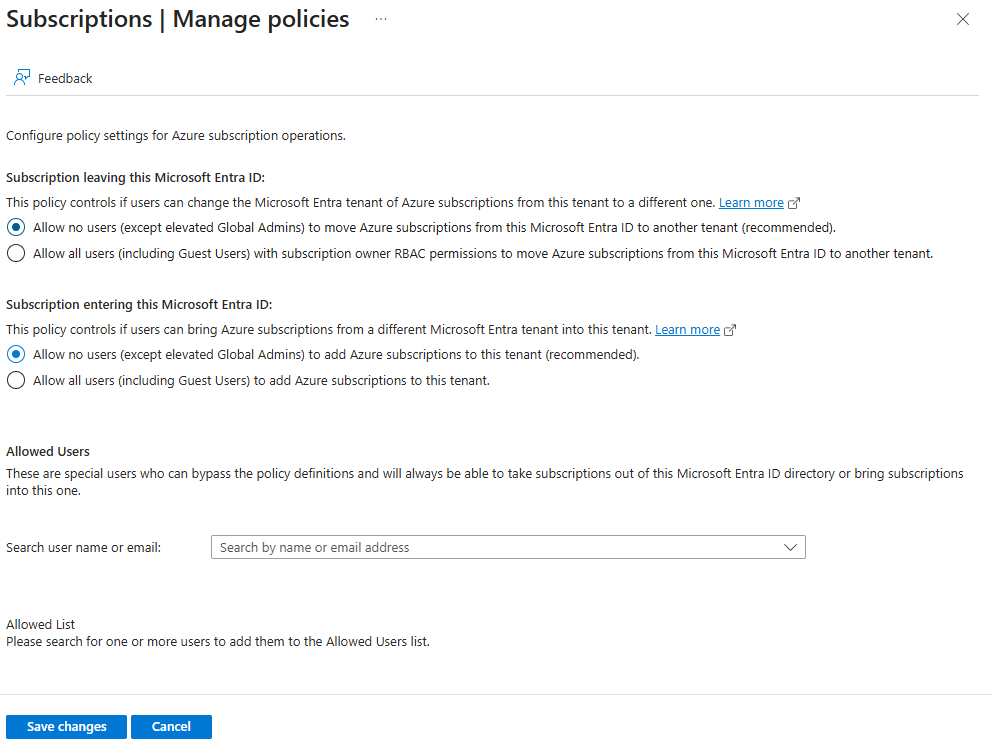
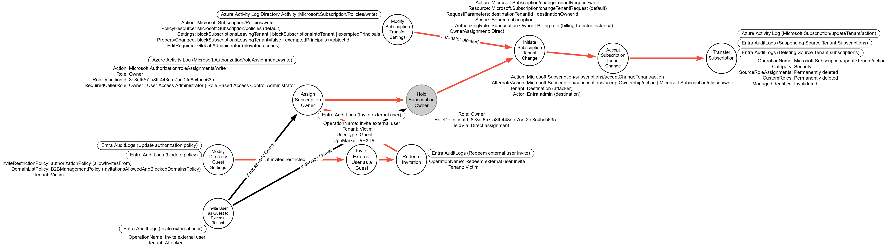
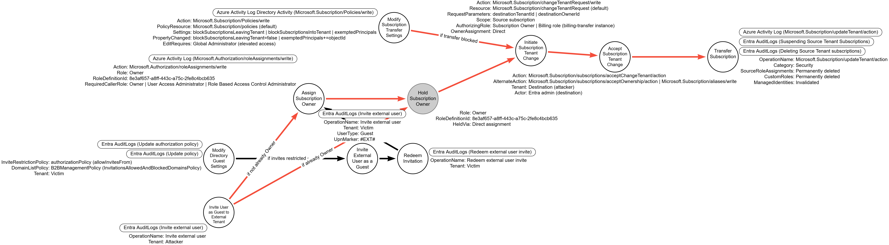
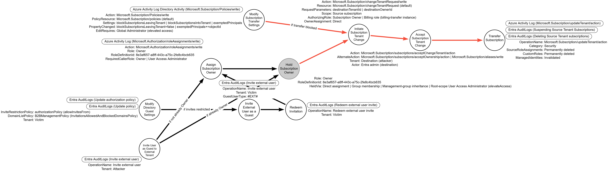

# Hijack Azure Subscription

## Metadata

| Key          | Value                                      |
|--------------|--------------------------------------------|
| ID           | TRR0022                                    |
| External IDs | [AZT507.3], [T1496]                        |
| Tactics      | Persistence, Impact                        |
| Platforms    | Azure                                      |
| Contributors | Andrew VanVleet                            |

## Technique Overview

An Azure subscription can be transferred from one directory to another, allowing
an attacker with sufficient permissions to transfer a victim's subscription,
including all the resources inside it, to a directory they control. A
transferred subscription retains the billing account set up by the victim and
the victim tenant administrators will no longer have control over the
subscription.
This would be a disruptive attack, as the victim tenant would lose all access to
those resources and anything with a dependency on them would immediately break,
but the attacker would gain full control of those resources and have the ability
to deploy new resources that would be charged to the victim.

An attacker might hijack a subscription as a destructive action, to mine
cryptocurrency, or to seize control of a sensitive resource.

## Technical Background

### Transfer approaches

Changing a subscription's directory is an Azure Resource Manager operation
under the `Microsoft.Subscription` resource provider, not a Microsoft Graph API
call. Microsoft's documentation describes the change two ways. The Entra
guidance for associating a subscription with a directory describes a
single-step change made by an account that "exists in both the current
directory and in the new directory."[^9] The change-directory guidance
describes a two-party request and accept workflow: a subscription `Owner` in
the source directory sends a change-tenant request naming the destination
tenant, and an Entra administrator in the destination directory accepts it. The
requester can be that acceptor or can send the request to another party.[^4]
The request and accept operations first appeared in the
`Microsoft.Subscription` API version `2024-08-01-preview`.[^11]

This gives an attacker two approaches, which differ in whether one account or
two carry out the move:

- **Two-party handoff.** A subscription `Owner` in the victim tenant sends the
  request, and a separate identity accepts it in the destination tenant. No
  account has to exist in both directories, so guest invitation settings in
  either tenant play no part. This is Procedure C.
- **Single-account transfer.** One account holds the requisite permissions in
  both the source (victim) and destination (attacker-controlled) tenant: it is
  a subscription `Owner` in the source directory and also exists in the
  destination directory. It can make the single-step change or send the
  request and accept it itself. This is Procedures A and B, which differ in
  which tenant issues the guest invitation that places the account in both
  directories. The victim tenant's guest invite settings and collaboration
  restrictions apply only to Procedure A, because Procedure B's invitation is
  issued and recorded by the attacker's tenant.

Whether the two-party handoff removes the dual-directory requirement that the
Entra guidance states is not addressed in the documentation.

### Requirements for both approaches

Both approaches need an account with `Owner` privileges over the subscription
to be transferred. Microsoft's transfer guidance states that the `Owner` role
"must be directly assigned without conditions, group assignment, or Privileged
Identity Management (PIM)."[^10]

The directory's subscription transfer policy must also permit the move. On May
1, 2026, Microsoft changed this policy's default to block subscription
transfers both into and out of a tenant; before that date, transfers were
permitted by default. The policy consists of three settings: one blocking
subscriptions from leaving the tenant, one blocking subscriptions from entering
it, and a list of principals exempted from those blocks. Editing the policy
requires a `Global Administrator` with elevated access to the root scope, the
Azure root-scope elevate-access operation ([AZT402]).[^2]

The same directory change can also occur as part of a billing-ownership
transfer, which a billing role authorizes and an administrator accepts with
`Microsoft.Subscription/subscriptions/acceptOwnership/action`. This relocates
control of the subscription as the change-directory flow does, but billing
ownership moves to the recipient account rather than remaining with the victim,
so it is an alternative route within the technique rather than a separate
procedure.

Billing information for a subscription is retained when the subscription is
transferred, so an attacker can effectively hijack a subscription and deploy
resources that the victim is paying for until the billing has been modified
(this would presumably require intervention from Microsoft Support, since the
victim would no longer have access to the subscription to change the billing
information).

### Additional requirements for the single-account transfer

The account must exist in both the current directory and in the new directory.
There are multiple ways to meet this requirement, but they all require that
guest access be enabled for the tenant that issues the invitation. For
example, the attacker could invite an account from their directory into the
victim directory or set up an account in the victim directory as a guest in
their own directory. Additional details can be found on Microsoft's Learn
site.[^1]

Meeting this condition might require modifying the guest permissions in the
victim tenant to allow guests from the attacker's tenant. There are two Entra
external collaboration settings that control guest access. The first is the
"Guest invite settings" that control who, if anyone, is allowed to invite
guests. The second is the "Collaboration restrictions" setting, which controls
which domains (using email as the controlling factor) guests can be invited
from. An attacker has many configuration options available to ensure they can
set up the requisite guest account.

The "Guest invite settings" allows a range of options, from prohibiting all
guests to allowing anyone to invite guests.

The "Collaboration restrictions" setting allows one of three options:

1. All invitations to be sent to any domain (no allowlist or blocklist)
2. Deny invitations to the specified domains (blocklist)
3. Allow invitations only to the specified domains (allowlist)

Cross-tenant access settings are also checked at the time an invitation is
sent, alongside the allow and block domain list.[^3]

### Prevention

Tenant owners can block the transfer of subscriptions in and out of the
directory and can exempt specific principals from those blocks.[^2] Tenant
owners can also control whether or not guests can be invited into the tenant,
from what domains, and the level of directory access guests receive. The
guest controls apply only to the single-account transfer.

### Logging

#### Guest Settings Modifications

The records in this section and in Inviting Guests apply only to the
single-account transfer.

When the collaboration restrictions policy is changed, Entra ID generates an
audit log with an `ActivityDisplayName` of `Update policy` and a
`TargetResources.displayName` of `B2BManagementPolicy`. The
`TargetResources.modifiedProperties` entries carry `oldValue` and `newValue`
fields showing the policy before and after the change.

The policy controlling collaboration restrictions is titled
`InvitationsAllowedAndBlockedDomainsPolicy`. This can be followed by an
`AllowedDomains` field, which is an array of the allowlisted domains. It could
alternately be followed by a `BlockedDomains` field with an array of blocklisted
domains. The setting allowing invitations to any domain will configure the
policy as an empty blocklist.

The setting that controls who, if anyone, can invite guests is stored in the
Entra `authorizationPolicy` (the `allowInvitesFrom` property). The Entra audit
activities reference lists an `Update authorization policy` activity under the
`AuthorizationPolicy` category and a legacy `Set directory feature on tenant`
activity under `DirectoryManagement`; the latter recorded a `DirectoryFeatures`
property whose `EnabledFeatures` array held `RestrictInvitations` when guests
were prohibited. The documentation does not state which of the two activities
fires when this setting is changed.[^5]

#### Inviting Guests

When an invitation is sent to a guest, an Entra audit log is generated with an
`OperationName` of `Invite external user`. This log shows the external user's
email and which internal user sent the invitation. When the invited guest
redeems the invitation, a second Entra audit log is generated with an
`OperationName` of `Redeem external user invite`, recorded in the tenant that
issued the invitation (the victim tenant in Procedure A, the attacker tenant in
Procedure B).[^5]

#### Adding Owners

There is an Azure Activity log generated when an owner is added to a
subscription. The `operationName` field will read
`Microsoft.Authorization/roleAssignments/write`. The ID for the `Owner` role is
`8e3af657-a8ff-443c-a75c-2fe8c4bcb635` in Azure RBAC.[^6]

#### Modifying the Transfer Policy

The subscription transfer policy is a tenant-scoped resource. Modifying it
invokes `Microsoft.Subscription/Policies/write`,[^8] a tenant-level directory
activity operation rather than a subscription-scoped one.[^2]

#### Transferring the Subscription

Completing the transfer is recorded in the Azure Activity log with an
`operationName` of `Microsoft.Subscription/updateTenant/action` under the
`Security` category, the operation named in Microsoft's published
subscription-migration analytic rule.[^7] The move permanently deletes every
role assignment in the source directory, removing the access that
source-directory principals held over the subscription. Microsoft's Entra audit
activities reference lists `Suspending Source Tenant Subscriptions` and
`Deleting Source Tenant subscriptions` activities.[^5]

The acceptance step is carried out by an administrator in the destination
(attacker) tenant. The subscription's own Activity Log is scoped to the
subscription and travels with it to the destination; a source tenant that had
exported those records to its own workspace before the move keeps that exported
copy. The documentation does not state which records the accept step produces,
or in which tenant each lands.

## Procedures

| ID                | Title            | Tactic            |
|-------------------|------------------|-------------------|
| TRR0022.AZR.A     | Hijack via an external guest user  | Persistence, Impact |
| TRR0022.AZR.B     | Hijack via an internal user             | Persistence, Impact |
| TRR0022.AZR.C     | Hijack via a two-party change-tenant request | Persistence, Impact |

### Procedure A: Hijack via an external guest user

This procedure is a single-account transfer, described in the
[Technical Background] section. The attacker establishes the account by
inviting a user from their tenant into the victim's tenant as a guest.

The guest account would then need to be granted the `Owner` role over the target
subscription.

If the victim tenant blocks subscription transfers out of the directory, the
attacker must first modify the subscription transfer policy, which requires the
elevated access described in the [Technical Background] section.

At this point the attacker can initiate the subscription transfer. The victim
loses access to the subscription and its resources.

#### Detection Data Model

The red path runs from inviting the attacker's user into the victim tenant as a
guest, through redeeming the invitation and granting that guest `Owner`, to
initiating the change-tenant request, having it accepted in the destination,
and completing the transfer; modifying the guest settings and the transfer
policy precede the path only when invitations or transfers are blocked. The
gray `Hold Subscription Owner` node marks a non-observable held-state
prerequisite, the guest's standing `Owner` right, which produces no telemetry
of its own.

### Procedure B: Hijack via an internal user

This procedure is a single-account transfer that establishes the account in
the opposite direction from Procedure A: the attacker controls a member account
in the victim's tenant and invites it into the attacker's tenant as a guest.
That account must hold
`Owner` over the target subscription; if it is not already an owner, it is
granted the role first, which requires a caller that already holds `Owner`,
`User Access Administrator`, or `Role Based Access Control Administrator` at
that scope.

From the point the account holds `Owner`, this procedure follows the same
change-tenant pipeline as Procedure A, described in the [Technical Background]
section, modifying the subscription transfer policy first only when the move is
blocked.

#### Detection Data Model

The red path runs from inviting the victim-tenant account into the attacker's
tenant as a guest, through assigning it `Owner` only when it is not already an
owner, to initiating the change-tenant request and completing the transfer; the
transfer-policy edit precedes initiation only when the move is blocked. The
gray `Hold Subscription Owner` node marks a non-observable held-state
prerequisite: the account's standing `Owner` right, which produces no telemetry
of its own.

### Procedure C: Hijack via a two-party change-tenant request

This procedure is the two-party handoff described in the [Technical Background]
section. The attacker holds `Owner` over the target subscription and sends the
change-tenant request to a destination tenant the attacker controls, where
a separate identity accepts it. No guest is invited into either tenant. Whether
this path removes the dual-directory requirement stated in the Entra guidance
is not addressed in the documentation; this procedure covers only the
documented request and accept steps.

Because the acting account already holds `Owner`, the path enters the shared
change-tenant pipeline at the request step with no guest-invitation or
owner-grant prefix, modifying the subscription transfer policy first only when
the move is blocked.

#### Detection Data Model

The red path runs directly from holding `Owner` on the source subscription to
initiating the change-tenant request, having it accepted in the destination
tenant, and completing the transfer; no guest-invitation or owner-assignment
node is on the path. The transfer-policy edit precedes initiation only when
the move is blocked. The gray `Hold Subscription Owner` node marks a
non-observable held-state prerequisite, the acting account's standing `Owner`
right, which produces no telemetry of its own.

## Available Emulation Tests

| ID            | Link             |
|---------------|------------------|
| TRR0022.AZR.A |                  |
| TRR0022.AZR.B |                  |
| TRR0022.AZR.C |                  |

## References

- [Transfer Subscriptions - Microsoft Learn]
- [Associate Azure Subscriptions to a Directory - Microsoft Learn]
- [Configure External Collab Settings - Microsoft Learn]
- [Cross-Tenant Access - Microsoft Learn]
- [Azure subscription hijacking and cryptomining - Medium]
- [Allow or block B2B collaboration with organizations - Microsoft Learn]
- [Change the Directory of an Azure Subscription - Microsoft Learn]
- [Manage Azure Subscription Policies - Microsoft Learn]
- [Microsoft Entra Audit Activity Reference - Microsoft Learn]
- [Azure Built-in Roles - Microsoft Learn]

[AZT507.3]: https://microsoft.github.io/Azure-Threat-Research-Matrix/Persistence/AZT507/AZT507-3/
[T1496]: https://attack.mitre.org/techniques/T1496/
[AZT402]: https://microsoft.github.io/Azure-Threat-Research-Matrix/PrivilegeEscalation/AZT402/AZT402/
[Transfer Subscriptions - Microsoft Learn]: https://learn.microsoft.com/en-us/azure/role-based-access-control/transfer-subscription
[Associate Azure Subscriptions to a Directory - Microsoft Learn]: https://learn.microsoft.com/en-us/entra/fundamentals/how-subscriptions-associated-directory
[Configure External Collab Settings - Microsoft Learn]: https://learn.microsoft.com/en-us/entra/external-id/external-collaboration-settings-configure
[Cross-Tenant Access - Microsoft Learn]: https://learn.microsoft.com/en-us/entra/external-id/cross-tenant-access-overview
[Azure subscription hijacking and cryptomining - Medium]: https://derkvanderwoude.medium.com/azure-subscription-hijacking-and-cryptomining-86c2ac018983
[Allow or block B2B collaboration with organizations - Microsoft Learn]: https://learn.microsoft.com/en-us/entra/external-id/allow-deny-list
[Change the Directory of an Azure Subscription - Microsoft Learn]: https://learn.microsoft.com/en-us/azure/cost-management-billing/manage/subscription-change-directory
[Manage Azure Subscription Policies - Microsoft Learn]: https://learn.microsoft.com/en-us/azure/cost-management-billing/manage/manage-azure-subscription-policy
[Microsoft Entra Audit Activity Reference - Microsoft Learn]: https://learn.microsoft.com/en-us/entra/identity/monitoring-health/reference-audit-activities
[Azure Built-in Roles - Microsoft Learn]: https://learn.microsoft.com/en-us/azure/role-based-access-control/built-in-roles
[Technical Background]: #technical-background

[^1]: [Configure External Collab Settings - Microsoft Learn](https://learn.microsoft.com/en-us/entra/external-id/external-collaboration-settings-configure)
[^2]: [Manage Azure subscription policies - Microsoft Learn](https://learn.microsoft.com/en-us/azure/cost-management-billing/manage/manage-azure-subscription-policy)
[^3]: [Allow or block B2B collaboration with organizations - Microsoft Learn](https://learn.microsoft.com/en-us/entra/external-id/allow-deny-list)
[^4]: [Change the Directory of an Azure Subscription - Microsoft Learn](https://learn.microsoft.com/en-us/azure/cost-management-billing/manage/subscription-change-directory)
[^5]: [Microsoft Entra Audit Activity Reference - Microsoft Learn](https://learn.microsoft.com/en-us/entra/identity/monitoring-health/reference-audit-activities)
[^6]: [Azure Built-in Roles - Microsoft Learn](https://learn.microsoft.com/en-us/azure/role-based-access-control/built-in-roles)
[^7]: [Azure-Sentinel SubscriptionMigration analytic rule, id 48c026d8-7f36-4a95-9568-6f1420d66e37 - GitHub](https://github.com/Azure/Azure-Sentinel/blob/master/Solutions/Azure%20Activity/Analytic%20Rules/SubscriptionMigration.yaml)
[^8]: [Azure resource provider operations - Microsoft Learn](https://learn.microsoft.com/en-us/azure/role-based-access-control/permissions/general)
[^9]: [Associate Azure Subscriptions to a Directory - Microsoft Learn](https://learn.microsoft.com/en-us/entra/fundamentals/how-subscriptions-associated-directory)
[^10]: [Transfer Subscriptions - Microsoft Learn](https://learn.microsoft.com/en-us/azure/role-based-access-control/transfer-subscription)
[^11]: [Add Initiate, Get and Accept Subscription Change Directory Api with new version, azure-rest-api-specs PR 29912 - GitHub](https://github.com/Azure/azure-rest-api-specs/pull/29912)
